# 重点算法题记录

## 单例模式

- 构造私有
- 以静态方法或者枚举返回实例
- 确保实例只有一个，尤其是单线程环境

### 1、单例DCL

~~~java
public class Singleton1 {
    public static void main(String[] args) {
        Singleton1 instance1 = Singleton1.getInstance();
        Singleton1 instance2 = Singleton1.getInstance();
        System.out.println(instance1 == instance2);
    }
    private Singleton1(){}
    private static volatile Singleton1 instance;
    public static Singleton1 getInstance(){
        if(instance == null){
            synchronized (Singleton1.class){
                if(instance == null){
                    instance = new Singleton1();
                }
            }
        }
        return instance;
    }
}
~~~

### 2、单例懒汉

​	饿汉式在`类加载`时已经创建好该对象，在程序调用时直接返回该单例对象即可，即我们在编码时就已经指明了要马上创建这个对象，不需要等到被调用时再去创建。

​	关于类加载，涉及到JVM的内容，我们目前可以简单认为在程序启动时，这个单例对象就已经创建好了。

~~~java
public class Singleton2 {
    private Singleton2(){}
    private static Singleton2 instance = new Singleton2();
    public static Singleton2 getInstance(){
        return instance;
    }
}
~~~

### 3、单例静态内部类

​	外部类加载时不需要加载内部类，，内部类不被加载则不会去初始化，故而不占内存。只有当getInstance()方法第一次被调用时，才会去初始化INSTANCE,**第一次调用getInstance()方法才会导致虚拟机加载SingleTonHoler类**，这种方法不仅能确保线程安全，也能保证单例的唯一性，同时也延迟了单例的实例化。

~~~java
public class Singleton3 {
    private Singleton3(){}
    private static class SingletonInstance{
        private static Singleton3 instance = new Singleton3();
    }

    public static Singleton3 getInstance(){
        return SingletonInstance.instance;
    }
}
~~~

### 4、单例枚举

~~~java
public class Singleton4{
    private Singleton4(){}`
    
    private enum SingletonInstance{
        INSTANCE;
        private final Singleton4 instance;
		SingletonInstance(){
            instance = new Singleton4();
        }
        
        private Singleton4 getInstance(){
            return instance;
        }
    }
    
    public static Singleton4 getInstance(){
        return SingletonInstance.INSTANCE.getInstance();
    }
}
~~~

## 排序

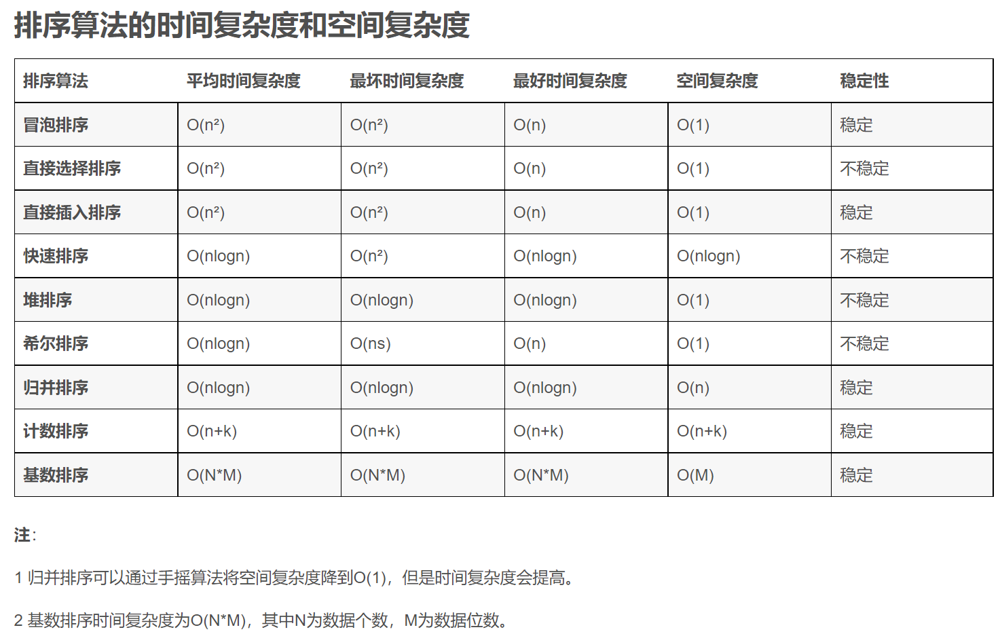

### 1、快速排序

- 平均时间复杂度O(nlogn),最差时间复杂度O(n^2)，空间复杂度O(logn)，不稳定
- 快排理想情况是每次都恰好取到中间值，最差情况是每次都取到最大最小值，如果数组本身有序，然后每次都选第一个或者最后一个为支点。所以快排越无序相对性能越好；
- 快排优化可以用三数取中

~~~java
public static void quickSort(int[] nums, int L, int R) {
        int i = L;
        int j = R;
        int pivot = nums[(L + R) / 2];

        while (i <= j) {
            while (nums[i] < pivot) {
                i++;
            }

            while (nums[j] > pivot) {
                j--;
            }

            if (i <= j) {
                int temp = nums[i];
                nums[i] = nums[j];
                nums[j] = temp;
                i++;
                j--;
            }
        }
        if (L < j)
            quickSort(nums, L, j);
        if (i < R)
            quickSort(nums, i, R);
    }
~~~

### 2、堆排

- 堆排首先写一个辅助函数swap，因为后面建堆要交换，堆排后也要交换数组中第一个和最后一个
- 然后写一个maxHeapify函数，负责在左右子树已经是堆的前提下，自顶向下递归建堆，保证以此根节点往下结构是正确的
- 然后自底向上，从左到右，调用上面的函数，依次建堆，直到最后到根节点
- l < heapsize && arrs[l] > arrs[max],判断越界要在前面，防止溢出
- 平均时间复杂度O(nlogn),最差时间复杂度O(nlogn)，最好时间复杂度O(nlogn)，空间复杂度O(1)，不稳定
- heapsize直接定义为nums.length

~~~java
public class HeapSort {

    public static void main(String[] args) {
        int[] arrs = {1,342,42,534,5,453,11,2,2,3453,451,14};
        heapSort(arrs);
        for(int i = 0; i < arrs.length; i++){
            System.out.println(arrs[i]);
        }
    }

    public static void heapSort(int[] arrs){
        int heapsize = arrs.length;
        buildMaxHeapify(arrs,heapsize);
        for(int i = arrs.length - 1; i >= 0; i--) {
            swap(arrs, 0, i);
            heapsize--;
            maxHeapify(arrs, 0, heapsize);
        }
    }

    public static void buildMaxHeapify(int[] arrs, int heapsize){
        for(int i = heapsize / 2; i >= 0; i--){
            maxHeapify(arrs, i, heapsize);
        }
    }

    public static void maxHeapify(int[] arrs, int curRoot, int heapsize){
        int l = curRoot * 2 + 1, r = curRoot * 2 + 2;
        int max = curRoot;
        //注意l < heapsize一定要放在前面不然会报错，这是短路原则不提前判断索引越界
        if(l < heapsize && arrs[l] > arrs[max])
            max = l;
        if(r < heapsize && arrs[r] > arrs[max])
            max = r;
        if (curRoot != max){
            swap(arrs, max, curRoot);
            maxHeapify(arrs, max, heapsize);
        }
    }

    public static void swap(int[] arrs, int i, int j){
        int temp = arrs[i];
        arrs[i] = arrs[j];
        arrs[j] = temp;
    }
}
~~~

### 3、优化后的冒泡排序

思路：

- **外层循环控制比较趟数，内层循环控制每次比较交换次数**，外层循环是从0开始计数所以是i < nums.length - 1;，内层循环要交换nums[j] 和 nums[j + 1]也要多预留一个，所以j < nums.length - i - 1
- 添加一个控制位，在已有序时提前退出
- 平均时间复杂度O(n^2),最差时间复杂度O(n^2)，空间复杂度O(1)，稳定

~~~java
    public static void bubbleSort(int[] nums){
        int isChange;
        //外层循环控制循环趟数，-1是因为比如两个数只要比较一次
        for(int i = 0; i < nums.length - 1; i++){
            isChange = 0;
            // 减i是因为i次轮循环已经确定i个数
            for (int j = 0; j < nums.length - i - 1; j++){
                if(nums[j] > nums[j + 1]){
                    int temp = nums[j];
                    nums[j] = nums[j + 1];
                    nums[j + 1] = temp;
                    isChange = 1;
                }
            }
            if(isChange == 0) break;
        }
    }
~~~

### 4、归并排序

- 思想是分而治之，**分：不断将数组从中间位置划分开，将整个数组排序划分为子数组排序问题**；**治：划分到子数组长度为 1 时，长度为1肯定是有序的，开始向上合并，不断将 较短排序数组 合并为 较长排序数组，直至合并至原数组时完成排序；**
- 递归函数的功能是假设输入数组的左边有序，右边也有序，将数组左右两边放入两个新数组再合并为一个新的数组，使用两个指针，从头开始遍历比较，修改原数组
- 用一个合并函数，专门用于合并一个数组左右两边。传入要合并的左右中，再传入一个临时数组，用于存储合并排序后的数字。合并完成后把临时数组代替原来数组中的元素
- 平均时间复杂度O(nlogn),最差时间复杂度O(nlogn)，最好时间复杂度O(nlogn)，空间复杂度O(n)，稳定

~~~java
public class MergeSort {
    public static void main(String []args){
        int []arr = {9,8,7,6,5,4,3,2,1};
        sort(arr);
        System.out.println(Arrays.toString(arr));
    }
    public static void sort(int []arr){
        int []temp = new int[arr.length];//在排序前，先建好一个长度等于原数组长度的临时数组，避免递归中频繁开辟空间
        sort(arr,0,arr.length-1,temp);
    }
    private static void sort(int[] arr,int left,int right,int []temp){
        // 递归结束条件
        if (left == right){
            return;
        }
        int mid = (left+right)/2;
        sort(arr,left,mid,temp);//左边归并排序，使得左子序列有序
        sort(arr,mid+1,right,temp);//右边归并排序，使得右子序列有序
        merge(arr,left,mid,right,temp);//将两个有序子数组合并操作
        
    }
    // 合并arr数组，以mid为界，传入一个临时数组，临时数组用来存储合并后的有序数组，避免每次都重新建新数组
    // 临时数组就是将一定范围内数组重排后，写回原数组
    private static void merge(int[] arr,int left,int mid,int right,int[] temp){
        int i = left;//左序列指针
        int j = mid+1;//右序列指针
        int t = 0;//临时数组指针
        while (i<=mid && j<=right){
            if(arr[i]<=arr[j]){
                temp[t++] = arr[i++];
            }else {
                temp[t++] = arr[j++];
            }
        }
        while(i<=mid){//将左边剩余元素填充进temp中
            temp[t++] = arr[i++];
        }
        while(j<=right){//将右序列剩余元素填充进temp中
            temp[t++] = arr[j++];
        }
        t = 0;
        //将temp中的元素全部拷贝到原数组中
        while(left <= right){
            arr[left++] = temp[t++];
        }
    }
}
~~~

## 多线程

### 1、写一个死锁

​	死锁：两个或多个线程同时想申请对方资源，多个线程相互等待形成死循环。

​	线程 A 通过 `synchronized (resource1)` 获得 `resource1` 的监视器锁，然后通过`Thread.sleep(1000);`让线程 A 休眠 1s 为的是让线程 B 得到执行然后获取到 resource2 的监视器锁。


~~~java
public class DeadLockDemo {
    private static Object resource1 = new Object();//资源 1
    private static Object resource2 = new Object();//资源 2

    public static void main(String[] args) {
        new Thread(() -> {
            synchronized (resource1) {
                System.out.println(Thread.currentThread() + "get resource1");
                try {
                    Thread.sleep(1000);
                } catch (InterruptedException e) {
                    e.printStackTrace();
                }
                System.out.println(Thread.currentThread() + "waiting get resource2");
                synchronized (resource2) {
                    System.out.println(Thread.currentThread() + "get resource2");
                }
            }
        }, "线程 1").start();

        new Thread(() -> {
            synchronized (resource2) {
                System.out.println(Thread.currentThread() + "get resource2");
                try {
                    Thread.sleep(1000);
                } catch (InterruptedException e) {
                    e.printStackTrace();
                }
                System.out.println(Thread.currentThread() + "waiting get resource1");
                synchronized (resource1) {
                    System.out.println(Thread.currentThread() + "get resource1");
                }
            }
        }, "线程 2").start();
    }
}

~~~

产生死锁要满足以下四个条件：

- 互斥条件：该资源任意时刻只能有一个线程占用
- 请求保持条件：一个进程因请求资源而阻塞时，对已获得的资源保持不放
- 不可剥夺：线程已获得的资源未使用完之前不能被其他线程强行剥夺，只有自己使用完毕才能释放资源
- 循环等待：若干进程之间形成一种头尾相接的循环等待资源的关系

如何避免死锁：

- 互斥条件是先天客观已经存在的，不好从这方面下手
- 破坏请求保持：一次申请所有资源
- 破坏 不可剥夺：占用资源的线程进一步申请其他资源时，如果申请不到主动释放自己已经获得的资源
- 破坏循环等待：按序申请资源，释放资源则反序释放。

我们对线程 2 的代码修改成下面这样就不会产生死锁了。破坏了循环等待条件。

~~~java
        new Thread(() -> {
            synchronized (resource1) {
                System.out.println(Thread.currentThread() + "get resource1");
                try {
                    Thread.sleep(1000);
                } catch (InterruptedException e) {
                    e.printStackTrace();
                }
                System.out.println(Thread.currentThread() + "waiting get resource2");
                synchronized (resource2) {
                    System.out.println(Thread.currentThread() + "get resource2");
                }
            }
        }, "线程 2").start();

~~~


## 链表

### 1、反转链表(261)

剑指offer 24 leetcode 206

定义一个函数，输入一个链表的头节点，反转该链表并输出反转后链表的头节点。

**示例:**

~~~java
输入: 1->2->3->4->5->NULL
输出: 5->4->3->2->1->NULL
~~~

思路：迭代

- 用两个指针迭代，遍历链表，遍历的时候偶反转两个节点
- 时间复杂度O(n),空间复杂度O(1)

~~~java
class Solution {
    public ListNode reverseList(ListNode head) {
        ListNode pre = null,cur = head;
        while(cur != null){
            ListNode next = cur.next;
            cur.next = pre;
            pre = cur;
            cur = next;
        }
        return pre;
    }
}
~~~

### 2、反转链表2(62)

leetcode 92

反转从位置 *m* 到 *n* 的链表。请使用一趟扫描完成反转。

~~~java
说明:
1 ≤ m ≤ n ≤ 链表长度。

示例:

输入: 1->2->3->4->5->NULL, m = 2, n = 4
输出: 1->4->3->2->5->NULL
~~~

思路：头插法

- **注意m和n是从1开始算的**

- 基础的反转链表只需要返回最后的pre就可以了，但是本题只反转一部分，**最后还是要返回头结点**，**所以为了方便最后返回结果，需要设立一个假结点dummy**

- 和反转链表一样，设立pre和cur两个指针，然后将cur移动到待翻转的第一个位置，将pre移动到cur前一个结点，然后用right - left范围的for循环控制反转链表的范围
- 使用头插法，就是删除cur节点后一个结点，然后将这个结点插入cur结点前面，每后一个都插入到最前，就将链表反转了
- 注意left第一个结点是从1开始算的

~~~java
class Solution {
    public ListNode reverseBetween(ListNode head, int left, int right) {
        ListNode dummy = new ListNode(0);
        dummy.next = head;

        ListNode pre = dummy;
        ListNode cur = dummy.next;

        // 因为cur一开始初始化就在head的位置了，所以移动要少一个1也就是left - 1
        for(int i = 0; i < left - 1; i++){
            pre = pre.next;
            cur = cur.next;
        }

        for(int i = 0; i < right - left; i++){
            ListNode removed = cur.next;
            cur.next = cur.next.next;

            removed.next = pre.next;
            pre.next = removed;
        }
        return dummy.next;
    }
}
~~~

### 3、每k个反转链表（122）

leetcode 25

给你一个链表，**每 k 个节点一组进行翻转**，请你返回翻转后的链表。

k 是一个正整数，它的值小于或等于链表的长度。

如果节点总数不是 k 的整数倍，那么请**将最后剩余的节点保持原有顺序**。

~~~java
示例：

给你这个链表：1->2->3->4->5

当 k = 2 时，应当返回: 2->1->4->3->5

当 k = 3 时，应当返回: 3->2->1->4->5
~~~

思路：

- 本题和上题一样，最终还是返回头结点，但是遍历已经到了后面，**所以还是需要一个dummy结点方便最后返回结果**

- 每次翻转前，要确定翻转链表的范围，这个必须通过 `k` 此循环来确定
- 需记录翻转链表前驱和后继，方便翻转完成后把已翻转部分和未翻转部分连接起来
- 初始需要两个变量 `pre` 和 `end`，`pre` 代表待翻转链表的前驱，`end` 代表待翻转链表的末尾
- 经过k此循环，`end` 到达末尾，记录待翻转链表的后继 `next = end.next`
- 翻转链表，然后将三部分链表连接起来，然后重置 `pre` 和 `end` 指针，然后进入下一次循环
- 特殊情况，当翻转部分长度不足 `k` 时，在定位 `end` 完成后，`end==null`，已经到达末尾，说明题目已完成，直接返回即可
- **反转链表2采用头插法，精准控制次数，不用断开连接，但是本题用的反转链表函数是一次性从头到尾的所以要断开连接，反转完了再接上**
- 时间复杂度O(n)空间复杂度O（1）

~~~java
class Solution {
    public ListNode reverseKGroup(ListNode head, int k) {
        ListNode dummy = new ListNode(0);
        //别忘了吧dummy和head连起来
        dummy.next = head;
        //pre指向待翻转头结点前一个，end指向待翻转最后一个
        ListNode pre = dummy;
        ListNode end = dummy;
        //end找到每次要翻转的末尾，如果正好结束的话就是end.next==null,因为循环中要用到end.next所以循环里面就不能为空
        // end.next != null也为true
        while(end.next != null){
            //不加条件的话for循环指定次数，null还next下去肯定会空指针异常啊
            for(int i = 0;i < k && end != null; i++) end = end.next;
            if(end == null) break;
            ListNode start = pre.next;
            ListNode next = end.next;
            //别忘了断开连接再反转链表，注意这里不能是next = null 这样代表end的下一个结点为空，但是不代表逻辑上断开的操作，不断开连接会一直反转到最后
            end.next = null;
            pre.next = reverse(start);
            start.next = next;
            //重新开始新循环，pre和end跳到待翻转
            pre = start;
            end =start;
        }
        return dummy.next;
    }

    //反转链表
    public ListNode reverse(ListNode head){
        ListNode pre = null;
        ListNode cur = head;

        while(cur != null){
            ListNode next = cur.next;
            cur.next = pre;
            pre = cur;
            cur = next;
        }
        return pre;
    }
}
~~~

### 4、合并K个排序链表（53）

LeetCode 23

给你一个链表数组，每个链表都已经按升序排列。请你将所有链表合并到一个升序链表中，返回合并后的链表。


思路：顺序合并

- 先写一个合并两个有序链表的方法，然后用一个变量res维护合并的链表，第i次循环把第i个链表和res合并
- 空间复杂度：*O*(1)
- 时间复杂度时间复杂度为 O(k^2 n)*O*(*k*2*n*)。

~~~java
class Solution {
    public ListNode mergeKLists(ListNode[] lists) {
        ListNode res = null;
        for(int i = 0; i < lists.length; i++){
            res = mergeTwoLists(res,lists[i]);
        }
        return res;
    }

    public ListNode mergeTwoLists(ListNode l1, ListNode l2){
        ListNode dummy = new ListNode(0);
        ListNode cur = dummy;
        
        while(l1 != null && l2 != null){
            if(l1.val < l2.val){
                cur.next = l1;
                l1 = l1.next;
                cur = cur.next;
            }else{
                cur.next = l2;
                l2 = l2.next;
                cur = cur.next;
            }
        }
        cur.next = l1 == null ? l2 : l1;
        return dummy.next;
    }
}
~~~

思路：归并思想，分而治之


- 在方法一的基础上优化，采用类似归并排序的分而治之的思想
- 

~~~java
class Solution {
    public ListNode mergeKLists(ListNode[] lists) {
        //注意排除为空情况，不然如果为空下面求长度会报空指针异常或者会出现-1
        if (lists == null || lists.length == 0) return null;
        return merge(lists,0,lists.length - 1);
    }
	//递归函数的功能是返回假设以mid为界限的左右两链表已经有序，进行合并
    //递归结束向上返回的条件是数组中只有一个元素了
    public ListNode merge(ListNode[] lists, int left, int right){
        if(left == right) return lists[left];
        int mid = left + (right - left) / 2;
        ListNode l1 = merge(lists, left, mid);
        ListNode l2 = merge(lists, mid + 1, right);
        return mergeTwoLists(l1,l2);
    }

    public ListNode mergeTwoLists(ListNode l1, ListNode l2){
        ListNode dummy = new ListNode(0);
        ListNode cur = dummy;
        
        while(l1 != null && l2 != null){
            if(l1.val < l2.val){
                cur.next = l1;
                l1 = l1.next;
                cur = cur.next;
            }else{
                cur.next = l2;
                l2 = l2.next;
                cur = cur.next;
            }
        }
        cur.next = l1 == null ? l2 : l1;
        return dummy.next;
    }
}
~~~

### 5、合并两个有序链表（109）

leetcode 21 ,剑指offer 25

将两个升序链表合并为一个新的 **升序** 链表并返回。新链表是通过拼接给定的两个链表的所有节点组成的。 


思路：

- 用两个指针（结点本身就是指针）遍历两个链表，比较两个指针指向结点大小，两节点交替前进，直至遍历完两个链表

- 小技巧：可以引入一个伪头结点，方便最后返回结果

​	- 用一个cur指针在两个链表之间游走，建立链表，另两个用于比较，所以总共用到了三个指针

- 都是用两个指针逐个比较，while循环必须保持两个指针都不为空，结束了在把还有的直接加入另一个
- l1和l2天然就是指针
- 时间复杂度O(n)空间复杂度O(1)

~~~java
class Solution {
    public ListNode mergeTwoLists(ListNode l1, ListNode l2) {
        ListNode dummy = new ListNode(0);
        ListNode cur = dummy;

        while (l1 != null && l2 != null){
            if (l1.val > l2.val){
                cur.next = l2;
                l2 = l2.next;
                cur = cur.next;
            } else {
                cur.next = l1;
                l1 = l1.next;
                cur = cur.next;
            }
        }
        cur.next = l1 == null ? l2 : l1;
        return dummy.next;
    }
}
~~~

### 6、环形链表(105)

leetcode 141

给定一个链表，判断链表中是否有环。

**示例 1：**


~~~java
输入：head = [3,2,0,-4]
输出：true
解释：链表中有一个环，其尾部连接到第二个节点。
~~~

思路：

- 一个快指针一次移动两步，一个慢指针一次移动一步，如果有环，他们一定会在环中相遇
- 注意因为fast一次走两步，所以if(fast == null || fast.next == null)，走到最后一个或者走到最后一个后面为空的说明无环，注意要提前判断，不然后面会空指针异常
- 环形链表快慢指针，我的习惯是快慢指针同一起点，while(true)相等再break
- 时间复杂度O(n)空间复杂度O(1)

~~~java
public class Solution {
    public boolean hasCycle(ListNode head) {
        if(head == null || head.next == null)
            return false;
        ListNode slow = head;
        ListNode fast = head;

        while(true){
            // 因为有fast.next.next，所以要保证fast和fast.next不为null,否则就return FALSE
            if(fast == null || fast.next == null)
                return false;
            slow = slow.next;
            fast = fast.next.next;
            if(slow == fast) break;
        }
        return true;
    }
}
~~~

### 7、环形链表2（74）

leetcode 142

给定一个链表，返回链表开始入环的第一个节点。 如果链表无环，则返回 `null`。O(1)解决。

**示例 1：**


~~~java
输入：head = [3,2,0,-4], pos = 1
输出：返回索引为 1 的链表节点
解释：链表中有一个环，其尾部连接到第二个节点。
~~~

思路：快慢指针数学推导，需要记忆数学规律，第一次遇到基本做不出来

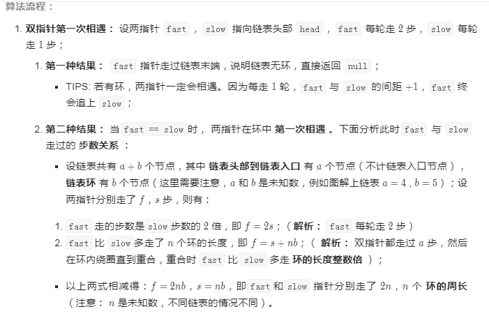

总结规律：快慢指针同时从head出发，第一次在环中相遇后，把快指针移到head然后一次走一步，再次相遇的结点就是链表入口

- **第一次相遇时慢指针已经走了nb步**
- **走a+nb步一定是在环入口**
- 时间复杂度O(n)空间复杂度O(1)

~~~java
public class Solution {
    public ListNode detectCycle(ListNode head) {
        ListNode fast = head,slow = head;
        while(true){
            if(fast == null || fast.next == null)
                return null;
            slow = slow.next;
            fast = fast.next.next;
            if(fast == slow) break;
        }

        fast = head;
        //如果无环上面会直接返回null，所以到这步就默认有环了，不用再验证
        while(slow != fast){
            slow = slow.next;
            fast = fast.next;
        }
        return fast;
    }
}
~~~

### 8、链表的中间节点（11）

leetcode 876

给定一个头结点为 `head` 的非空单链表，返回链表的中间结点。

**如果有两个中间结点，则返回第二个中间结点。**

**示例 1：**

~~~java
输入：[1,2,3,4,5,6]
输出：此列表中的结点 4 (序列化形式：[4,5,6])
由于该列表有两个中间结点，值分别为 3 和 4，我们返回第二个结点。
~~~

思路：**快慢指针**

- 使用快慢指针，只需要遍历一次链表
- 快指针每次走两步，慢指针每次走一步，当快指针走到末尾，慢指针必然在中间
- while循环的结束条件是快指针走到末尾，**链表有奇数个快指针正好走到尾，快指针为偶数个快指针会走到末尾下一个null**
- 注意如果是偶数个节点，想返回中间右边那个节点就

~~~java
        while(fast != null && fast.next != null){
            slow = slow.next;
            fast = fast.next.next;
        }
~~~

- 如果想返回中间靠左的就

~~~java
        while(fast.next != null && fast.next.next != null){
            slow = slow.next;
            fast = fast.next.next;
        }
~~~

- 时间复杂度O(n)空间复杂度O(1)

~~~java
class Solution {
    public ListNode middleNode(ListNode head) {
        ListNode fast = head;
        ListNode slow = head;

        while(fast != null && fast.next != null){
            slow = slow.next;
            fast = fast.next.next;
        }
        return slow;
    }
}
~~~


### 9、重排链表（41）

leetcode 143 字节高频

给定一个单链表 L：L0→L1→…→Ln-1→Ln ，
将其重新排列后变为： L0→Ln→L1→Ln-1→L2→Ln-2→…

**翻译：给一个链表，依次头尾头尾取元素，然后组成一个新的链表**

你不能只是单纯的改变节点内部的值，而是需要实际的进行节点交换。

**示例 1:**

~~~java
给定链表 1->2->3->4, 重新排列为 1->4->2->3.
~~~

**示例 2:**

~~~java
给定链表 1->2->3->4->5, 重新排列为 1->5->2->4->3.
~~~

思路：找链表中点+反转链表+合并链表

- 先取头再取尾，这样链表左半边都是顺序依次加入链表，右半边都是反序加入链表
- 写一个取链表中间节点的函数
- 写一个反转链表函数
- 写一个原地合并两个链表的函数，两链表长度不会超过一，所以直接一个个合并就行了，合并前用一个临时节点保存下一个结点就行了
- 注意此题反转链表前也要断开前面连接因为要分成两个独立链表，不然反转完前一个结点的next还是指向反转完的末尾
- 时间复杂度O(n)空间复杂度O(1)

~~~java
class Solution {
    public void reorderList(ListNode head) {
        if (head == null){
            return;
        }
        // 找到mid
        ListNode mid = middleNode(head);
        // 断开连接，分成两个链表
        ListNode l1 = head;
        ListNode l2 = mid.next;
        mid.next = null;
        // 将第二部分链表反转一下
        l2 = reverse(l2);
        // 依次合并
        mergeTwoList(l1, l2);
    }

    // 反转链表
    private ListNode reverse(ListNode head){
        ListNode pre = null;
        ListNode cur = head;

        while (cur != null){
            ListNode next = cur.next;
            cur.next = pre;
            pre = cur;
            cur = next;
        }
        return pre;
    }

    // 寻找中间靠左的中间节点
    private ListNode middleNode(ListNode head){
        ListNode slow = head;
        ListNode fast = head;

        while (fast.next != null && fast.next.next != null){
            fast = fast.next.next;
            slow = slow.next;
        }
        return slow;
    }

    // 合并两个长度差不超过1的链表，一个接一个合并
    public void mergeTwoList(ListNode l1, ListNode l2){
        while (l1 != null && l2 != null){
            ListNode l1_temp = l1.next;
            ListNode l2_temp = l2.next;

            l1.next = l2;
            l1 = l1_temp;

            l2.next = l1;
            l2 = l2_temp;
        }
    }
}
~~~

### 10、链表中倒数第k个结点（61）

 剑指offer 22

​	输入一个链表，输出该链表中倒数第k个节点。为了符合大多数人的习惯，本题从1开始计数，即链表的尾节点是倒数第1个节点。

​	例如，一个链表有 `6` 个节点，从头节点开始，它们的值依次是 `1、2、3、4、5、6`。这个链表的倒数第 `3` 个节点是值为 `4` 的节点。

**例：**

~~~java
给定一个链表: 1->2->3->4->5, 和 k = 2.

返回链表 4->5.
~~~

思路：

- 用双指针，不用统计链表长度。前指针先往后走k步，然后后指针和前指针一起往后走，当前指针为null时即后指针距离尾结点k-1,即倒数第k个

~~~java
class Solution {
    public ListNode getKthFromEnd(ListNode head, int k) {
        if(head == null || k == 0) return null;
        ListNode former = head;
        ListNode latter = head;

        for(int i = 0; i < k; i++){
            if( former == null) return null;
            former = former.next;
        }

        while(former != null){
            former = former.next;
            latter = latter.next;
        }
        return latter;
    }
}
~~~

### 11、删除链表结点（4）

剑指offer 18

​	给定**单向链表的头指针**和**一个要删除的节点的值**，定义一个函数删除该节点。返回删除后的链表的头节点。

~~~java
示例 1:

输入: head = [4,5,1,9], val = 5
输出: [4,1,9]
解释: 给定你链表中值为 5 的第二个节点，那么在调用了你的函数之后，该链表应变为 4 -> 1 -> 9.
~~~

思路：

- 用两个指针，一个pre = head,一个cur = head.next,**设置一个pre前驱指针只是为了删除节点方便**，可以直接指定pre.next = cur.next
- **为什么不初始化pre为null，因为如果是第一个的话pre.next会报空指针异常**
- 要考虑链表中没有val这一情况，需要加入判断cur不为空

~~~java
class Solution {
    public ListNode deleteNode(ListNode head, int val) {
        if(head.val == val) return head.next;
        ListNode pre = head;
        ListNode cur = head.next;

        // cur != null是为了防止链表中没有这个值
        // while循环用cur找到要删除的那个值
        // 最后判断也会空指针异常
        while(cur != null && cur.val != val){
            pre = cur;
            cur = cur.next;
        }

        if(cur != null) pre.next = cur.next;
        return head;
    }
}
~~~

### 12、排序链表（38）

LeetCode 148

给你链表的头结点 `head` ，请将其按 **升序** 排列并返回 **排序后的链表** 。

- 你可以在 `O(n log n)` 时间复杂度和O(1)空间复杂度下，对链表进行排序吗？

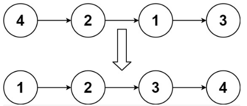

~~~java
输入：head = [4,2,1,3]
输出：[1,2,3,4]
~~~

思路：归并排序思想

- 借用归并排序的思想，找到链表的中点，试着将已经排序的两个链表合并为一个链表，递归下去，自底向上合并
- 递归结束的条件是只剩下一个节点了，也就是head.next == null，注意也要保证head == null不然会空指针异常
- 找链表中点用快慢指针，注意找的是左中点
- 时间复杂度O(nlogn)

~~~java
class Solution {
    public ListNode sortList(ListNode head) {
        // 条件容易错
        if (head == null || head.next == null){
            return head;
        }
        ListNode middleNode = middleNode(head);
        ListNode rightNode = middleNode.next;
        middleNode.next = null;

        ListNode l1 = sortList(head);
        ListNode l2 = sortList(rightNode);
        return mergeTwolists(l1, l2);
    }

    // 找到链表的中间节点
    private ListNode middleNode(ListNode head){
        ListNode slow = head;
        ListNode fast = head;

        while (fast.next != null && fast.next.next != null){
            fast = fast.next.next;
            slow = slow.next;
        }
        return slow;
    }

    // 合并两个有序链表
    private ListNode mergeTwolists(ListNode l1, ListNode l2){
        ListNode dummy = new ListNode(0);
        ListNode cur = dummy;

        while (l1 != null && l2 != null){
            if (l1.val < l2.val){
                cur.next = l1;
                l1 = l1.next;
                cur = cur.next;
            } else {
                cur.next = l2;
                l2 = l2.next;
                cur = cur.next;
            }
        }
        cur.next = l1 == null ? l2 : l1;
        return dummy.next;
    }
}
~~~

思路：迭代，优化空间复杂度为O(1)

~~~java
class Solution {
     // 自底向上归并排序
    public ListNode sortList(ListNode head) {
        if(head == null){
            return head;
        }

        // 1. 首先从头向后遍历,统计链表长度
        int length = 0; // 用于统计链表长度
        ListNode node = head;
        while(node != null){
            length++;
            node = node.next;
        }

        // 2. 初始化 引入dummynode
        ListNode dummyHead = new ListNode(0);
        dummyHead.next = head;

        // 3. 每次将链表拆分成若干个长度为subLen的子链表 , 并按照每两个子链表一组进行合并
        for(int subLen = 1;subLen < length;subLen <<= 1){ // subLen每次左移一位（即sublen = sublen*2） PS:位运算对CPU来说效率更高
            ListNode prev = dummyHead;
            ListNode curr = dummyHead.next;     // curr用于记录拆分链表的位置

            while(curr != null){               // 如果链表没有被拆完
                // 3.1 拆分subLen长度的链表1
                ListNode head_1 = curr;        // 第一个链表的头 即 curr初始的位置
                for(int i = 1; i < subLen && curr != null && curr.next != null; i++){     // 拆分出长度为subLen的链表1
                    curr = curr.next;
                }

                // 3.2 拆分subLen长度的链表2
                ListNode head_2 = curr.next;  // 第二个链表的头  即 链表1尾部的下一个位置
                curr.next = null;             // 断开第一个链表和第二个链表的链接
                curr = head_2;                // 第二个链表头 重新赋值给curr
                for(int i = 1;i < subLen && curr != null && curr.next != null;i++){      // 再拆分出长度为subLen的链表2
                    curr = curr.next;
                }

                // 3.3 再次断开 第二个链表最后的next的链接
                ListNode next = null;        
                if(curr != null){
                    next = curr.next;   // next用于记录 拆分完两个链表的结束位置
                    curr.next = null;   // 断开连接
                }

                // 3.4 合并两个subLen长度的有序链表
                ListNode merged = mergeTwoLists(head_1,head_2);
                prev.next = merged;        // prev.next 指向排好序链表的头
                while(prev.next != null){  // while循环 将prev移动到 subLen*2 的位置后去
                    prev = prev.next;
                }
                curr = next;              // next用于记录 拆分完两个链表的结束位置
            }
        }
        // 返回新排好序的链表
        return dummyHead.next;
    }


    public ListNode mergeTwoLists(ListNode l1, ListNode l2) {
        ListNode dummy = new ListNode(0);
        ListNode cur = dummy;

        while(l1 != null && l2 != null){
            if(l1.val > l2.val){
                cur.next = l2;
                l2 = l2.next;
                cur = cur.next;
            }else{
                cur.next = l1;
                l1 = l1.next;
                cur = cur.next;
            }
        }
        cur.next = l1 == null ? l2 : l1;
        return dummy.next;
    }
}
~~~


### 13、相交链表、两个链表的第一个公共结点(109)

LeetCode 160  剑指offer52

编写一个程序，找到两个单链表相交的起始节点。如果没有交点返回null

如下面的两个链表**：**

[](https://assets.leetcode-cn.com/aliyun-lc-upload/uploads/2018/12/14/160_statement.png)

在节点 c1 开始相交。


思路：

- 两个指针分别指向链表头结点，往后遍历，当一个一个指针为null，给他换到另一个链表的头结点，继续往下遍历，这样下去两个指针走的路程一定会相同，相遇的就为第一个公共结点。
- 如果没有交点，换着走相同步数还是会在null相遇，所以这个方法很妙
- 时间复杂度O（M+N），空间复杂度O（1）

~~~java
public class Solution {
    public ListNode getIntersectionNode(ListNode headA, ListNode headB) {
        ListNode PA = headA;
        ListNode PB = headB;
        while (PA != PB) {
            PA = PA == null ? headB : PA.next;
            PB = PB == null ? headA : PB.next;
        }
        return PA;
    }
}
~~~

### 14、复制带随机指针的链表（20）

LeetCode 138 

​	请实现 copyRandomList 函数，实现一个复杂链表的深拷贝。在复杂链表中，每个节点除了有一个 next 指针指向下一个节点，还有一个 random 指针指向链表中的任意节点或者 null。你的代码 **只** 接受原链表的头节点 `head` 作为传入参数。


~~~java
输入：head = [[7,null],[13,0],[11,4],[10,2],[1,0]]
输出：[[7,null],[13,0],[11,4],[10,2],[1,0]]
~~~

本题链表节点

~~~java
class Node {
    int val;
    Node next, random;
    public Node(int val) {
        this.val = val;
        this.next = null;
        this.random = null;
    }
}
~~~

思路：哈希表

- 如果只遍历一次，pre.next = node;前驱节点很好指向下一个，**但是random节点可能还没建好，所以一次遍历肯定不行**，得先把链表节点建好，然后用hashmap存储好这些节点，第二次遍历构建关系
- 需要深拷贝，所以要建立一个完全的新链表
- 新建一个hashmap，第一次遍历原链表，key存储原链表，val新建一个和原来链表相同的节点
- 第二次遍历链表，取出链表节点的同时建立next和random的指向
- 遍历两次HashMap，时间复杂度O(N)，**空间复杂度O(N)**

~~~java
class Solution {
    public Node copyRandomList(Node head) {
        if(head == null) return null;
        Node cur = head;
        Map<Node,Node> map = new HashMap<>();
        //复制链表嘛，首先肯定得现在HashMap中把各个节点复制一遍
        while(cur != null){
            map.put(cur,new Node(cur.val));
            cur = cur.next;
        }
        cur = head;
        while(cur != null){
            map.get(cur).next = map.get(cur.next);
            map.get(cur).random = map.get(cur.random);
            cur = cur.next;
        }
        return map.get(head);
    }
}
~~~

思路：

- **多了一个random节点，不能一次直接复制**就是因为random节点还没建好，上面一个方法为了解决加了一个hashmap,首先将所有节点都复制一份，然后再构建next和random的节点指向，空间复杂度为O(N）
- 为了空间复杂度为O（1）,可以在原链表原地复制一个节点在每一个节点后面
- **根据前一个节点指向random,next暂时不用指向，注意要判断是否为空，空间点是没有next的**
- 这样就不用构建next指向了，拆分后天然就是按next顺序的
- cur是复制的，所以cur ！= null即可，和遍历普通链表一样
- 注意此题细节非常多
- 时间复杂度O（N），**空间复杂度O（1）**

~~~java
/*
// Definition for a Node.
class Node {
    int val;
    Node next;
    Node random;

    public Node(int val) {
        this.val = val;
        this.next = null;
        this.random = null;
    }
}
*/

class Solution {
    public Node copyRandomList(Node head) {
        if(head == null) return null;
        
        // 原地复制一个节点在原来后面
        // 虽说是一次跳两步但实际上对原链表跳一步，因为第二个链表是复制的
        Node cur = head;
        while(cur != null){
            Node temp = new Node(cur.val);
            temp.next = cur.next;
            cur.next = temp;
            cur = cur.next.next;
        }

        // 模仿前一个节点的random指向
        cur = head;
        while(cur != null){
            // 链表题防空指针异常很关键
            if(cur.random != null)
                cur.next.random = cur.random.next;
            cur = cur.next.next;
        }

        // 拆分两个链表
        // 对链表拆分天然就有next指向，所以上面构建random指向就够了
        Node pre = head;
        cur = head.next;
        Node res = head.next;
        while(cur != null){
            pre.next = pre.next.next;
            //如果cur正好是最后一个就会报空指针异常，所有.next.next的操作都应该注意
            cur.next = (cur.next != null) ? cur.next.next : null;
            pre = pre.next;
            cur = cur.next;
        }
        return res;
    }
}
~~~

### 15、回文链表（41）

LeetCode 234

请判断一个链表是否为回文链表。你能否用 O(n) 时间复杂度和 O(1) 空间复杂度解决此题？

**示例 2:**

~~~java
输入: 1->2->2->1
输出: true
~~~

思路：

- 因为要判断是不是回文链表，输入的链表必定是偶数个节点，用快慢指针取到链表中点左边一个，然后对它下一个节点反转链表，然后一一比对看看是不是每个节点都相等的
- O(n) 时间复杂度和 O(1) 空间复杂度

~~~java
class Solution {
    public boolean isPalindrome(ListNode head) {
        if(head == null) return true;

        ListNode mid = midNode(head);
        // 反转链表只需要把最后的连接断开就行，因为反转是一直反转到结束的
        ListNode secondHalfStart = reverse(mid.next);

        ListNode p1 = head;
        ListNode p2 = secondHalfStart;
       
        while(p1 != null && p2 != null){
            if(p1.val != p2.val){
                return false;
            }
            p1 = p1.next;
            p2 = p2.next;
        }
        // 循环结束可以恢复一下
        mid.next = reverse(secondHalfStart);
        return true;
    }

    // 取中间靠左节点
    public ListNode midNode(ListNode head){
        ListNode slow = head;
        ListNode fast = head;

        while(fast.next != null && fast.next.next != null){
            slow = slow.next;
            fast = fast.next.next;
        }
        return slow;
    }

    // 反转链表
    public ListNode reverse(ListNode head){
        ListNode pre = null;
        ListNode cur = head;

        while(cur != null){
           ListNode next = cur.next;
           cur.next = pre;
           pre = cur;
           cur = next;
        }
        return pre;
    }
}
~~~

### 16、删除链表倒数第N个节点（46）

leetcode 19

给你一个链表，删除链表的倒数第 `n` 个结点，并且返回链表的头结点。

**进阶：**你能尝试使用一趟扫描实现吗？

- 链表中结点的数目为 `sz`
- `1 <= sz <= 30`
- `1 <= n <= sz`


思路：

- 使用快慢指针，快指针先出发n个，然后快慢一起走，当快为空，因为倒数第几个是从1开始算，所以此时慢正好是倒数第k个
- **这题和上面链表倒数第k个节点区别是本题要删除，pre要落到正好倒数第k个节点前一个，所以慢指针得提前放一个在dummy这样方便删除**
- 也就是前一个节点从head之前出发
- 本题条件确保了链表长度是大于n的，否则for循环里面要判空

~~~java
class Solution {
    public ListNode removeNthFromEnd(ListNode head, int n) {
        ListNode dummy = new ListNode(0, head);
        ListNode pre = dummy;
        ListNode cur = head;

        for (int i = 0; i < n; i++){
            cur = cur.next;
        }

        while(cur != null){
            pre = pre.next;
            cur = cur.next;
        }

        pre.next = pre.next.next;
        return dummy.next;
    }
}
~~~

### 17、LRU（175）

leetcode 146

https://leetcode-cn.com/problems/lru-cache/solution/lruhuan-cun-ji-zhi-by-leetcode-solution/

- `1 <= capacity <= 3000`

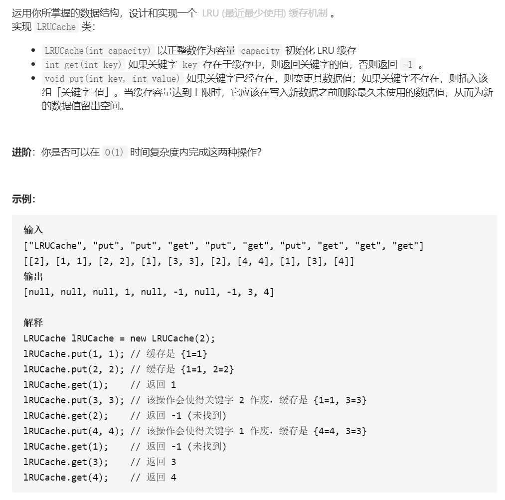

思路：哈希表加双向链表

- 题目意思就是实现一个键值对的机制，根据key得到value，添加key和value，因为要实现最近最少用的淘汰机制，还要O（1）的时间复杂度内完成，所以不能用hash表

- **双向链表java没有直接提供这种数据结构，需要自己写一个内部类来实现一个**，一个节点存储两个值，key和value

- 题目要求**O(1)的时间复杂度**完成这个操作，用一个双向链表存储这些键值对，靠近头部的是最近使用的，靠近尾部的是最近未使用的，然后用hash表存储键和对应的在双向链表中位置

- **map里存储的key就是输入的key,value就是双向链表的节点。也就是说实际进行操作的是map，当查询时直接去map查，双向链表是用来淘汰的，当要淘汰的时候直接删除链表最后一个节点，根据删除的返回值再去删除map**

- 小技巧：在双向链表的实现中，使用一个伪头部（dummy head）和伪尾部（dummy tail）标记界限，这样在添加节点和删除节点的时候就不需要检查相邻的节点是否存在，也方便添加删除头尾结点。

- get操作：

  - 如果key不存在返回-1
  - 如果key存在，则key对应节点为最近被使用的结点。通过哈希表定位到它在双向链表中的位置，然后把这个结点移到双向链表的头部，最后返回该结点的值

  

- put操作：

  - 如果key不存在，使用key和value创建一个新节点，在双向链表头部添加该结点，然后将key和该结点加入哈希表。然后判断双向链表的容量是不是超了，超了删除尾结点，并删掉哈希表对应值
  - 如果key存在，先通过哈希表定位，再将对应值更新为value,然后移到链表头部

- LRU需要四个辅助函数，分别是**addFirst将结点放到第一个**；**deleteNode删除一个结点**；moveFirst将节点放到第一个，这个可以调用前两个，先删除再放到第一个；deleteLast删除最后一个，用于内存淘汰，调用deleteNode

- LRU最基础的辅助方法是将节点添加到第一个和删除节点，这样后面一个节点被查了需要移动到第一个节点的话，只需要将这个节点添加到第一个再删除，需要淘汰最后一个节点也直接删除就行

- 注意为了封装特性，类中字段方法除了公共调用的put和get都是私有的

- **链表的作用其实就是为了淘汰，知道要淘汰的是最后一个**。**哈希表负责具体真的查，查一个值后先删除这个值但是不删哈希表，加到第一个表示最近刚刚使用过。但是淘汰一个就要删除了。两个最基础的函数一个是加到头部一个是删除一个节点。**

~~~java
class LRUCache {
    // 自己实现一个双向链表，每个节点存储key和value
    class DListNode{
        int key;
        int value;
        DListNode pre;
        DListNode next;
        public DListNode(){}
        public DListNode(int key, int value){
            this.key = key;
            this.value = value;
        }
    }

    // 定义map头尾节点，容量，大小，具体初始化放到构造函数
    private Map<Integer, DListNode> map;
    private DListNode head;
    private DListNode tail;
    private int capacity;
    private int size;

    public LRUCache(int capacity) {
        map = new HashMap<>();
        head = new DListNode();
        tail = new DListNode();
        head.next = tail;
        tail.pre = head;
        this.capacity = capacity;
        this.size = 0;
    }
    
    // 实际上真正执行查找返回结果的是map，双向链表主要负责的是淘汰
    public int get(int key) {
        DListNode node = map.get(key);
        if (node == null){
            return -1;
        }
        moveToFirst(node);
        return node.value;
    }
    
    public void put(int key, int value) {
        DListNode node = map.get(key);
        if (node == null){
            DListNode newNode = new DListNode(key, value);
            map.put(key, newNode);
            addFirst(newNode);
            size++;
            if (size > capacity){
                DListNode tail = removeTail();
                map.remove(tail.key);
                size--;
            }
        } else {
            node.value = value;
            moveToFirst(node);
        }
    }

    // 将一个节点添加到第一个,可用于添加一个新节点到第一个，也可用于更改一个节点后将其删除再添加到第一个
    // 只加
    private void addFirst(DListNode node){
        node.next = head.next;
        node.pre = head;
        head.next.pre = node;
        head.next = node;
    }

    // 删除一个节点，可以用于淘汰最后一个节点或者更改一个节点后将其删除再加到第一个
    // 只删
    private void removeNode(DListNode node){
        node.pre.next = node.next;
        node.next.pre = node.pre;
    }

    // 将一个已经存在的节点移动到第一个
    // 删再加第一属于移动
    private void moveToFirst(DListNode node){
        removeNode(node);
        addFirst(node);
    }

    // 淘汰尾部节点，因为还要依此删除hash表中节点，所以要有一个返回值
    // 删尾，属于淘汰
    private DListNode removeTail(){
        DListNode res = tail.pre;
        removeNode(res);
        return res;
    }
}

/**
 * Your LRUCache object will be instantiated and called as such:
 * LRUCache obj = new LRUCache(capacity);
 * int param_1 = obj.get(key);
 * obj.put(key,value);
 */
~~~

### 18、删除链表中重复的元素（37）

leetcode 83

存在一个**按升序排列的链表**，给你这个链表的头节点 `head` ，请你删除所有重复的元素，使每个元素 **只出现一次** 。

返回同样按升序排列的结果链表。


思路：

- 因为题目所给链表是按升序排列的，所以相等元素是相邻的，所以用一个指针指向链表头结点，然后一次遍历判断这个节点和它下一个节点是否相等
- 小细节，while循环的条件是cur.next != null,不然cur.next.val会报空指针异常，cur.next.next可以把null赋值给cur.next，但是null是不存在val的
- 注意cur = cur.next;是放到else里面的，只有不相等了才执行，因为你不知道后面几个重复的

~~~java
class Solution {
    public ListNode deleteDuplicates(ListNode head) {
        if (head == null){
            return null;
        }

        ListNode cur = head;
        while (cur.next != null){
            // 如果当前值和下一个相等跳过下一个，当前cur是不动的，直到下一个while循环，不相等了才移动到下一个
            // 因为要求cur.next.val，即使不是跳两步
            if (cur.val == cur.next.val){
                cur.next = cur.next.next;
            } else {
                cur = cur.next;
            }
        }
        return head;
    }
}
~~~

### 19、删除链表中重复的元素2 （36）

leetcode 82

存在一个按**升序排列的链表**，给你这个链表的头节点 head ，请你删除链表中所有存在数字重复情况的节点，**只保留原始链表中 没有重复出现 的数字。**返回同样按升序排列的结果链表。

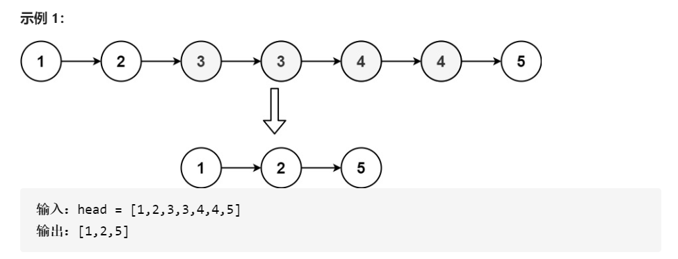

思路：

- 这题在上一题的基础上不保留任何出现重复的数字，可以考虑在之前新加一个节点，**把cur放在前一个这样相等的话一次跳两步就行了**
- 问题来了，不能简单每次都跳两步就完事了，如果是奇数个相同的数呢？如果是偶数个呢？要分情况讨论，很麻烦。所以有个小技巧，在确定出现重复之后，记录下这个重复的数字，然后while循环，不断往下遍历一个，如果相等就直接跳过一个，最终都跳过去。这样逻辑简明很多
- 上一题每次只跳一个所以不存在这种奇偶的问题，直接跳就完事
- 使用哑节点，

~~~java
class Solution {
    public ListNode deleteDuplicates(ListNode head) {
        if (head == null){
            return head;
        }

        ListNode dummy = new ListNode(0);
        dummy.next = head;
        ListNode cur = dummy;
        while (cur.next != null && cur.next.next != null){
            // 确定出现重复了，但不确定重复几次
            if (cur.next.val == cur.next.next.val){
                // 记录下重复值是多少
                int x = cur.next.val;
                // 接下来只要和记录的相等就一直while循环跳过下去
                while (cur.next != null && cur.next.val == x){
                    cur.next = cur.next.next;
                }
            } else {
                cur = cur.next;
            }
        }
        return dummy.next;
    }
}
~~~

### 20、两两交换链表中的节点（25）

LeetCode 24

给定一个链表，两两交换其中相邻的节点，并返回交换后的链表。

**你不能只是单纯的改变节点内部的值**，而是需要实际的进行节点交换。

**示例 1：**


~~~
输入：head = [1,2,3,4]
输出：[2,1,4,3]
~~~

思路：

- 创建哑节点，方便最后返回结果
- 令temp表示当前到达的节点，每次更换后面两个节点的位置

~~~java
class Solution {
    public ListNode swapPairs(ListNode head) {
        ListNode dummy = new ListNode(0);
        dummy.next = head;
        ListNode temp = dummy;
		
        // 条件要确保下两个节点都要存在
        while (temp.next != null && temp.next.next != null){
            // 方便后面表示
            ListNode node1 = temp.next;
            ListNode node2 = temp.next.next;
            
            temp.next = node2;
            node1.next = node2.next;
            node2.next = node1;
            temp = node1;
        }
        return dummy.next;
    }
}
~~~

### 21、奇偶链表（21）

LeetCode 328

给定一个单链表，把所有的奇数节点和偶数节点分别排在一起。请注意，这里的奇数节点和偶数节点指的是节点编号的奇偶性，而不是节点的值的奇偶性。从1开始算奇偶

示例 1:

~~~
输入: 1->2->3->4->5->NULL
输出: 1->3->5->2->4->NULL
~~~

**说明:**

- 应当保持奇数节点和偶数节点的相对顺序。
- 链表的第一个节点视为奇数节点，第二个节点视为偶数节点，以此类推。

思路：

- 翻译翻译，下标从1开始算，第一个节点为奇数，第二个为偶数。将奇数链表和偶数链表拆分成两个链表，然后将偶数下标链表放到奇数链表后面
- 为了最后将偶数链表拼接到奇数链表方便，需要新建一个节点保存偶数链表第一个节点

~~~java
class Solution {
    public ListNode oddEvenList(ListNode head) {
        if (head == null){
            return null;
        }

        // 记录下偶数头
        ListNode evenHead = head.next;
        ListNode odd = head, even = head.next;
        // 当链表个数为偶数时，even正好到最后一个，如果没有even.next ！= null，就会进入下一轮循环，odd就为null，这样在下面求odd.next就会报空指针异常
        // 当链表个数为奇数时，even正好为null，直接结束
        // 所以这种一次跳两步的循环条件要多一个。.next != null
        while (even != null && even.next != null){
            odd.next = even.next;
            odd = odd.next;

            even.next = odd.next;
            even = even.next;
        }
        odd.next = evenHead;
        return head;
    }
}
~~~

### 22、旋转链表（14）

给你一个链表的头节点 `head` ，旋转链表，将链表每个节点向右移动 `k` 个位置。如果链表到尾就移到开头。

**提示：**

- 链表中节点的数目在范围 `[0, 500]` 内
- `-100 <= Node.val <= 100`
- `0 <= k <= 2 * 109`

**示例 1：**

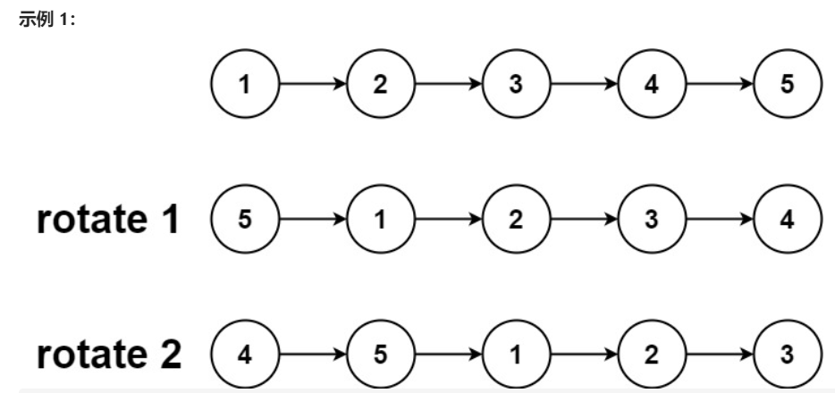

```
输入：head = [1,2,3,4,5], k = 2
输出：[4,5,1,2,3]
```

思路：

- 因为向右移动移动到尾就会移动到开头，所以可以**将链表首尾相接**，模拟移动过程，**然后找出移动过后尾结点在哪**，然后断开连接
- 成环后，新的链表结尾在原来的头结点往后 len - 1 - k % len

~~~java
class Solution {
    public ListNode rotateRight(ListNode head, int k) {
        if (head == null || head.next == null || k == 0){
            return head;
        }

        // 尾首相接
        ListNode tail = head;
        int len = 1;
        while (tail.next != null){
            tail = tail.next;
            len++;
        }
        tail.next = head;

        // 找出断开连接处，断开连接
        ListNode newTail = head;
        for (int i = 0; i < len - 1 - k % len; i++){
            newTail = newTail.next;
        }
        ListNode newHead = newTail.next;
        newTail.next = null;

        return newHead;
    }
}
~~~

### 23、排序奇升偶降链表（补充题，字节出现多次）

​	给定一个奇数位升序，偶数位降序的链表，将其重新排序。下标从1开始

~~~
输入: 1->8->3->6->5->4->7->2->NULL
输出: 1->2->3->4->5->6->7->8->NULL
~~~

思路：

- 按奇偶拆分链表,与上面奇偶链表稍有不同，上面奇偶链表是将链表拆分然后合成一个链表，我这里拆分后不需要合并，函数返回偶数链表的头结点就行了，奇数链表头结点我已经有了
- 反转偶链表
- 合并两个有序链表

~~~java
public class Solution0 {
    public static void main(String[] args) {
        ListNode l1 = new ListNode(1);
        ListNode l2 = new ListNode(4);
        ListNode l3 = new ListNode(3);
        ListNode l4 = new ListNode(2);
        ListNode l5 = new ListNode(5);
        l1.next = l2;
        l2.next = l3;
        l3.next = l4;
        l4.next = l5;
        ListNode res = orderList(l1);

        while (l1 != null){
            System.out.println(l1.val);
            l1 = l1.next;
        }
    }

    // 整合下面三个方法
    public static ListNode orderList(ListNode head){
        if (head == null){
            return null;
        }
        ListNode evenHead = evenOddList(head);
        ListNode newEvenOrder = reverse(evenHead);
        return mergeTwoLists(head, newEvenOrder);

    }


    // 拆分奇偶链表，返回偶数链表的头结点就行
    public static ListNode evenOddList(ListNode head){
        if (head == null){
            return null;
        }

        ListNode odd = head, even = head.next;
        ListNode evenHead = head.next;

        while (even != null && even.next != null){
            odd.next = even.next;
            odd = odd.next;

            even.next = odd.next;
            even = even.next;
        }
        return evenHead;
    }

    // 反转链表
    public static ListNode reverse(ListNode head){
        ListNode pre = null;
        ListNode cur = head;

        while (cur != null){
            ListNode next = cur.next;
            cur.next = pre;
            pre = cur;
            cur = next;
        }
        return pre;
    }

    // 合并两个有序链表
    public static ListNode mergeTwoLists(ListNode l1, ListNode l2){
        ListNode dummy = new ListNode(0);
        ListNode cur = dummy;

        while (l1 != null && l2 != null){
            if (l1.val < l2.val){
                cur.next = l1;
                l1 = l1.next;
                cur = cur.next;
            } else {
                cur.next = l2;
                l2 = l2.next;
                cur = cur.next;
            }
        }
        cur.next = l1 == null ? l2 : l1;
        return dummy.next;
    }
}
~~~

### 24、分隔链表（12）

​	给你一个链表的头节点 head 和一个特定值 x ，请你对链表进行分隔，使得所有 小于 x 的节点都出现在 大于或等于 x 的节点之前。

你应当保留 两个分区中每个节点的初始相对位置。

**示例 1：**


~~~
输入：head = [1,4,3,2,5,2], x = 3
输出：[1,2,2,4,3,5]
~~~

思路：

- 题目意思就是将所有小于给定值的出现在链表左边，所有大于等于给定值的在链表右边，这两部分还分别要保持原来链表的顺序
- 我们只要维护两个链表，一个保存较小值，一个保存大于等于值，最后将这两个链表连起来就行
- 构建两个哑结点，小的哑结点方便最后返回最终结果，大的哑结点方便最后小的和大的相接方便取到大的开头
- 注意，最后要将large的next置为空，因为如果我们复用的是原链表的节点，如果large不是最后一个，那么最后一个large可能会有它自己的指向

~~~java
class Solution {
    public ListNode partition(ListNode head, int x) {
        ListNode dummySmall = new ListNode(0);
        ListNode dummyLarge = new ListNode(0);
        ListNode small = dummySmall;
        ListNode large = dummyLarge;

        while (head != null){
            if (head.val < x){
                small.next = head;
                small = small.next;
            } else {
                large.next = head;
                large = large.next;
            }
            head = head.next;
        }
        // 注意large要断开连接，因为不是最后一个它会有自己的指向
        large.next = null;
        small.next = dummyLarge.next;
        return dummySmall.next;
    }
}
~~~


## 数组

### 1、扑克牌中的顺子（9）

剑指offer 61

​	从扑克牌中随机抽5张牌，判断是不是一个顺子，即这**5张牌是不是连续的**。2～10为数字本身，A为1，J为11，Q为12，K为13，而**大、小王为 0 ，可以看成任意数字**。A 不能视为 14。

​	

**示例 2:**

```
输入: [0,0,1,2,5]
输出: True
```

思路：

- 翻译成数组其实就是，数组值范围是0到13，0可以代表任何数字，判断输入的数组是不是连续的五个数

- 最重要两个条件，一个是连续，一个是大小王看成任意数字，所以五张牌只要保证两点即可，**一个是没有重复一个是最大值减去最小值小于5**
- 如果有大小王，用大小王代替缺失的数字就行了
- 遍历五张牌，遇到大小王跳过，用hashset判重，记录下最大最小值，如果最后最大最小值小于5就可以确定可以构成顺子

~~~java
class Solution {
    public boolean isStraight(int[] nums) {
        Set<Integer> repeat = new HashSet<>();
        int max = 0, min = 14;
        for(int num : nums) {
            if(num == 0) continue; // 跳过大小王
            max = Math.max(max, num); // 最大牌
            min = Math.min(min, num); // 最小牌
            if(repeat.contains(num)) return false; // 若有重复，提前返回 false
            repeat.add(num); // 添加此牌至 Set
        }
        return max - min < 5; // 最大牌 - 最小牌 < 5 则可构成顺子
    }
}
~~~

### 2、最长重复子数组（46）

LeetCode 718

给两个整数数组 `A` 和 `B` ，返回两个数组中公共的、长度最长的子数组的长度。

**提示：**

- `1 <= len(A), len(B) <= 1000`
- `0 <= A[i], B[i] < 100`

**示例：**

```
输入
A: [1,2,3,2,1]
B: [3,2,1,4,7]
输出：3
解释：
长度最长的公共子数组是 [3, 2, 1] 。
```

思路：滑动窗口

- 一句话总结：两次都是两个数组固定开头对齐，一次固定数组1，向右移动数组2，一次固定数组2，向右移动数组1.
- maxLength函数负责指定两个数组起点，搜索len长度，计算出重复子数组长度
- 首先固定第一个数组不动，第二个数组一开始起点和第一个一样，始终以0开始沿着第一个数组移动，维护一个长度len记录它们重合的部分；把这个重合部分的长度交给maxLength去搜索
- 注意这个重合部分很有讲究，有两种情况
  - 要么移动的数组长度大于第一个，每次重合长度减一
  - 要么移动数组的长度小于第一个，每次重合长度不变，直到移动到边界再减一
- 移动两次，一次固定数组1，数组2和数组1开头重合，然后数组2向右移动直到脱离；一次固定数组2，数组1和数组2开头重合，数组1向右移动直到脱离；这样可以遍历所有情况，其实就相当于一个数组既向左移又向右移
- 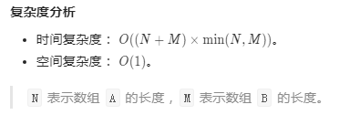

~~~java
class Solution {
    public int findLength(int[] nums1, int[] nums2) {
        int m = nums1.length, n = nums2.length;
        int res = 0;

        //模拟移动mums2，nums1不动，nums2不断向右移
        //nums2每右移一次，重合的地方就少一个，所以len每次要减1
        //有可能nums2的长度本来就很小，所以每次重合的长度就为nums2的长度，这个也要考虑，直到nums2出nums1的时候才会比他的长度再小
        for(int i = 0; i < m; i++){
            int len = Math.min(n,m-i);
            int maxLen = maxLength(nums1, nums2, i, 0, len);
            res = Math.max(res,maxLen);
        }
		//for循环的范围是不动的那个数组长度
        for(int i = 0; i < n; i++){
            int len = Math.min(m,n-i);
            int maxLen = maxLength(nums1,nums2,0,i,len);
            res = Math.max(res,maxLen);
        }
        return res;
    }

    //这个函数功能是判断两个数组以start1和start2为起点，开始往下搜索len个看看有没有重复的
    public int maxLength(int[] nums1, int[] nums2, int start1, int start2, int len){
        int maxLen = 0, k = 0;
        for(int i = 0; i < len; i++){
            if(nums1[start1 + i] == nums2[start2 + i]){
                k++;
            }else{
                k = 0;
            }
            maxLen = Math.max(maxLen,k);
        }
        return maxLen;
    }
}
~~~

### 3、合并两个有序数组（93）

LeetCode 88

给你**两个有序整数数组** `nums1` 和 `nums2`，**请你将 `nums2` 合并到 `nums1`** 中*，*使 `nums1` 成为一个有序数组。

初始化 nums1 和 nums2 的元素数量分别为 m 和 n 。你可以假设 nums1 的空间大小等于 m + n，这样它就有足够的空间保存来自 nums2 的元素。

**示例 1：**

~~~java
输入：nums1 = [1,2,3,0,0,0], m = 3, nums2 = [2,5,6], n = 3
输出：[1,2,2,3,5,6]
~~~

思路：**逆向双指针**

- 题目意思就是将数组2合并到数组1里面，数组1预留了空间给数组1
- 比较插入数组1要从后往前插，不然会覆盖原本数组1的内容

- 这种做法避免了如果条件为同时大于等于0，需要将剩下的整个加入另一个的操作
- 时间复杂度O(m + n),空间复杂度O(1)

~~~java
class Solution {
    public void merge(int[] nums1, int m, int[] nums2, int n) {
        int p1 = m - 1, p2 = n - 1;
        int tail = m + n - 1;
        int cur;

        while(p1 >= 0 || p2 >= 0){
            if(p1 == -1){
                nums1[tail--] = nums2[p2--];
            }else if(p2 == -1){
                nums1[tail--] = nums1[p1--];
            }else if(nums1[p1] > nums2[p2]){
                nums1[tail--] = nums1[p1--];
            }else{
                nums1[tail--] = nums2[p2--];
            }
        }
    }
}
~~~

### 4、两数之和（118）

leetcode 01

给定一个整数数组 nums 和一个整数目标值 target，请你在该数组中找出 和为目标值 的那 两个 整数，并返回它们的数组下标。

你可以假设每种输入只会对应一个答案。但是，数组中同一个元素不能使用两遍。

你可以按任意顺序返回答案。2 <= nums.length <= 103

~~~java
示例 1：
输入：nums = [2,7,11,15], target = 9
输出：[0,1]
解释：因为 nums[0] + nums[1] == 9 ，返回 [0, 1] 。
~~~

思路：

- 第一时间想到用两个for循环枚举暴力解法,时间复杂度O(n^2)。但是可以用空间换时间
- 在一次遍历中，用一个HashMap保存数组中各个元素，key为值，value为数组下标，添加过程中如发现哈希表中存在target-当前遍历值，返回其下标
- 时间复杂度O(n)，因为map找值时间复杂度O(1)
- 空间复杂度O(n)

~~~java
class Solution {
    public int[] twoSum(int[] nums, int target) {
        HashMap<Integer,Integer> map = new HashMap<>();
        for(int i = 0; i < nums.length; i++){
            if(map.containsKey(target - nums[i]))
                return new int[]{map.get(target - nums[i]),i};
            map.put(nums[i], i);
        }
        return new int[0];
    }
}
~~~

### 5、数组中的逆序对（20）

剑指offer 51

在数组中的两个数字，如果前面一个数字大于后面的数字，则这两个数字组成一个逆序对。输入一个数组，求出这个数组中的逆序对的总数。

**示例 1:**

~~~java
输入: [7,5,6,4]
输出: 5
~~~

思路：

- 归并排序的合并阶段就是合并两个排序数组，每当遇到左数组的当前元素大于右数组的当前元素，意味着从左数组当前元素开始往后的所有元素与右数组的这个元素构成了逆序对
- 所以只需要在归并排序的基础上加一个计算左数组剩余有多少元素就行了

~~~java
class Solution {
    int count = 0;
    public int reversePairs(int[] nums) {
        if(nums.length < 2) return 0;
       mergeSort(nums, 0, nums.length - 1);
       return count;
    }
    
    public void mergeSort(int[] nums, int left, int right){
        if(left == right) return;
        int mid = left + (right - left) / 2;
        mergeSort(nums,left,mid);
        mergeSort(nums,mid + 1, right);
        merge(nums,left,mid,right);
    }

    public void merge(int[] nums, int left, int mid, int right){
        int[] leftArray = new int[mid - left + 1];
        int[] rightArray = new int[right - mid];

        for(int i = 0; i < mid - left + 1; i++){
            leftArray[i] = nums[left + i];
        }

        for(int i = 0; i < right - mid; i++){
            rightArray[i] = nums[mid + 1 + i];
        }

        int i = 0, j = 0;
        int k = left;

        while(i < mid - left + 1 && j < right - mid){
            if(leftArray[i] <= rightArray[j]){
                nums[k++] = leftArray[i++];
            }else{
                nums[k++] = rightArray[j++];
                count += mid - left + 1 - i;
            }
        }

        while (i < mid - left + 1){
            nums[k++] = leftArray[i++];
        }

        while(j < right - mid){
            nums[k++] = rightArray[j++];
        }
    }
}
~~~

### 6、合并区间（44）

Leetcode 56，面试笔试高频题

以数组 intervals 表示若干个区间的集合，其中单个区间为 intervals[i] = [starti, endi] 。请你合并所有重叠的区间，并返回一个不重叠的区间数组，该数组需恰好覆盖输入中的所有区间。

**示例 1：**

~~~
输入：intervals = [[1,3],[2,6],[8,10],[15,18]]
输出：[[1,6],[8,10],[15,18]]
解释：区间 [1,3] 和 [2,6] 重叠, 将它们合并为 [1,6].
~~~

思路：

- 输入是一个乱序的二维数组，为了能够合并区间，按每个数组区间的第一个元素对数组进行排序，**排序后可合并的区间一定是连续的**，比如下图的蓝黄绿


- 数组排序传入一个Comparator对象，重写compare方法，可以用lambda表达式简化
- 遍历intervals数组，如果当前遍历区间的下一个区间的左端点小于等于当前区间的右端点，那么就代表可以合并，比较最右端点谁大

- 时间复杂度O(nlogn),因为除了排序只对数组进行了一次线性扫描
- 空间复杂度O(logn)存储答案外排序用

~~~java
class Solution {
    public int[][] merge(int[][] intervals) {
        //因为不知道有多少个区间，所以用集合存储
        List<int[]> res = new ArrayList<>();
        if (intervals.length == 0 || intervals == null) return res.toArray(new int[0][]);
        // 对起点终点进行排序
        Arrays.sort(intervals, (a, b) -> a[0] - b[0]);
        int i = 0;
        while (i < intervals.length) {
            int left = intervals[i][0];
            int right = intervals[i][1];
            // 如果有重叠，循环判断哪个起点满足条件，因为排序后重叠的可能有多个，所以要用while不能用if
            while (i < intervals.length - 1 && intervals[i + 1][0] <= right) {
                i++;
                right = Math.max(right, intervals[i][1]);
            }
            // 将现在的区间放进res里面
            res.add(new int[]{left, right});
            // 接着判断下一个区间
            i++;
        }
        return res.toArray(new int[0][]);
    }
}
~~~

### 7、寻找数组中超过一半的数字（44）

LeetCode 169 剑指offer 39

数组中有一个数字出现的次数超过数组长度的一半，请找出这个数字。你可以假设数组是非空的，并且给定的数组总是存在多数元素。

**示例 1:**

~~~java
输入: [1, 2, 3, 2, 2, 2, 5, 4, 2]
输出: 2
~~~

思路：

- 投票法
- 设众数票数+1非众数票数减一，那么数组所有数的和一定大于0
- 若数组前a个数票数和为0，那么剩下的n-a票数肯定也是大于0的，即后n-1个数的众数也是一样的，这样每当票数为0都可以缩小数组的搜索范围
- 从头到尾遍历，先以第一个数作为众数，后续遇到相同值票数加一遇到不同值票数减一，如果发现票数为0了，缩小数组范围，把前面的去掉，以现在遍历的值作为众数，再次遍历。能始终使得众数票数大于0的那就是最终结果了

~~~java
class Solution {
    public int majorityElement(int[] nums) {
        int votes = 0;
        int res = 0;
        for(int num : nums){
            if(votes == 0) res = num;
            if(num == res) votes++;
            else votes--;
        }
        return res;
    }
}
~~~

### 8、将二维矩阵顺时针旋转90度（38）

Leetcode 48

给定一个 n × n 的二维矩阵 matrix 表示一个图像。请你将图像顺时针旋转 90 度。

你必须在 **原地 旋转图像**，这意味着你需要直接修改输入的二维矩阵。请不要 使用另一个矩阵来旋转图像。**空间复杂度要求O（1）**

**示例 1：**


~~~
输入：matrix = [[1,2,3],[4,5,6],[7,8,9]]
输出：[[7,4,1],[8,5,2],[9,6,3]]
~~~

思路：

- 观察图像可以发现，旋转90度后，第一行在倒数第一列，第二行在倒数第二列。
- 可以得到规律matrix[row] [col]在旋转后新位置为matrix[col] [n -  row - 1]
- 所以最简单的方法就是新建一个临时数组，用于保存旋转后位置，旋转完再复制到原数组，但是空间复杂度O(n^2)
- 有一种方法，原地修改数组，就是利用对原数组两次翻转代替旋转
- 先对原数组沿水平轴翻转，再对数组沿主对角线翻转得到的就是顺时针旋转90度
- 时间复杂度O(n^2)，空间复杂度O(1)

~~~java
class Solution {
    public void rotate(int[][] matrix) {
        int n = matrix.length;
        // 水平翻转
        for (int i = 0; i < n / 2; ++i) {
            for (int j = 0; j < n; ++j) {
                int temp = matrix[i][j];
                matrix[i][j] = matrix[n - i - 1][j];
                matrix[n - i - 1][j] = temp;
            }
        }
        // 主对角线翻转
        for (int i = 0; i < n; ++i) {
            for (int j = 0; j < i; ++j) {
                int temp = matrix[i][j];
                matrix[i][j] = matrix[j][i];
                matrix[j][i] = temp;
            }
        }
    }
}

~~~

### 9、螺旋矩阵、顺时针打印矩阵（67）

LeetCode 54 剑指offer 29

给你一个 `m` 行 `n` 列的矩阵 `matrix` ，请按照 **顺时针螺旋顺序** ，返回矩阵中的所有元素。

**示例 1：**


~~~
输入：matrix = [[1,2,3],[4,5,6],[7,8,9]]
输出：[1,2,3,6,9,8,7,4,5]
~~~

思路：

- 本题是要将二维数组从外到内，顺时针打印

- 设立上下左右四条边界作为遍历时候的边界
- 因为不知道要遍历多少轮，使用while(true)遍历，里面四个for循环，分别从左到右，从上到下，从右到左，从下至上遍历
- 只要这四个for循环遍历完再往下缩小边界范围不行了，也就是遍历完了就break
- 注意像if(++top>bottom) break;是这题灵魂，比如从左往右，这句话既判断是否打印完，又给top+了1，防止重复算上边界四个角的值.
- 时间复杂度O(mn),空间复杂度O(1)

~~~java
class Solution {
    public List<Integer> spiralOrder(int[][] matrix) {
        List<Integer> res = new ArrayList<>();
        if (matrix == null || matrix.length == 0){
            return res;
        }

        int left = 0, right = matrix[0].length - 1, top = 0, bottom = matrix.length - 1;
        while(true){
            // 从左到右
            for (int i = left; i <= right; i++){
                res.add(matrix[top][i]);
            }
            if (++top > bottom){
                break;
            }

            //从上到下
            for (int i = top; i <= bottom; i++){
                res.add(matrix[i][right]);
            }
            if(--right < left){
                break;
            }

            //从右到左
            for (int i = right; i >= left; i--){
                res.add(matrix[bottom][i]);
            }
            if (--bottom < top){
                break;
            }

            //从下到上
            for(int i = bottom; i >= top; i--){
                res.add(matrix[i][left]);
            }
            if(++left > right){
                break;
            }
        }
        return res;
    }
}
~~~

### 9、螺旋矩阵二（25）

LeetCode 59

给你一个正整数 `n` ，生成一个包含 `1` 到 `n2` 所有元素，且元素按顺时针顺序螺旋排列的 `n x n` 正方形矩阵 `matrix` 。

**提示：**

- `1 <= n <= 20`

**示例 1：**


```
输入：n = 3
输出：[[1,2,3],[8,9,4],[7,6,5]]
```

思路：

- 本题意思是生成1到n的平方的数，按照螺旋矩阵顺序，从外到内，顺时针填入这个n*n的矩阵
- 还是定义四条边界，上下左右
- 然后在while循环里面依次填入，注意填完一行要++

~~~java
class Solution {
    public int[][] generateMatrix(int n) {
        int[][] res = new int[n][n];
        int left = 0, right = n - 1, top = 0, bottom = n - 1;
        int index = 1;

        while (index <= n * n){
            for (int i = left; i <= right; i++){
                res[top][i] = index++;
            }
            top++;

            for (int i = top; i <= bottom; i++){
                res[i][right] = index++;
            }
            right--;

            for (int i = right; i >= left; i--){
                res[bottom][i] = index++;
            }
            bottom--;

            for (int i = bottom; i >= top; i--){
                res[i][left] = index++;
            }
            left++;
        }
        return res;
    }
}
~~~


### 10、下一个排列（41）

Leetcode 31

实现获取 下一个排列 的函数，算法需要将给定数字序列重新排列成字典序中下一个更大的排列。

如果不存在下一个更大的排列，则将数字重新排列成最小的排列（即升序排列）。

必须 原地 修改，只允许使用额外常数空间。

以 `1,2,3,4,5,6` 为例，其排列依次为：

~~~
123456
123465
123546
...
654321
~~~

可以看到有这样的关系：`123456 < 123465 < 123546 < ... < 654321`。

**示例 1：**

~~~
输入：nums = [1,2,3]
输出：[1,3,2]
~~~

**示例 2：**

```
输入：nums = [3,2,1]
输出：[1,2,3]
```

思路：

- 题目意思是找在字典顺序中下一个排列，翻译翻译就是将数组中的数字重新排列，**找出下一个排列组合比当前数大的并且是最小的**
- 希望下一个数比当前数大很简单，**只要将后面的大数与前面的小数交换即可**，本题的难点在于不光要大，还要找到下一个最小的排列
- 因为要找后面比前面大的数，如果都是降序那后面没有比前面大的数，所以有了升序才可能有后面比前面大的数存在
- **从后往前找到第一对相邻的升序元素，那么后面肯定是降序的**
- **从后往前找第一个大于升序元素左边那个的，然后交换**
- **交换后需要将后面的所有数重置为升序这样才是最小的**
- 如果不存在更大的下一个排列比如654321，那样第一个while找相邻升序时i就会变成-1，这样还是直接翻转返回最小的排列，其实题目这样规定也是为了我们最后返回方便，不用另外处理了
- 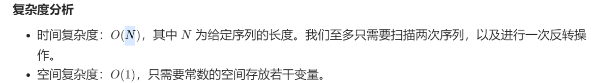

~~~java
class Solution {
    public void nextPermutation(int[] nums) {
        int i = nums.length - 2;
        // 从后往前找相邻递增
        while (i >= 0 && nums[i] >= nums[i + 1]){
            i--;
        }
        // 从后往前找第一个比nums[i]大的，然后交换
        if (i >= 0){
            int j = nums.length - 1;
            while (j >= 0 && nums[i] >= nums[j]){
                j--;
            }
            swap(nums, i, j);
        }
        // 将后面所有数字变为升序，这样才是最小的
        reverse(nums, i + 1);
    }

    private void swap(int[] nums, int i, int j){
        int temp = nums[i];
        nums[i] = nums[j];
        nums[j] = temp;
    }

    private void reverse(int[] nums, int start){
        int left = start, right = nums.length - 1;
        while (left < right){
            swap(nums, left, right);
            left++;
            right--;
        }
    }
}
~~~

### 11、二维数组中判断目标数字在不在里面（33）

LeetCode 240 剑指offer 04

编写一个高效的算法来搜索 m x n 矩阵 matrix 中的一个目标值 target 。该矩阵具有以下特性：

- 每行的元素从左到右升序排列。
- 每列的元素从上到下升序排列。

判断数组中是否存在这个数。


**示例 1：**

~~~java
输入：matrix = [[1,4,7,11,15],[2,5,8,12,19],[3,6,9,16,22],[10,13,14,17,24],[18,21,23,26,30]], target = 5
输出：true
~~~

思路：

- 从左下角和右上角来看，往两边要么减要么增，有点类似于二叉搜索树，所以可以从左下角或者右上角出发
- 比如从左下角出发，大于目标值行-1，小于目标值列+1
- 时间复杂度O(m+n)最多遍历m+n次，空间复杂度O(1)

~~~java
class Solution {
    public boolean searchMatrix(int[][] matrix, int target) {
        int i = matrix.length - 1;
        int j = 0;

        while(i >= 0 && j < matrix[0].length){
            if(matrix[i][j] > target){
                i--;
            }else if(matrix[i][j] < target){
                j++;
            }else{
                return true;
            }
        }
        return false;
    }
}
~~~

### 12、数组中重复的数字（7）

剑指offer 03

找出数组中重复的数字。在一个长度为 n 的数组 nums 里的**所有数字都在 0～n-1 的范围内**。不知道有几个数字重复，也不知道每个数字重复了几次。**找出任意一个重复的数字。**2 <= n <= 100000

**示例 1：**

~~~
输入：
[2, 3, 1, 0, 2, 5, 3]
输出：2 或 3 
~~~

思路：

- 把所有条件都用上的才是最优解！

- 数组长度为n，所有数字又都在0到n-1的范围内，那么如果数组中没有重复数字的话，一定是下标和数值相等，也就是nums[i] = i
- 那么如果数组中有重复数字，必定不符合一个萝卜一个坑。
- 将数组中元素从下标0开始移动到它对应下标位置，即nums[i]移动到nums[nums[i]]
- 不断移动，如果数组中有重复的，交换过程一定会发现要交换的和现在的相等，交换后还是一样
- 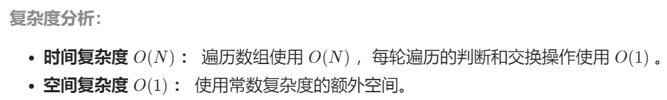

~~~java
class Solution {
    public int findRepeatNumber(int[] nums) {
        for(int i = 0;i<nums.length;i++){
            //只有不符合当前值等于下标才要交换，外面还要套一层while或if
            while(nums[i] != i){
                if(nums[i] == nums[nums[i]]){
                    return nums[i];
                }

                int temp = nums[i];
                nums[i] = nums[temp];
                nums[temp] = temp;
            }
        }
       return -1;
    }
}
~~~

###  13、最大数（28）

Leetcode 179

给定一组非负整数 `nums`，重新排列每个数的顺序（每个数不可拆分）使之组成一个最大的整数。

**注意：**输出结果可能非常大，所以你需要**返回一个字符串**而不是整数。

**示例 1：**

~~~java
输入：nums = [10,2]
输出："210"
~~~

思路：

- 将int类型数组转换成String类型数组
- 为Arrays.sort方法添加比较器，注意比较器规则是，如果返回一个正数就交换a和b，所以比较器return a - b就是从小到大排，return b - a就是从大到小排
- 比较器里面比较字符串大小用a.cpmpareTo方法，因为String类型实现了Comparable接口，重写了compareTo方法，这个compareTo方法比较的是两个字符串从头开始的Ascll码大小

~~~java
 System.out.println("1".compareTo("0"));// 输出1
~~~

- return (b+a).compareTo(a+b)
- 注意最后特判一下前导0的情况，比如[0,0]不能最后返回00，最后如果数组中第一个为0，那说明后面也是0，直接返回0即可

~~~java
class Solution {
    public String largestNumber(int[] nums) {
        int len = nums.length;
        String[] numToWord = new String[len];

        for (int i = 0; i < len; i++){
            numToWord[i] = String.valueOf(nums[i]);
        }

        Arrays.sort(numToWord, (a, b) -> {
            return (b + a).compareTo(a + b);
        });

        if (numToWord[0].equals("0")){
            return "0";
        }

        StringBuilder sb = new StringBuilder();
        for (int i = 0; i < len; i++){
            sb.append(numToWord[i]);
        }
        return sb.toString();
    }
}
~~~

### 14、最小数（10）

输入一个非负整数数组，把数组里所有数字拼接起来排成一个数，打印能拼接出的所有数字中最小的一个。

**示例 1:**

~~~java
输入: [10,2]
输出: "102"
~~~

思路：

- 和上题思路基本一样，区别在于排序的时候是return (a + b).compareTo(b + a)正序排
- 前导0，求最大数的时候如果开头是0就直接返回0，因为后面肯定也是0
- 求最小数的时候如果开头是0直接跳过即可

~~~java
class Solution {
    public String minNumber(int[] nums) {
        int len = nums.length;
        String[] numToWord = new String[len];

        for (int i = 0; i < len; i++){
            numToWord[i] = String.valueOf(nums[i]);
        }

        Arrays.sort(numToWord, (a, b) -> {
            return (a + b).compareTo(b + a);
        });


        StringBuilder sb = new StringBuilder();
        for (int i = 0; i < len; i++){
            if (numToWord[i] == "0"){
                continue;
            }
            sb.append(numToWord[i]);
        }
        return sb.toString();
    }
}
~~~

### 15、第一个缺失的正整数（36）

Leetcode 102

给你一个未排序的整数数组 `nums` ，请你找出其中**没有出现的最小的正整数**，也就是从1开始最小的正整数。

**示例 1：**

~~~
输入：nums = [1,2,0]
输出：3
~~~

**示例 2：**

~~~
输入：nums = [3,4,-1,1]
输出：2
~~~

思路：

- 想到的第一种简单的做法就是，将所有数存到哈希表里面，然后从1开始不断枚举看看在不在哈希表里面，如果不在说明这就是第一个缺失的正整数，空间复杂度O（n）
- 想想要要常数时间复杂度就不能用哈希表
- 对于一个长度为N的数组，第一个缺失的正整数的范围只可能是1到N+1,因为最极端的情况，数组全是负数，那么第一个缺失的就是1.如果数组就是正好1到N，那么缺失的就是N+1
- **我们只在意数组中1到N的数，可以将所有负数改成一个大于N的数，比如N+1，这样一来数组中所有的数都是正数了，所以我们可以对数组中的数用负号进行标记了**
- 遍历数组中的每个数，这个数可能已经被其他数打了负号标记，所以都取绝对值。拿到数后将数-1对应的下标标记为负数
- 再次遍历数组，下标不为负数的就是第一个缺失的

~~~java
class Solution {
    public int firstMissingPositive(int[] nums) {
        int n = nums.length;
        // 将所有负数变为一个比n大的数，比如n + 1
        for (int i = 0; i < n; i++){
            if (nums[i] <= 0){
                nums[i] = n + 1;
            }
        }

        // 将所有小于n的数对应下标标记为负数，代表是有的
        // 注意取得时候要取绝对值，因为你现在遍历的数可能被之前的标记过为负数了
        for (int i = 0; i < n; i++){
            int num = Math.abs(nums[i]);
            if (num <= n){
                nums[num - 1] = -Math.abs(nums[num - 1]);
            }
        }

        // 我们是从小到大遍历的，遍历到的一个正数的下标+1就是结果
        // 相当于用数组下标作为结果
        for (int i = 0; i < n; i++){
            if (nums[i] > 0){
                return i + 1;
            }
        }
        return n + 1;
    }
}
~~~

### 16、最长连续序列长度（24）

Leetcode 128

给定一个**未排序的整数数组 nums** ，找出**数字连续的最长序列（不要求序列元素在原数组中连续）的长度**。

请你设计并实现时间复杂度为 O(n) 的算法解决此问题。

**提示：**

- `0 <= nums.length <= 105`
- `-109 <= nums[i] <= 109`

**示例 1：**

~~~
输入：nums = [100,4,200,1,3,2]
输出：4
解释：最长数字连续序列是 [1, 2, 3, 4]。它的长度为 4。
~~~

思路：

- 用一个哈希表存储所有数字
- 遍历数组看看有没有以这个为起点开始的连续序列，查找用哈希表查
- 可以优化，每次只枚举连续序列的第一个起点，每次新遍历一个数字为起点时，只要发现它的前一个数字存在于这个哈希表就跳过
- 注意算长度是从1开始算的
- 时间复杂度O(n),外层循环需要 O(n)O(n) 的时间复杂度，只有当一个数是连续序列的第一个数的情况下才会进入内层循环，然后在内层循环中匹配连续序列中的数，因此数组中的每个数只会进入内层循环一次。根据上述分析可知，总时间复杂度为 O(n)
- 空间复杂度为O(n)

~~~java
class Solution {
    public int longestConsecutive(int[] nums) {
        Set<Integer> setNum = new HashSet<>();
        for (int num : nums){
            setNum.add(num);
        }

        int maxLength = 0;
        for (int num : nums){
            if (!setNum.contains(num - 1)){
                int curNum = num;
                int curLenght = 1;

                while (setNum.contains(curNum + 1)){
                    curNum++;
                    curLenght++;
                }
                maxLength = Math.max(maxLength, curLenght);
            }
        }
        return maxLength;
    }
}
~~~


## BFS广度优先

### 1、二叉树的层序遍历（97）

Leetcode 102 剑指offer 32

给你一个二叉树，请你返回其按 **层序遍历** 得到的节点值。 （即逐层地，从左到右访问所有节点）。

 思路：

- 新建一个队列，将根结点加入队列，每取出一个结点将他的左右孩子加入队列，迭代
- 只要队列不为空就一直循环
- 因为每一层的结果要单独放在一个list里面，所以每次迭代前要记录下**这层有多少个结点**，因为会不断往里面加子节点
- 时间复杂度O(n)空间复杂度O(n)

~~~java
class Solution {
    public List<List<Integer>> levelOrder(TreeNode root) {
        List<List<Integer>> res = new ArrayList<>();
        //不能漏
        if(root == null) return res;
        Queue<TreeNode> q = new LinkedList<>();
        q.offer(root);

        while(!q.isEmpty()){
            int n = q.size();
            //每次while循环都是重新开一层
            List<Integer> temp = new ArrayList<>();
            for(int i = 0; i < n; i++){
                TreeNode node = q.poll();
                temp.add(node.val);
                if(node.left != null) q.offer(node.left);
                if(node.right != null) q.offer(node.right);
            }
            res.add(temp);
        }
        return res;
    }
}
~~~

### 2、二叉树的右视图（58）

leetcode 199

给定一棵二叉树，想象自己站在它的右侧，按照从顶部到底部的顺序，返回从右侧所能看到的节点值。

思路：

- 在原来层序遍历的基础上，还是得记每层的长度
- 在for循环里面加一个判断，当遍历到每层size-1就加入结果集
- 时间复杂度O(n)空间复杂度O(n)

~~~java
class Solution {
    public List<Integer> rightSideView(TreeNode root) {
        List<Integer> res = new ArrayList<>();
        if (root == null) {
            return res;
        }
        Queue<TreeNode> queue = new LinkedList<>();
        queue.offer(root);
        while (!queue.isEmpty()) {
            int size = queue.size();
            for (int i = 0; i < size; i++) {
                TreeNode node = queue.poll();
                if (node.left != null) {
                    queue.offer(node.left);
                }
                if (node.right != null) {
                    queue.offer(node.right);
                }
                if (i == size - 1) {  //将当前层的最后一个节点放入结果列表
                    res.add(node.val);
                }
            }
        }
        return res;
    }
}
~~~

### 3、二叉树之字形，锯齿状层序遍历（93）

leetcode 103 剑指offer 32

~~~java
给定一个二叉树，返回其节点值的锯齿形层序遍历。（即先从左往右，再从右往左进行下一层遍历，以此类推，层与层之间交替进行）。

例如：给定二叉树 [3,9,20,null,null,15,7],

    3
   / \
  9  20
    /  \
   15   7
返回锯齿形层序遍历如下：

[
  [3],
  [20,9],
  [15,7]
]
~~~

思路：

- 在原来层序遍历的基础上，添加一个boolean类型的标志位，如果是偶数层就为true,代表从左往右打印，如果为false,代表从右往左打印，每轮循环将这个标志位反转一次
- 添加结果集时使用LinkedList，添加元素时判断一下，如果是偶数层就添加到linkedlist末尾；如果是奇数层就使用头插法加到链表开头就是反序了

~~~java
class Solution {
    public List<List<Integer>> zigzagLevelOrder(TreeNode root) {
        List<List<Integer>> res = new LinkedList<>();
        if(root == null) return res;
        Queue<TreeNode> nodeQueue = new LinkedList<>();
        nodeQueue.offer(root);
        //用一个标志位来判断是偶数层还是奇数层，从0开始偶数层从左到右打印，奇数层从右到左
        boolean isEvenLevel = true;
        
        while(!nodeQueue.isEmpty()){
            LinkedList<Integer> temp = new LinkedList<>();
            int size = nodeQueue.size();
            for(int i = 0; i < size; i++){
                TreeNode node = nodeQueue.poll();
                if(isEvenLevel){
                    temp.add(node.val);
                }else{
                    temp.addFirst(node.val);
                }

                if(node.left != null) nodeQueue.offer(node.left);
                if(node.right != null) nodeQueue.offer(node.right);
            }
            res.add(temp);
            isEvenLevel = ! isEvenLevel;
        }
        return res;
    }
}
~~~

### 4、序列化二叉树（17）

剑指offer 37、LeetCode 297

请实现两个函数，分别用来序列化和反序列化二叉树。

**示例:** 

~~~java
你可以将以下二叉树：

    1
   / \
  2   3
     / \
    4   5

序列化为 "[1,2,3,null,null,4,5]"
~~~

思路：

- 序列化就是将一个二叉树根据层序遍历顺序变成一个字符串，注意普通的层序遍历左右子节点不为空才加入队列，而序列化为空的也要记上
- 反序列化是根据一个字符串建立一棵二叉树，也是利用一个队列结构，每次循环poll出一个结点就顺序访问数组中两个元素，建立左右子节点，空的直接不建就行。

~~~java
public class Codec {

    
    public String serialize(TreeNode root) {
        if(root == null) return "[]";
        StringBuilder res = new StringBuilder("[");
        Queue<TreeNode> queue = new LinkedList<>();
        queue.offer(root);

        while(!queue.isEmpty()){
            TreeNode temp = queue.poll();
            if(temp != null){
                res.append(temp.val + ",");
                queue.offer(temp.left);
                queue.offer(temp.right);
            }else{
                res.append("null,");
            }
        }
        res.deleteCharAt(res.length() - 1);
        res.append("]");
        return res.toString();
    }

    
    public TreeNode deserialize(String data) {
        if(data.equals("[]")) return null;
        String[] vals = data.substring(1, data.length() - 1).split(",");
        TreeNode root = new TreeNode(Integer.parseInt(vals[0]));
        Queue<TreeNode> queue = new LinkedList<>() {{ add(root); }};
        int i = 1;
        while(!queue.isEmpty()) {
            TreeNode node = queue.poll();
            if(!vals[i].equals("null")) {
                node.left = new TreeNode(Integer.parseInt(vals[i]));
                queue.add(node.left);
            }
            i++;
            if(!vals[i].equals("null")) {
                node.right = new TreeNode(Integer.parseInt(vals[i]));
                queue.add(node.right);
            }
            i++;
        }
        return root;
    }
}
~~~

### 5、检验是不是完全二叉树（29）

leetcode  958

​	给定一个二叉树，确定它是否是一个*完全二叉树*。

**提示：**

1. 树中将会有 1 到 100 个结点。

**示例 1：**


~~~
输入：[1,2,3,4,5,6]
输出：true
解释：最后一层前的每一层都是满的（即，结点值为 {1} 和 {2,3} 的两层），且最后一层中的所有结点（{4,5,6}）都尽可能地向左。
~~~

**示例 2：**


```
输入：[1,2,3,4,5,null,7]
输出：false
解释：值为 7 的结点没有尽可能靠向左侧。
```

思路：

- 对树进行层序遍历，和普通层序遍历区别是即使是空节点也加入队列，完全二叉树的空节点肯定在叶子节点
- 如果遍历到空节点，说明到最后了，后续队列中应该也都是空节点，如果遍历到不是空节点那说明不是完全二叉树
- 增加一个标志位，表示遍历到最后，标志位到最后了并且从队列拿出来的不为空那说明不是

~~~java
class Solution {
    public boolean isCompleteTree(TreeNode root) {
   
        Queue<TreeNode> queue = new LinkedList<>();
        queue.offer(root);
        boolean isEnd = false;

        while (!queue.isEmpty()){
            TreeNode temp = queue.poll();

            if (isEnd && temp != null){
                return false;
            }

            if (temp == null){
                isEnd = true;
                continue;
            }
            
            queue.offer(temp.left);
            queue.offer(temp.right);
            
        }
        return true;
    }
}
~~~


## DFS深度优先

### 1、二叉树的前序遍历（48）

leetcode  144

递归：

~~~java
class Solution {
    public List<Integer> preorderTraversal(TreeNode root) {
        List<Integer> res = new  ArrayList<>();
        preOrder(root,res);
        return res;
    }

    public void preOrder(TreeNode root,List<Integer> res){
        if(root == null) return;
        res.add(root.val);
        preOrder(root.left,res);
        preOrder(root.right,res);
    }
}
~~~

非递归：

思路：

- 使用栈的辅助空间，将root.left依次压入栈中，不管是前中后都是这么操作，因为不管是前中后遍历都要从左边开始，中间过程可以根据前中后的特点给res添加值，前序遍历是在向栈中添加root.left的过程中就添加结果值。
- 然后再将root.left从栈中依次取出
- 时间复杂度O(n),空间复杂度O(n)

~~~java
class Solution {
    public List<Integer> preorderTraversal(TreeNode root) {
        List<Integer> res = new ArrayList<>();
        if(root == null) return res;
        Deque<TreeNode> stack = new LinkedList<>();

        while(!stack.isEmpty() || root != null){
            //不断将root.left压入栈，这一步就完成了根左两个操作
            while(root != null){
                res.add(root.val);
                stack.push(root);
                root = root.left;
            }
            //这时候root=null了
            root = stack.pop();
            root = root.right;
        }
        return res;
    }
}
~~~

### 2、二叉树的中序遍历（73）

leetcode 94

给定一个二叉树的根节点 `root` ，返回它的 **中序** 遍历。递归很简单，面试肯定考察非递归。

思路：

- 中序遍历是左中右，先将所有root.left依次压入栈，依次弹出栈，那么就实现了左中，其中如果遇到有右结点的再令root = root.right,不断迭代，最后就是中序遍历

- 空间复杂度o(n)，还有一个莫里斯法空间复杂度o(1) 

**递归写法：**

~~~java
class Solution {
    public List<Integer> inorderTraversal(TreeNode root) {
        List<Integer> res = new ArrayList<>();
        inorder(root,res);
        return res;
    }

    public void inorder(TreeNode root,List<Integer> res){
        if(root == null) return;
        inorder(root.left,res);
        res.add(root.val);
        inorder(root.right,res);
    }
}
~~~

**非递归写法**：

~~~java
class Solution {
    public List<Integer> inorderTraversal(TreeNode root) {
        List<Integer> res = new ArrayList<>();
        if(root == null) return res;
        Stack<TreeNode> stk = new Stack<>();
        //这个条件很精髓
        while(root != null || !stk.isEmpty()){
            while(root != null){
                stk.push(root);
                root = root.left;
            }

            root = stk.pop();
            //这一步完成了左根操作
            res.add(root.val);
            root = root.right;
        }
        return res;
    }
}
~~~

### 3、二叉树的后序遍历（22）

leetcode 145

**递归：**

~~~java
class Solution {
    public List<Integer> postorderTraversal(TreeNode root) {
        List<Integer> res = new ArrayList<>();
        postOrder(root,res);
        return res;

    }
    public void postOrder(TreeNode root,List<Integer> res){
        if(root == null) return;
        postOrder(root.left,res);
        postOrder(root.right,res);
        res.add(root.val);
    }
}
~~~

**非递归：**

- 不断往栈里加入root.left，这个和之前的两个是一样的
- 用一个pre结点代表**这个结点包括它的左右子节点已经全部被添加到结果集里了**
- 当从栈中pop出的结点没有右子节点或者右子节点已经被添加完了，才向结果集中添加当前结点，并把当前结点设置为pre,root为null
- 当右子节点存在或者且右子节点没有被添加访问完，就将当前结点再次压入栈

~~~java
class Solution {
    public List<Integer> postorderTraversal(TreeNode root) {
        List<Integer> res = new ArrayList<Integer>();
        if(root == null) return res;
        Deque<TreeNode> stack = new LinkedList<>();
        // pre结点包括它的左右子节点都已经被add过,必须要初始化为null
        TreeNode pre = null;

        while(root != null || !stack.isEmpty()){
            while(root != null){
                stack.push(root);
                root = root.left;
            }

            root = stack.pop();
            //右边为空或者右边已经被访问过，最后加入根，实在没办法了最后才加root
            if(root.right == null || root.right == pre){
                res.add(root.val);
                pre = root;
                //root的左右都已经被遍历过了，给他null防止再次迭代在栈中加入其左子节点
                root = null;
            }else{
                //右子树不为空，再次把根结点压入
                stack.push(root);
                root = root.right;
            }

        }
        return res;
    }
}
~~~

### 4、二叉树的镜像、翻转二叉树（16）

剑指offer 27 LeetCode 226

请完成一个函数，输入一个二叉树，该函数输出它的镜像。

例如输入：

~~~
     4

   /   \
  2     7
 / \   / \
1   3 6   9
~~~

镜像输出：

~~~java
     4

   /   \
  7     2
 / \   / \
9   6 3   1
~~~

思路

- 递归就是自底向上交换左右
- 用队列就是自顶向下，

思路：递归解法

- 自底向上交换左右
- 递归结束的条件是遇到空节点返回空
- **递归函数的功能是交换当前输入节点的左右子节点，然后返回当前节点**
- 递推参数是节点左右
- 时间复杂度O(n)，空间复杂度O(n)

~~~java
class Solution {
    public TreeNode mirrorTree(TreeNode root) {
        if( root == null) return null;

        TreeNode leftRoot = mirrorTree(root.left);
        TreeNode rightRoot = mirrorTree(root.right);
        root.left = rightRoot;
        root.right = leftRoot;
        return root;
    }
}
~~~

思路：非递归

- 借助队列的辅助结构，层序遍历树
- 每弹出一个节点先把它的左右加入队列，保持层序遍历顺序。然后把这个节点的左右交换一下，相当于自顶向下
- 时间复杂度O(n)，空间复杂度O(n)

~~~java
class Solution {
    public TreeNode mirrorTree(TreeNode root) {
        if(root == null) return null;
        Queue<TreeNode> queue = new LinkedList<>();
        queue.offer(root);

        while(!queue.isEmpty()){
            TreeNode node = queue.poll();
            if(node.left != null) queue.offer(node.left);
            if(node.right != null) queue.offer(node.right);
            
            TreeNode temp = node.left;
            node.left = node.right;
            node.right = temp;
        }
        return root;
    }
}
~~~

### 5、二叉树的最大深度（48）

LeetCode 104 剑指offer 55

输入一棵二叉树的根节点，求该树的深度。从根节点到叶节点依次经过的节点（含根、叶节点）形成树的一条路径，最长路径的长度为树的深度。

**示例：**
给定二叉树 `[3,9,20,null,null,15,7]`，

~~~java
    3
   / \
  9  20
    /  \
   15   7
~~~

返回它的最大深度 3 。

思路: 递归dfs解法

- 注意深度是从1开始算的

- 递归函数功能是假设已经计算出左右子树深度，返回1加上左右子树的最大深度
- 递推参数是左右子树
- 结束条件是遇到空节点返回0

~~~java
class Solution {
    public int maxDepth(TreeNode root) {
        if(root == null) return 0;
        int left = maxDepth(root.left);
        int right = maxDepth(root.right);
        return 1 + Math.max(left,right);
    }
}
~~~

思路：层序遍历bfs解法

- 借助队列的辅助结构进行层序遍历，每遍历完一层res+1

~~~java
class Solution {
    public int maxDepth(TreeNode root) {
        if(root == null) return 0;
        Queue<TreeNode> queue = new LinkedList<>();
        queue.offer(root);
        int res = 0;

        while(!queue.isEmpty()){
            int size = queue.size();
            for(int i = 0; i < size; i++ ){
                TreeNode temp = queue.poll();
                if(temp.left != null) queue.offer(temp.left);
                if(temp.right != null) queue.offer(temp.right);
            }
            res++;
        }
        return res;
    }
}
~~~

### 6、二叉树的最小深度（4）

LeetCode 111

给定一个二叉树，找出其最小深度。

最小深度是从根节点到最近叶子节点的最短路径上的节点数量。


思路：bfs层序遍历解法

- 一层一层遍历，如果遇到一个节点左右为空说明到头了
- 注意，res++要放在前面，因为for循环遍历一层有return，放最后会少加一个1

~~~java
class Solution {
    public int minDepth(TreeNode root) {
        if(root == null) return 0;
        Queue<TreeNode> queue = new LinkedList<>();
        queue.offer(root);
        int res = 0;

        while(!queue.isEmpty()){
            int size = queue.size();
             res++;
            for(int i = 0; i < size; i++){
                TreeNode temp = queue.poll();
                if(temp.left == null && temp.right == null) return res;
                if(temp.left != null) queue.offer(temp.left);
                if(temp.right != null) queue.offer(temp.right);
            }
        }
        return res;
    }
}
~~~

思路：dfs

- 递归函数功能是按题目意思找最小高度，那么递归参数变为root.left我就可以假设它找到了root.left的最小高度
- 递归结束条件是遇到空返回0
- 如果左右有一个为0说明这个节点到底了，就是结果了

~~~java
class Solution {
    public int minDepth(TreeNode root) {
        if(root == null) return 0;
        int left = minDepth(root.left);
        int right = minDepth(root.right);
        if(left == 0 || right == 0) return left + right + 1;
        return Math.min(left,right) + 1;
    }
}
~~~

### 7、验证二叉树是否对称（38）

LeetCode 101 剑指offer 28

~~~
请实现一个函数，用来判断一棵二叉树是不是对称的。如果一棵二叉树和它的镜像一样，那么它是对称的。

例如，二叉树 [1,2,2,3,4,4,3] 是对称的。

    1
   / \
  2   2
 / \ / \
3  4 4  3

示例 1：

输入：root = [1,2,2,3,4,4,3]
输出：true
~~~

思路：

- 将这个树和它的镜像进行对比，提供的函数签名没有两个参数，所以要再起一个函数
- 递归函数功能是通过和自己的镜像比看看是否对称
- 结束条件是同时遍历到底为true，不同时遍历到底或者元素不相等了返回错误

~~~java
class Solution {
    public boolean isSymmetric(TreeNode root) {
        return dfs(root,root);
    }

    public boolean dfs(TreeNode node1, TreeNode node2){
        if(node1 == null && node2 == null) return true;
        if(node1 == null || node2 == null || node1.val != node2.val) return false;
        return dfs(node1.left, node2.right) && dfs(node1.right, node2.left);
    }
}
~~~

### 8、验证二叉搜索树（34）

LeetCode 110

给定一个二叉树，判断其是否是一个有效的二叉搜索树。

思路：递归

~~~java
class Solution {
    public boolean isValidBST(TreeNode root) {
        return dfs(root,Long.MIN_VALUE,Long.MAX_VALUE);
    }

    public boolean dfs(TreeNode root, long min, long max){
        if(root == null) 
            return true;

        if(root.val <= min || root.val >= max) 
            return false;

        return dfs(root.left,min,root.val) && dfs(root.right,root.val,max);
    }
}
~~~

思路：迭代

- 中序遍历，判断当前节点是否大于之前一个节点
- 注意第一次初始化pre前一个值为了通过测试用例设置为Double.MAX_VALUE;
- 注意判断的时候，等于也不行

~~~java
class Solution {
    public boolean isValidBST(TreeNode root) {
        if(root == null) return true;
        Deque<TreeNode> stack = new LinkedList<>();
        double pre = -Double.MAX_VALUE;
        while(root != null || !stack.isEmpty()){
            while(root!= null){
                stack.push(root);
                root = root.left;
            }

            root = stack.pop();
 			//注意等于也不行
            if(root.val <= pre) return false;
            pre = root.val;
            root = root.right;
        }
        return true;
    }
}
~~~

### 9、验证平衡二叉树（48）

LeetCode 110 剑指offer 55-2

给定一个二叉树，判断它是不是平衡的二叉树。

**示例 1：**


~~~java
输入：root = [3,9,20,null,null,15,7]
输出：true
~~~

思路：后序遍历+剪枝

- 平衡二叉树的定义就是左右子树的深度差不超过1,需要计算深度，所以无法直接返回布尔值，要另起一个函数用于计算深度
- 对二叉树进行后序遍历，从底至顶返回二叉树的深度，若判定二叉树不是平衡二叉树就剪枝向上返回
- **回溯函数的功能是计算平衡二叉树的深度，如果是平衡二叉树就返回深度，如果不是平衡二叉树就返回-1**
- 这样设计回溯函数的原因是，要验证是不是平衡二叉树就必须涉及到深度计算，层层向上返回
- 注意要剪枝，如果left或者right结点为-1了，那肯定不是了，不能再计算了

~~~java
class Solution {
    public boolean isBalanced(TreeNode root) {
        return recur(root) != -1;
    }
    
    public int recur(TreeNode root){
        if(root == null) return 0;
        int left = recur(root.left);
        if(left == -1) return -1;
        int right = recur(root.right);
        if(right == -1) return -1;
        return Math.abs(left - right) < 2 ? Math.max(left,right) + 1 : -1;
    }
}
~~~

### 10、从前序和中序遍历构造二叉树（43）

leetcode 105 ,剑指offer 07

输入某二叉树的前序遍历和中序遍历的结果，请重建该二叉树。假设输入的前序遍历和中序遍历的结果中都不含重复的数字。

例如，给出

```
前序遍历 preorder = [3,9,20,15,7]
中序遍历 inorder = [9,3,15,20,7]
```

返回如下的二叉树：

```
    3
   / \
  9  20
    /  \
   15   7
```

思路：

- 递归函数功能是找出当前根节点在哪，建立返回一个根节点。只有前序遍历是不够的确定根节点，后面左右子树无法确定。只有中序遍历也是不够的，因为根节点在中间，找不到。所以要借助前序遍历找根，根据中序遍历区分左右子树，再递归下去建左右子节点
- 建立好根节点，用好递归函数，建立左子树和右子树
- 前序遍历第一个节点为根节点，根据这个节点找到中序遍历根节点，注意这个过程可以用hashmap优化时间复杂度。
- 递归参数就是新确定的左子树的先序遍历和中序遍历索引，右子树的先序遍历和中序遍历索引
- 注意这个递归参数是本题难点，inRoot - inLeft得到size，注意这个size是从1开始算起的，比如inRoot是2，inLeft是0,2-0为2，意思是左边有两个元素，转换成索引少算一个需要减一，本题从preLeft加起所以又需要加一，正好抵消
- 时间复杂度O(n),空间复杂度O(n)

~~~java
class Solution {
    HashMap<Integer, Integer> map;
    public TreeNode buildTree(int[] preorder, int[] inorder) {
        map = new HashMap<>();
        for (int i = 0; i < inorder.length; i++){
            map.put(inorder[i], i);
        }
        return myBuildTree(preorder, inorder, 0, preorder.length - 1, 0, inorder.length - 1);
    }

    public TreeNode myBuildTree(int[] preorder, int[] inorder, int preLeft, int preRight, int inLeft, int inRight){
        if (preLeft > preRight){
            return null;
        }

        int preRoot = preLeft;
        int inRoot =  map.get(preorder[preRoot]);

        TreeNode root = new TreeNode(preorder[preRoot]);
        int size = inRoot - inLeft;
        root.left = myBuildTree(preorder, inorder, preLeft + 1, preLeft + size, inLeft, inRoot - 1);
        root.right = myBuildTree(preorder, inorder, preLeft + size + 1, preRight, inRoot + 1, inRight);

        return root;
    }
}
~~~

### 11、从中序遍历和后续遍历构造二叉树（10）

leetcode 106

思路：

- 同上题思路基本一样,细节是本题加上size多算1要减一

~~~java
class Solution {
    HashMap<Integer,Integer> map;
    public TreeNode buildTree(int[] inorder, int[] postorder) {
        int n = inorder.length;
        map = new HashMap<>();
        for(int i = 0; i < n; i++){
            map.put(inorder[i],i);
        }
        return myBuildTree(inorder,postorder,0,n-1,0,n-1);
    }

    public TreeNode myBuildTree(int[] inorder, int[] postorder,int in_left,int in_right,int post_left,int post_right){
        if(in_left > in_right) return null;
        int post_root = post_right;
        int in_root = map.get(postorder[post_root]);
        TreeNode root = new TreeNode(postorder[post_root]);
        int size = in_root - in_left;

        root.left = myBuildTree(inorder,postorder,in_left,in_root - 1,post_left,post_left + size - 1);
        root.right = myBuildTree(inorder,postorder,in_root + 1,in_right,post_left + size,post_right - 1);

        return root;
    }
}
~~~

### 12、判断树B是不是树A的子结构

剑指offer 26

输入两棵二叉树A和B，判断B是不是A的子结构。(约定空树不是任意一个树的子结构),B是A的子结构， 即 A中有出现和B相同的结构和节点值。

例如:
给定的树 A:

​		3
​	  / \

   4   5
  / \
 1   2
给定的树 B：

   4 
  /
 1
返回 true，因为 B 与 A 的一个子树拥有相同的结构和节点值。


思路：

- 函数dfs的功能是判断以A为起点，看看B是不是A的子结构
- 结束条件是B被遍历完了，说明是子结构。如果A被遍历完或者A的节点值不等于B那说明不是子结构


- 函数isSubStructure功能是枚举出所有A的起点看看有没有和B匹配的
- 题目说了空树不是任何树的子结构，A也不能是子结构，顺便补了dfs为空树的坑，所以递归结合素条件是A和B都不为null


~~~java
class Solution {
    public boolean isSubStructure(TreeNode A, TreeNode B) {
        if (A == null || B == null){
            return false;
        }
        return dfs(A,B) || isSubStructure(A.left,B) || isSubStructure(A.right,B);
    }

    public boolean dfs(TreeNode A, TreeNode B){
        if (B == null){
            return true;
        }

        if (A == null || A.val != B.val){
            return false;
        }

        return dfs(A.left,B.left) && dfs(A.right,B.right);
    }
}
~~~

### 13、二叉树的直径（43）

leetcode 543

​	给定一棵二叉树，你需要计算它的直径长度。一棵二叉树的直径长度是任意两个结点路径长度中的最大值。这条路径可能穿过也可能不穿过根结点。

**示例 :**
给定二叉树

~~~java
          1
         / \
        2   3
       / \     
      4   5    
~~~

返回 **3**, 它的长度是路径 [4,2,1,3] 或者 [5,2,1,3]。

思路：

- 二叉树的直径就是二叉树左右最大长度，注意这个是从0开始算的
- 可以观察出一个规律，经过**一个根节点的直径可以表示为左右子树的深度和**（这个深度是从1开始算的），所以可以完美利用上面已有的二叉树的最大深度
- 维护一个全局变量res用来记录递归完树计算最大深度过程中的最大直径

~~~java
class Solution {
    int res;
    public int diameterOfBinaryTree(TreeNode root) {
        dfs(root);
        return res;
    }

    public int dfs(TreeNode root){
        if (root == null){
            return 0;
        }

        int left = dfs(root.left);
        int right = dfs(root.right);
        res = Math.max(res,left + right);
        return 1 + Math.max(left,right);
    }
}
~~~

### 14、判断二叉树是否存在路径和等于目标值（37）

LeetCode 112

​	给你二叉树的根节点 root 和一个表示目标和的整数 targetSum ，判断该树中是否存在 根节点到叶子节点 的路径，这条路径上所有节点值相加等于目标和 targetSum 。

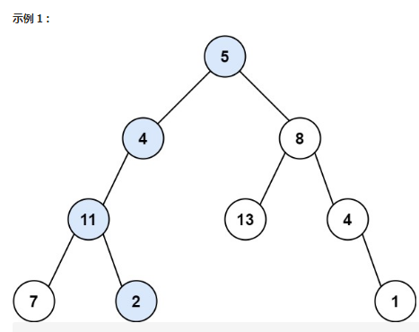

~~~
输入：root = [5,4,8,11,null,13,4,7,2,null,null,null,1], targetSum = 22
输出：true
~~~

思路：递归dfs

- 这题一个需要注意是，如果输入root为空，说明没有，0也不算

- 递归函数功能是判断以当前节点为起点到叶子节点是否存在等于目标值的路径
- 结束条件是遍历到叶子节点下面，或者输入的节点为null那就是没有连0都不算，就返回false;如果遍历到叶子节点，和等于目标值就返回true
- 递归参数是本题最重要的，每递归一层将目标值减去当前节点值，只要左右子树递归下去有一个符合就行，用或连接
- 时间复杂度O(N)，N是树中节点个数，代表将树中节点都遍历一次
- 空间复杂度O（N），N代表树的高度

~~~java
class Solution {
    public boolean hasPathSum(TreeNode root, int targetSum) {
        if(root == null) return false;
        //叶子节点判断
        if(root.left == null && root.right == null) return root.val == targetSum;

        return hasPathSum(root.left, targetSum - root.val) || hasPathSum(root.right, targetSum - root.val);
    }
}
~~~

思路：层序遍历bfs

- 用一个队列专门记录树中的结点，一个队列专门记录每一个结点对应的路径和
- 当遍历到叶子结点时，如果路径和等于目标值，那么就成功
- 每次向值队列添加值，把上一层的累加到下一层的值就行，队列会记录累加值

~~~java
class Solution {
    public boolean hasPathSum(TreeNode root, int targetSum) {
        if(root == null) return false;
        Queue<TreeNode> queue_node = new LinkedList<>();
        Queue<Integer> queue_val = new LinkedList<>();
        queue_node.offer(root);
        queue_val.offer(root.val);

        while(!queue_node.isEmpty()){
            TreeNode node = queue_node.poll();
            int temp = queue_val.poll();

            if(node.left == null && node.right == null && temp == targetSum) 
                return true;
                
            if(node.left != null){
                queue_node.offer(node.left);
                queue_val.offer(temp + node.left.val);
            }

            if(node.right != null){
                queue_node.offer(node.right);
                queue_val.offer(temp + node.right.val);
            }
        }
        return false;
    }
}
~~~

### 15、打印出所有路径和等于目标值的路径（45）

LeetCode 113 剑指offer 34

​	输入一棵二叉树和一个整数，打印出二叉树中节点值的和为输入整数的所有路径。从树的根节点开始往下一直到叶节点所经过的节点形成一条路径。

**示例:**
给定如下二叉树，以及目标和 `target = 22`，

~~~
              5
             / \
            4   8
           /   / \
          11  13  4
         /  \    / \
        7    2  5   1
~~~

返回:

~~~
[
   [5,4,11,2],
   [5,8,4,5]
]
~~~

思路：先序遍历+回溯

- 回溯实质上是for循环里面的递归，但是在树中可以先序遍历其实就是起了for循环的作用，所以不用for循环

- path是回溯路径用于添加节点值，如果遍历到叶子节点并且目标值刚好减到等于叶子节点说明这条路径有效

- 每往下深一层，目标值减去当前上一个节点值，如果到了叶子节点正好等于叶子节点说明有效加入path

- 遍历到叶子节点说明这条路不行

- 注意每次都要new一个path,不然是浅拷贝，引用还指向原来的path

- 回溯函数不可能每次都返回结果所以要另起一个，回溯函数正常都是void返回值，声明全局变脸结果和经过路径，每次满足要求添加到结果集里面

- 注意计算时间复杂度的时候，添加进答案也要O(N)的时间复杂度

  

~~~java
class Solution {
    List<List<Integer>> res;
    LinkedList<Integer> path;
    public List<List<Integer>> pathSum(TreeNode root, int targetSum) {
        res = new LinkedList<>();
        path = new LinkedList<>();
        recur(root,targetSum);
        return res;
    }

    public void recur(TreeNode root, int targetSum){
        if (root == null){
            return;
        }
        path.add(root.val);
        
        if(root.left == null && root.right == null && targetSum == root.val){
            res.add(new LinkedList<>(path));
        }

        recur(root.left,targetSum - root.val);
        recur(root.right,targetSum -root.val);
        path.removeLast();
    }
}
~~~

### 16、二叉树中的最大路径和（48）

leetcode 124

路径 被定义为一条从树中任意节点出发，沿父节点-子节点连接，达到任意节点的序列。同一个节点在一条路径序列中 至多出现一次 。该路径 至少包含一个 节点，且不一定经过根节点。

路径和 是路径中各节点值的总和。

给你一个二叉树的根节点 root ，返回其 最大路径和 。


思路：

- 
- 递归是自底向上的，也就是从孩子树到最后根节点，中间最大值会被maxSum记录下来
- 这题感觉有点像求最大深度和求二叉树的直径那题，求二叉树直径是递归函数求深度，然后用一个变量记录下递归过程最大直径。**而本题是递归函数求以一个根节点往下到叶子结点一条链路的最大和，然后在递归过程中记录下最大的左右路径和**

~~~java
class Solution {
    int maxSum = Integer.MIN_VALUE;

    public int maxPathSum(TreeNode root) {
        maxPath(root);
        return maxSum;
    }

    public int maxPath(TreeNode root){
        if (root == null){
            return 0;
        }
		
        //计算出左右子树最大路径值，但是不能小于0
        int leftMax = Math.max(maxPath(root.left), 0);
        int rightMax = Math.max(maxPath(root.right), 0);
        maxSum = Math.max(maxSum,leftMax + rightMax + root.val);

        //计算出以当前节点往下搜索一条最大路径值，然后返回
        return root.val + Math.max(leftMax, rightMax);
    }
}
~~~

### 17、岛屿数量（66）

LeetCode 200

给你一个由 '1'（陆地）和 '0'（水）组成的的二维网格，请你计算网格中岛屿的数量。

岛屿总是被水包围，并且每座岛屿只能由水平方向和/或竖直方向上相邻的陆地连接形成。

此外，你可以假设该网格的四条边均被水包围。

数组长度大于等于1

**示例 2：**

~~~
输入：grid = [
  ["1","1","0","0","0"],
  ["1","1","0","0","0"],
  ["0","0","1","0","0"],
  ["0","0","0","1","1"]
]
输出：3
~~~

思路：**dfs**

- 一个1至少是一个岛屿，dfs的功能就是以一个1为起点，深度优先搜索下去，一个dfs方向除非碰到水边界，否则把所有能触及到的1改成0
- 主函数就是两个for循环遍历二维数组，找1，以这个起点开始dfs

- 

~~~java
class Solution {
    public int numIslands(char[][] grid) {
        int count = 0;
        for(int i = 0; i < grid.length; i++){
            for(int j = 0; j < grid[0].length; j++){
                if(grid[i][j] == '1'){
                    dfs(grid,i,j);
                    count++;
                }
            }
        }
        return count;
    }

    private void dfs(char[][] grid, int i , int j){
        if(i < 0 || j < 0 || i >= grid.length || j >= grid[0].length || grid[i][j] == '0') return;
        grid[i][j] = '0';
        dfs(grid,i - 1, j);
        dfs(grid,i + 1, j);
        dfs(grid,i,j + 1);
        dfs(grid,i,j - 1);
    }
}
~~~

思路：**bfs**

- 将一个节点加入队列，如果它为1就将它的前后左右加入队列，然后将这个节点改为0，**不断循环从队列中弹出来，看一个一节点的前后左右是否满足为1且没有越界的，最后数1就行了**

- 队列存储一个节点的坐标

~~~java
class Solution {
    public int numIslands(char[][] grid) {
        int count = 0;
        for(int i = 0; i < grid.length; i++) {
            for(int j = 0; j < grid[0].length; j++) {
                if(grid[i][j] == '1'){
                    bfs(grid, i, j);
                    count++;
                }
            }
        }
        return count;
    }
    private void bfs(char[][] grid, int i, int j){
        Queue<int[]> list = new LinkedList<>();
        list.add(new int[] { i, j });
        while(!list.isEmpty()){
            int[] cur = list.poll();
            i = cur[0]; j = cur[1];
            if(0 <= i && i < grid.length && 0 <= j && j < grid[0].length && grid[i][j] == '1') {
                grid[i][j] = '0';
                list.add(new int[] { i + 1, j });
                list.add(new int[] { i - 1, j });
                list.add(new int[] { i, j + 1 });
                list.add(new int[] { i, j - 1 });
            }
        }
    }
}
~~~

### 18、二叉搜索树的公共祖先（2）

LeetCode 235 剑指offer 68

**在二叉树中只要p和q在一个结点的左右子节点，那么这个结点就是最近公共祖先**

给定一个二叉搜索树, 找到该树中两个指定节点的最近公共祖先。

最近公共祖先:对于有根树 T 的两个结点 p、q，最近公共祖先表示为一个结点 x，满足 x 是 p、q 的祖先且 x 的深度尽可能大（**一个节点也可以是它自己的祖先**）。条件：所有节点的值都是唯一的。p,q都存在于此二叉树中。

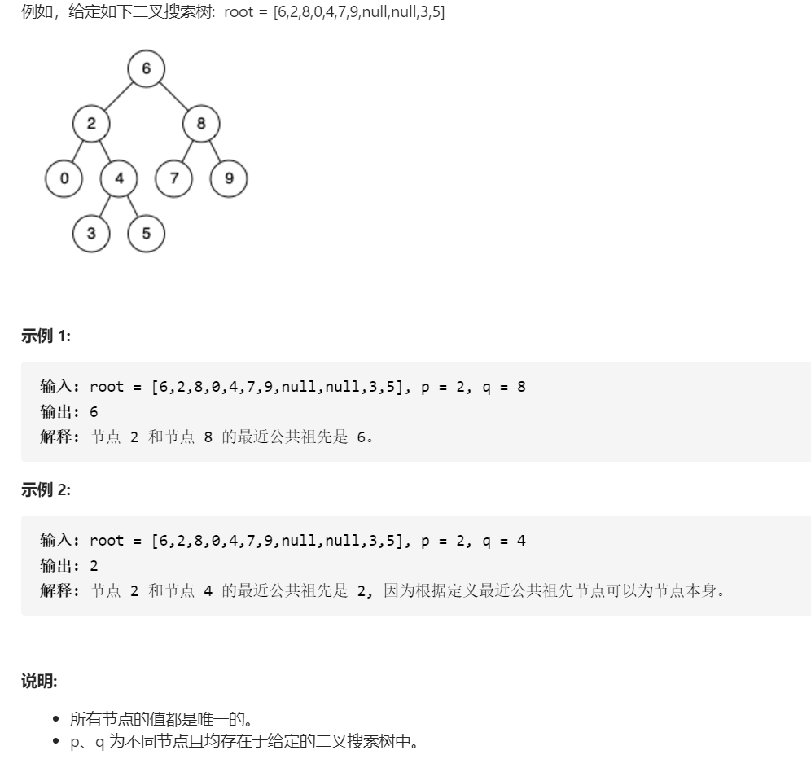

思路：

- 前提条件为二叉搜索树，那么，比根结点小的都在左边，比根结点大的都在右边
- 对二叉搜索树来说，从上往下搜索到的第一个节点在左右的就是最近的父节点
- 如果p和q同时大于根，那么最近公共祖先一定在右边，root = r.right
- 如果p和q同时小于根，那么最近公共祖先一定在左边，root = r.left
- 如果不满足，即p和q在根左边和右边那么这个根就是最近公共祖先，如果p或q等于根结点了，那么也是最近公共祖先了

~~~java
class Solution {
    public TreeNode lowestCommonAncestor(TreeNode root, TreeNode p, TreeNode q) {
        while(root != null){
            if(root.val < p.val && root.val < q.val){
            root = root.right;
        }else if(root.val > p.val && root.val > q.val){
            root = root.left;
        }else{
            break;
        }
        
        }
        return root;
    }
}
~~~

### 19、二叉树的最近公共祖先（88）

LeetCode 236 剑指offer 68

给定一个二叉树, 找到该树中两个指定节点的最近公共祖先。注意不是二叉搜索树了，是二叉树

思路：后序遍历DFS

- 递归函数的功能是找p或者q节点，如果找到了就返回这个节点
- 找一下看看当前节点的左子树有没有p或者q，找一下当前节点的右子树有没有p或者q，如果左右都能找到，因为是自底向上，所以当前节点就是最近公共祖先
- 如果左子树没有找到那肯定在右子树，就返回右子树。如果右子树没有找到那肯定在左子树，就返回左子树。**因为是自底上上所以为null返回的另一边就是最近公共祖先，如果两个都不为null那就返回root是最近公共祖先**

- 最差情况下遍历所有节点，时间复杂度O(n)空间复杂度O(n)

~~~java
class Solution {
    public TreeNode lowestCommonAncestor(TreeNode root, TreeNode p, TreeNode q) {
        if(root == null) return null;
        if(root == p || root == q) return root;

        //递归遍历左子树，找p和q，谁先找到返回谁
        TreeNode left  = lowestCommonAncestor(root.left,p,q);
        //递归遍历右子树，找p和q，谁先找到返回谁
        TreeNode right = lowestCommonAncestor(root.right,p,q);
        //如果左子树p和q都找不到，p和q一定在右子树中，右子树先遍历到的那个就是公共祖先
        if(left == null) return right;
        //如果右子树p和q都找不到，p和q一定在左子树中，左子树先遍历到的那个就是公共祖先
        if(right == null) return left;

        //左右子树都不为空，那么这个结点就是公共结点
        return root;
    }
}
~~~

### 20、求所有根节点到叶子节点的数字之和（38）

LeetCode 129

给你一个二叉树的根节点 root ，树中每个节点都存放有一个 0 到 9 之间的数字。每条从根节点到叶节点的路径都代表一个数字

例如，**从根节点到叶节点的路径 1 -> 2 -> 3 表示数字 123 。**计算从根节点到叶节点生成的 所有数字之和 。


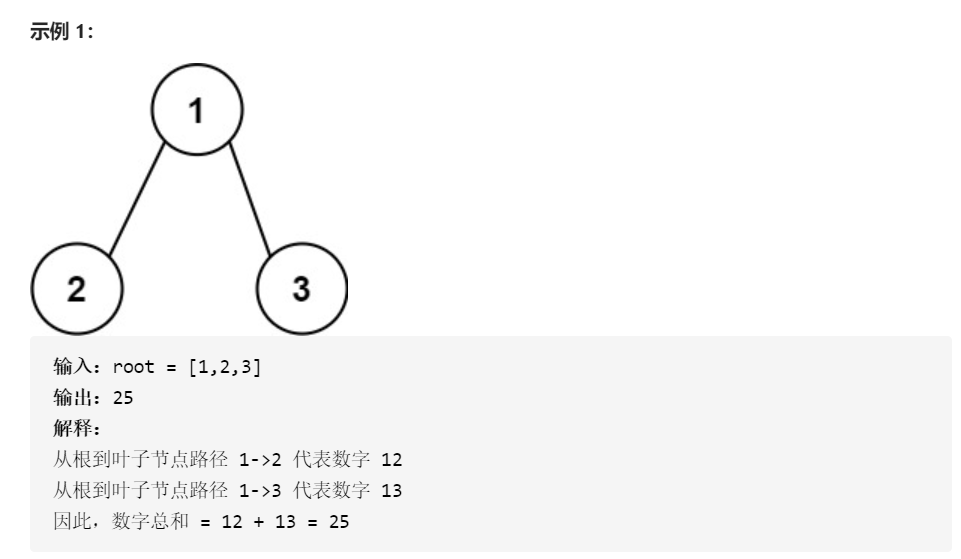

思路：dfs

- 深度优先搜索是很直观的做法。从根节点开始，遍历每个节点，**如果遇到叶子节点，则将叶子节点对应的数字加到数字之和。如果当前节点不是叶子节点，则计算其子节点对应的数字，然后对子节点递归遍历。**


- 函数dfs有两个return，一个return代表遍历一条路径到底，返回这条路径的数字是多少；另一个return返回左子树的所有路径和加上右子树所有的路径和
- 递归参数是把到当前一层的路径和作为子节点上一层的数字

~~~java
class Solution {
    public int sumNumbers(TreeNode root) {
        return dfs(root, 0);
    }

    private int dfs(TreeNode root, int preSum){
        if (root == null){
            return 0;
        }

        int sum = preSum * 10 + root.val;
        if(root.left == null && root.right == null){
            return sum;
        } else {
            return dfs(root.left, sum) + dfs(root.right, sum);
        }
    }
}
~~~

思路：bfs

- 使用广度优先搜索，**需要维护两个队列，分别存储节点和节点对应的数字**。用两个队列是因为节点队列用来判断是不是叶子节点，一个队列用来存储到目前节点的数字值是多少

- 初始时，将根节点和根节点的值分别加入两个队列。每次从两个队列分别取出一个节点和一个数字，进行如下操作：

  - 如果当前节点是叶子节点，则将该节点对应的数字加到数字之和；

  - 如果当前节点不是叶子节点，则获得当前节点的非空子节点，并根据当前节点对应的数字和子节点的值计算子节点对应的数字，然后将子节点和子节点对应的数字分别加入两个队列。

~~~java
class Solution {
    public int sumNumbers(TreeNode root) {
        if (root == null){
            return 0;
        }

        int sum = 0;
        Queue<TreeNode> queueNode = new LinkedList<>();
        Queue<Integer> queueVal = new LinkedList<>();
        queueNode.offer(root);
        queueVal.offer(root.val);

        while (!queueNode.isEmpty()){
            int val = queueVal.poll();
            TreeNode node = queueNode.poll();

            if (node.left == null && node.right == null){
                sum += val;
            } else {
                if (node.left != null){
                    queueNode.offer(node.left);
                    queueVal.offer(node.left.val + val * 10);
                }

                if (node.right != null){
                    queueNode.offer(node.right);
                    queueVal.offer(node.right.val + val * 10);
                }
            }
        }
        return sum;
    }
}
~~~

### 21、机器人的运动范围（1）

剑指offer 13

​	地上有一个m行n列的方格，从坐标 [0,0] 到坐标 [m-1,n-1] 。一个机器人从坐标 [0, 0] 的格子开始移动，它每次可以向左、右、上、下移动一格（不能移动到方格外），也不能进入行坐标和列坐标的数位之和大于k的格子。例如，当k为18时，机器人能够进入方格 [35, 37] ，因为3+5+3+7=18。但它不能进入方格 [35, 38]，因为3+5+3+8=19。请问该机器人能够到达多少个格子？

**示例 1：**

~~~
输入：m = 2, n = 3, k = 1
输出：3
~~~

**提示：**

- `1 <= n,m <= 100`
- `0 <= k <= 20`

思路：

- 题目要求横坐标和纵坐标的数位之和不能超过k，先封装一个函数，用来计算一个数的数位和
- 计算一个数的数位和可以对10求余，得到的就是各位，然后再除10删除最后一位
- 可以回溯加剪枝，和12题有些类似，在递归中结束条件即为剪枝条件，用一个数组记录一个位置是否已经被访问过，区别在于12题是找路径，可能要回去开辟新路，而这题是找个数，访问过就是访问过了，不需要再回去了，所以递归后不需要修复原值
- 函数dfs的功能是找能访问多少个格子
- 数组越界、访问过、数位和大于k这几种情况返回0，其他情况累加1
- 因为是计算个数，回去一定要减枝，不然多算了
- 假设从0,0开始

~~~java
class Solution {
    public int movingCount(int m, int n, int k) {
        boolean[][] visited = new boolean[m][n];
        return dfs(visited,m,n,k,0,0);
    }

    public int dfs(boolean[][] visited, int m, int n, int k, int i, int j){
        if(i >= m || j >= n || visited[i][j] || bitsum(i) + bitsum(j) > k) return 0;
        visited[i][j] = true;
        return 1 + dfs(visited,m,n,k,i+1,j) + dfs(visited,m,n,k,i,j+1);
    }

    public int bitsum(int n){
        int sum = 0;
        while(n != 0){
            sum += n % 10;
            n = n / 10;
        }
        return sum;
    }
}
~~~

### 22、二叉搜索树的第k大结点是多少（29）

剑指offer 54

给定一个二叉搜索树，找出第k大结点

**示例 1:**

~~~
输入: root = [3,1,4,null,2], k = 1
   3
  / \
 1   4
  \
   2
输出: 4
~~~

思路：反向中序遍历

- 题目要求找第k大的，也就是倒数第k个，二叉搜索树的中序遍历虽然是有序的但是是递增的，所以可以用右中左的顺序，反向遍历二叉搜索树
- 注意二叉搜索树，不是平衡二叉搜索树，所以最差的情况下二叉树会退化成链表，所以时间复杂度为O(n),空间复杂度也为O(n)

~~~java
class Solution {
    int res,k;
    //局部变量和全局变量重名了，要用this区分
    public int kthLargest(TreeNode root, int k) {
        this.k = k;
        dfs(root);
        return res;
    }

    public void dfs(TreeNode root){
        if(root == null) return;
        dfs(root.right);
        if(--k == 0) res = root.val;
        dfs(root.left);
    }
}
~~~

### 23、判断一个数组是不是某个二叉搜索树的后序遍历结果(6)

剑指offer 33

​	输入一个整数数组，判断该数组是不是某个**二叉搜索树**的后序遍历结果，如果是则返回true,不是返回false。假设输入的数组任意两个数字互不相同

参考以下这颗二叉搜索树：

~~~
     5
    / \
   2   6
  / \
 1   3
~~~

**示例 2：**

~~~
输入: [1,3,2,6,5]
输出: true
~~~

思路：

- 任意一个数组必然存在它的后序遍历，关键是还要这个还原出的数组要是二叉搜索树
- 后序遍历数组，最后一个必然是根节点
- 从前往后遍历，第一个大于根节点的必然是右子树后序遍历顺序的第一个，从这个开始往后到倒数第一个都是右子树，理论上都大于根
- 再往后遍历，验证如果每一个都大于根那么就是符合的

- 再分别对左子树和右子树递归验证
- 注意递归结束条件是left >= right，
- 从左往右开始遍历，定义一个变量，如果这个值小于根结点就+1,
- 然后会遍历到右子树的第一个结点继续遍历，如果数值大于最后一个结点就+1
- **注意判断递归结束的条件，当变量值正好等于最后一个根结点，说明对了这是最理想的左右子树都存在的情况；但是当左子树不存在时，left = mid = right - 1,这种情况直接返回true，所以递归结束条件是if(left >= right) return true;**
- 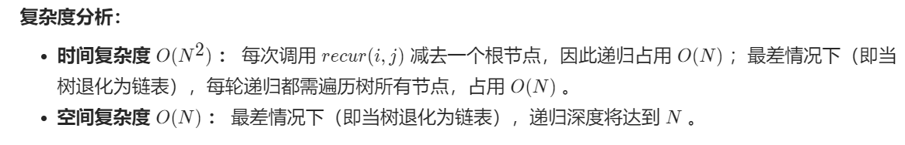

~~~java
class Solution {
    public boolean verifyPostorder(int[] postorder) {
        return dfs(postorder, 0, postorder.length - 1);
    }

    private boolean dfs(int[] postorder, int left, int right){
        if (left >= right){
            return true;
        }

        int temp = left;
        while (postorder[right] > postorder[temp]){
            temp++;
        }
        int mid = temp;
        while (postorder[right] < postorder[temp]){
            temp++;
        } 
        return (temp == right) && dfs(postorder, left, mid - 1) && dfs(postorder, mid, right - 1); 
    }
}
~~~

### 24、矩阵中的路径、二维数组搜索单词是否存在(16)

LeetCode 79 剑指offer 12

给定一个二维网格和一个单词，找出该单词是否存在于网格中。

单词必须按照字母顺序，通过相邻的单元格内的字母构成，其中“相邻”单元格是那些水平相邻或垂直相邻的单元格。**同一个单元格内的字母不允许被重复使用。**

给定一个二维网格和一个单词，找出该单词是否存在于网格中。

单词必须按照字母顺序，通过相邻的单元格内的字母构成，其中“相邻”单元格是那些水平相邻或垂直相邻的单元格。同一个单元格内的字母不允许被重复使用。

~~~
示例:

board =
[
  ['A','B','C','E'],
  ['S','F','C','S'],
  ['A','D','E','E']
]

给定 word = "ABCCED", 返回 true
给定 word = "SEE", 返回 true
给定 word = "ABCB", 返回 false
~~~

思路：

- 遍历二维数组中的每一个字符，以这个字符为起点dfs下去看看有没有符合的，有则返回true,没则返回false;
- dfs辅助函数表示以board[i] [j]为起点开始往下搜索，注意这个k表示当前遍历到了字符数组第几个结点，如果遍历完了k = length - 1了，那说明存在返回true,如果起点不等于或者索引越界返回false;
- \0’是一个“空字符”常量，它表示一个字符串的结束，**它的ASCII码值为0**。
- 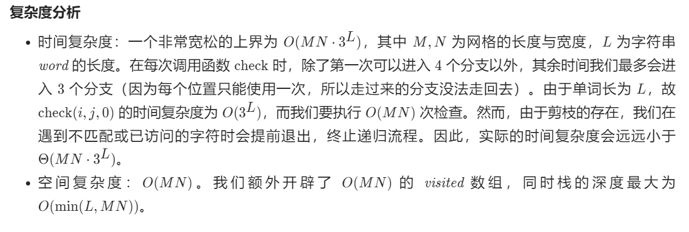

~~~java
class Solution {
    public boolean exist(char[][] board, String word) {
        char[] words = word.toCharArray();
        for(int i = 0; i < board.length; i++){
            for(int j = 0; j < board[0].length; j++){
                if(dfs(board,words,i,j,0)){
                    return true;
                }
            }
        }
        return false;
    }

    //dfs的功能是，在二维数组以board[i][j]为起点是否有符合的结果，k表示目前遍历到了字符数组中的哪一个，如果k=words.length - 1了那说明遍历完了
    public boolean dfs(char[][] board, char[] words, int i, int j, int k){
        if(i >= board.length || i < 0 || j >= board[0].length || j < 0 || board[i][j] != words[k])
            return false;
        
        if(k == words.length - 1) return true;
		// 到这个位置了至少说明目前这个字符是相等的，不能让这个字符被重复利用
        board[i][j] = '\0';
        boolean res = dfs(board,words,i-1,j,k+1) || dfs(board,words,i+1,j,k+1) || dfs(board,words,i,j+1,k+1) || dfs(board,words,i,j-1,k+1);
        board[i][j] = words[k];
        return res;
    }
}
~~~

### 25、二叉搜索树原地转换成排序的循环双向链表（20）

LeetCode 426，剑指offer 36

为了让您更好地理解问题，以下面的二叉搜索树为例：

 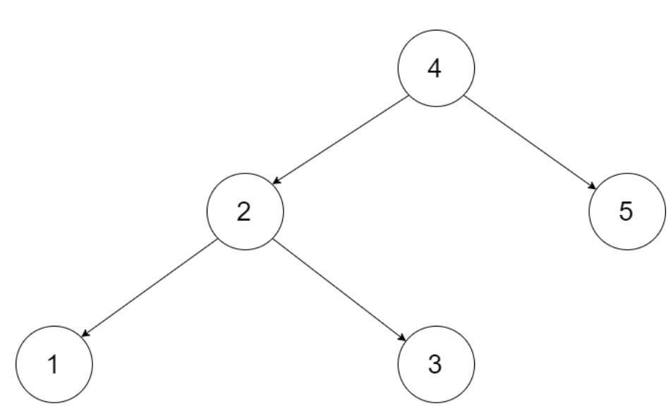

我们希望将这个**二叉搜索树转化为双向循环链表**。链表中的每个节点都有一个前驱和后继指针。对于双向循环链表，**第一个节点的前驱是最后一个节点，最后一个节点的后继是第一个节点。**

下图展示了上面的二叉搜索树转化成的链表。“head” 表示指向链表中有最小元素的节点。

特别地，我们希望可以就地完成转换操作。当转化完成以后，树中节点的左指针需要指向前驱，树中节点的右指针需要指向后继。**还需要返回链表中的第一个节点的指针。**

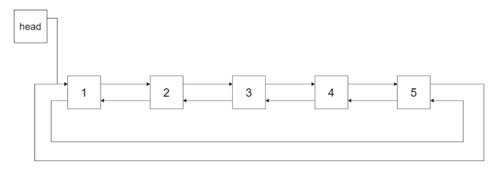

思路：

- 因为是二叉搜索树，所以对二叉搜索树进行中序遍历得到的就是有序的，根据这个来构建双向链表
- 使用二叉树的递归中序遍历，以递归输入的节点作为当前节点指针，自己造一个pre节点在cur前一个用于构建二叉树关系，再造一个head方便最后返回结果
- 注意从第一个节点开始，pre为空，此时可以构建cur节点左指向为空，但是空节点不能指向右边，否则会空指针异常，所以这种情况直接把cur赋值给head

~~~java
class Solution {
    Node pre,head;
    public Node treeToDoublyList(Node root) {
        //如果输入根为空，经过dfs直接退出，head和pre还是为空，所以要加这个判断
        if(root == null) return null;
        dfs(root);
        head.left = pre;
        pre.right = head;
        return head;
    }

    public void dfs(Node cur){
        if(cur == null) return;
        dfs(cur.left);
        cur.left = pre;
        //第一次pre为空，空节点不能指向右边节点，此时head为cur
        if(pre == null) head = cur;
        else pre.right = cur;
        //别忘了这个，不然pre只会原地不动
        pre = cur;
        dfs(cur.right);
    }
}
~~~


## 栈

### 1、有效括号（82）

leetcode 20

给定一个只包括 '('，')'，'{'，'}'，'['，']' 的字符串 s ，判断字符串是否有效。

有效字符串需满足：左括号必须用相同类型的右括号闭合。左括号必须以正确的顺序闭合。

**示例 1：**

~~~java
输入：s = "()"
输出：true
~~~

思路：

- for循环遍历字符串字符，每遇到左括号把它对应的右括号压入栈，遍历遇到右括号把它和弹栈出来的比较，如果不同提前返回false；
- 遍历的时候有两种情况是false，一种是不匹配的右括号，一种是还没遍历完栈就空了说明右括号多了
- 遍历字符过程中栈肯定不能空，如果是对称的那一定是遍历完最后一个字符正正好栈为空。中途为空说明右括号多了，结束后应该为空，不为空说明，左括号多了
- 总之要匹配不仅要右括号和左括号一一对应，还要数量精确相等，各一半
- 时间复杂度O(n),空间复杂度O(n)

~~~java
class Solution {
    public boolean isValid(String s) {
        if(s.isEmpty()) return true;
        Stack<Character> stk = new Stack<>();
        for(char c : s.toCharArray()){
            if(c == '('){
                stk.push(')');
            }else if(c == '{'){
                stk.push('}');
            }else if(c == '['){
                stk.push(']');
            //不为左括号说明是右括号,还没遍历完栈就为空说明右括号多了数量就不匹配
            //这句判断还用到了短路原则，stk.isEmpty()放前面，如果为空就不行后面的pop()了
            }else if(stk.isEmpty() || c != stk.pop()){
                return false;
            }
        }
        //再判断防止左括号多了
        return stk.isEmpty();
    }
}
~~~

**拓展**

​	如果题目改为：

给定一个只包括 '('，')'的字符串 s ，判断字符串是否有效。

思路：

- 只需用一个变量不需要用栈
- 遍历字符串的每个字符，遇到左括号+1，遇到右括号-1
- 遍历过程中如果提前为0了说明右括号多了
- 结束时如果不为0说明左括号多了

~~~java
import java.util.*;
public class Main{
    public static void main(String[] args){
        Scanner sc = new Scanner(System.in);
        String str = sc.nextLine();
        if (isValid(str)){
            System.out.println("YES");
        } else {
            System.out.println("NO");
        } 
    }
    
    private static boolean isValid(String s){
        int sum = 0;
        for (char c : s.toCharArray()){
            if (c == '('){
                sum++;
            } else {
                if (sum == 0){
                    return false;
                } else {
                    sum--;
                }
            }
        }
        return sum == 0 ? true : false;
    }
}
~~~


### 2、两个栈实现队列(23)

剑指offer 09

用两个栈实现一个队列。队列的声明如下，请实现它的两个函数 appendTail 和 deleteHead ，分别完成在队列尾部插入整数和在队列头部删除整数的功能。(若队列中没有元素，deleteHead 操作返回 -1 )

~~~
示例 1：
输入：
["CQueue","appendTail","deleteHead","deleteHead"]
[[],[3],[],[]]
输出：[null,null,3,-1]
~~~

思路：

- 一个队列具备的两个功能分别由两个栈来完成：栈A实现入队加入队尾功能，栈B实现出队删除队头功能
- 必须在一开始初始化两个栈，因为方法参数中无栈，为全局变量
- 只有在stack_out为空时才一次性把stack_in一次性全部装入stack_b;

~~~java
class CQueue {
    Stack<Integer> stack_in;
    Stack<Integer> stack_out;
    public CQueue() {
       
            stack_in = new Stack<>();
            stack_out = new Stack<>();
        
    }
    
    public void appendTail(int value) {
        stack_in.push(value);
    }
    
    public int deleteHead() {
        if(stack_out.isEmpty()){
            while(!stack_in.isEmpty()){
                stack_out.push(stack_in.pop());
            }
        }
        if(stack_out.isEmpty()){
             return -1;
        }else{
            int deleteItem = stack_out.pop();
            return deleteItem;
        }
           
      
    }
}

/**
 * Your CQueue object will be instantiated and called as such:
 * CQueue obj = new CQueue();
 * obj.appendTail(value);
 * int param_2 = obj.deleteHead();
 */
~~~

### 3、最小栈（44）

LeetCode 155 剑指offer30

设计一个支持 `push` ，`pop` ，`top` 操作，并能在常数时间内检索到最小元素的栈。

- push(x) —— 将元素 x 推入栈中。
- pop() —— 删除栈顶的元素，不返回值
- top() —— 获取栈顶元素。
- getMin() —— 检索栈中的最小元素。

思路：

- 用两个栈，一个栈负责加入删除元素，一个栈负责保存目前的最小值，最小值始终在栈的最上面
- 加入值时，要和保存最小值的栈顶比较大小，如果小于等于栈顶则加入
- 删除值时，如果和保存最小值的栈相等则则将最小栈的元素也一并删除
- **注意包装类要使用equals比较大小，Integer会缓存-128到127的值，在这个范围内的值用==是true，出了这个范围是false**

~~~Java
class MinStack {

    /** initialize your data structure here. */
    private Deque<Integer> stack;
    private Deque<Integer> min_stack;
    public MinStack() {
        stack = new LinkedList<>();
        min_stack = new LinkedList<>();
    }
    
    public void push(int val) {
        stack.push(val);
        if(min_stack.isEmpty() || val <= min_stack.peek())
            min_stack.push(val);
    }
    
    public void pop() {
        if(stack.pop().equals(min_stack.peek()))
            min_stack.pop();
    }
    
    public int top() {
        return stack.peek();
    }
    
    public int getMin() {
        return min_stack.peek();
    }
}

/**
 * Your MinStack object will be instantiated and called as such:
 * MinStack obj = new MinStack();
 * obj.push(val);
 * obj.pop();
 * int param_3 = obj.top();
 * int param_4 = obj.getMin();
 */
~~~

### 4、栈的压入弹出序列、验证栈序列（4）

剑指offer 31 LeetCode 946

输入两个数组，第一个数组表示栈的压入顺序，判断第二个数组是否可能第一个数组压入后的弹出顺序。**栈中所有数字均不相等**

注意**压入的途中是可以中途弹出的**，例如，序列 {1,2,3,4,5} 是某栈的压栈序列，序列 {4,5,3,2,1} 是该压栈序列对应的一个弹出序列，但 {4,3,5,1,2} 就不可能是该压栈序列的弹出序列。即1不可能在2之前被抽出

**示例 1：**

~~~
输入：pushed = [1,2,3,4,5], popped = [4,5,3,2,1]
输出：true
解释：我们可以按以下顺序执行：
push(1), push(2), push(3), push(4), pop() -> 4,
push(5), pop() -> 5, pop() -> 3, pop() -> 2, pop() -> 1
~~~

**示例 2：**

~~~
输入：pushed = [1,2,3,4,5], popped = [4,3,5,1,2]
输出：false
解释：1 不能在 2 之前弹出。
~~~

思路：

- 题目意思就是判断弹出序列的顺序有无角度是压入序列的顺序，中途可以弹出
- 自建一个栈，按压入序列的顺序依次压入栈，每压入一个就判断一下是否等于弹出序列，如果相等立马弹出
- **注意题目一个重要条件，没有重复元素，如果有重复元素就不能保证相邻两个重复元素的压入弹出顺序了**
- 和上面的有效括号很像，提前栈为空说明左边压入序列比右边弹出序列要少，结束了如果不为空说明左边压入序列比右边多，所以只有在左右数量精准匹配，而且压入弹出顺序完美匹配才行
- 和有效括号区别是，有效括号不管怎样都要pop出来,但是压入弹出序列需要刚压入的和弹出序列刚好相等才pop，所以条件用peek比较

~~~java
class Solution {
    public boolean validateStackSequences(int[] pushed, int[] popped) {
        Stack<Integer> stack = new Stack<>();
        int j = 0;

        for(int i=0;i<pushed.length;i++){
            stack.push(pushed[i]);
            // 还有一个区别，这里是用while的，因为一个元素push进来，后续可能因为终于来了这个才开始pop，不确定要pop几次，每pop一次把j加一，所以用while不用if
            while(!stack.isEmpty() && stack.peek() == popped[j]){
                stack.pop();
                j++;
            }

        }
        return stack.isEmpty();
    }
}
~~~


## 动态规划

**动态规划解题步骤：**

​	确定状态----》化为子问题----》研究策略最后一步如何由之前的子问题得来----》写出状态转移方程-----》确定初始状态

**动态规划dp[i]的意义：**

​	解动态规划第一步就是要确定dp[i]数组的意义。一般有两种意义

- 第一种就是dp[i]就直接表示最终结果，也就是最大或者最小值。最后不多开一个空间的话直接返回dp[i - 1]即可
- 第二种是dp[i]表示，固定以nums[i]结尾的最大或者最小值，然后中间用另一个变量记录下遍历过程中的最大或者最小。很多时候采用第二种思路，解题会简单很多。状态转移方程会非常好写。

### 1、圆圈中最后剩下的数字、约瑟夫环问题（14）

​	0,1,···,n-1这n个数字排成一个圆圈，从数字0开始，每次从这个圆圈里删除第m个数字（删除后从下一个数字开始计数）。求出这个圆圈里剩下的最后一个数字。

例如，0、1、2、3、4这5个数字组成一个圆圈，从数字0开始每次删除第3个数字，则删除的前4个数字依次是2、0、4、1，因此最后剩下的数字是3。

**示例 1：**

```
输入: n = 5, m = 3
输出: 3
```

思路：动态规划

- 模拟出一个链表，复制题目中操作，要删除n-1轮，每轮遍历m次，所以时间复杂度O(mn)

~~~java
class Solution {
    public int lastRemaining(int n, int m) {
        int res = 0;
        for(int i = 2; i <= n; i++){
            res = (res + m) % i;
        }
        return res;
    }
}
~~~

### 2、斐波那契（26）

剑指offer 10

写一个函数，输入 n ，求斐波那契（Fibonacci）数列的第 n 项（即 F(N)）。斐波那契数列的定义如下：

F(0) = 0,   F(1) = 1
F(N) = F(N - 1) + F(N - 2), 其中 N > 1.

思路：	

- 状态转移方程：dp[n] = dp[n -1] + dp[n - 2]
- 时间复杂度O(n)，空间复杂度O(1)

~~~java
class Solution{
    public int fib(int n){
        if(n == 0) return 0;
        if(n == 1) return 1;
        int first = 0，second = 1;
        int sum = 0;
        for(int i=2;i<=n;i++){
            sum = first + second;
            first = second;
            second = sum;
        }
        return sum;
    }
}
~~~

### 3、爬楼梯、青蛙跳台阶（15）

LeetCode 70 剑指offer 10 

一只青蛙一次可以跳上1级台阶，也可以跳上2级台阶。求该青蛙跳上一个 `n` 级的台阶总共有多少种跳法。

思路：	

- 设dp[i]表示i级台阶有多少种跳法

- 状态转移方程：dp[n] = dp[n -1] + dp[n - 2]
- 初始值：**注意跳台阶当台阶数为0或1，跳法都是1**.青蛙跳台阶和斐波那契就是初始值不一样其他都是一样的。
- **动态规划听上去高大上，其实就是用空间换时间而已，将过去的计算状态保存下来，自底向上用for循环往上推**
- 时间复杂度O(n)，空间复杂度O(1)

~~~java
class Solution {
    public int climbStairs(int n) {
        if(n == 0 || n == 1) return 1;
        int first = 1, second = 1;
        int sum = 0;
        for(int i = 2; i <= n; i++){
            sum = first + second;
            first = second;
            second = sum;
        }
        return sum;
    }
}
~~~

### 4、买卖股票的最佳时机（99）

leetcode 121 ,剑指offer 63

给定一个数组 prices ，它的第 i 个元素 prices[i] 表示一支给定股票第 i 天的价格。你只能选择 某一天 买入这只股票，并选择在 未来的某一个不同的日子 卖出该股票。设计一个算法来计算你所能获取的最大利润。返回你可以从这笔交易中获取的最大利润。如果你不能获取任何利润，返回 0 

~~~java
示例 1：

输入：[7,1,5,3,6,4]
输出：5
解释：在第 2 天（股票价格 = 1）的时候买入，在第 5 天（股票价格 = 6）的时候卖出，最大利润 = 6-1 = 5 。
     注意利润不能是 7-1 = 6, 因为卖出价格需要大于买入价格；同时，你不能在买入前卖出股票。
~~~

思路：动态规划

- dp[i]表示**到以prices[i]的迄今为止最大利润**，并不是一定要以prices[i]结尾
- **转移方程：dp[i] = max(dp[i-1],prices[i] - min(price[0:i]))前i-1日最大利润和第i日价格减去之前最低价格**
- 初始状态dp[0]=0，返回dp[n-1],n为dp数组长度
- 空间优化：由于dp[i]只与dp[i-1],prices[i]和min_price有关，可以用变量代替dp列表
- 
- 时间复杂度O(n)，空间复杂度O(1)

~~~java
class Solution {
    public int maxProfit(int[] prices) {
        int min_price = Integer.MAX_VALUE;
        int profit = 0;

        for(int price : prices){
            min_price = Math.min(min_price,price);
            // 这里的第二个profit就相当于dp[i - 1];
            profit = Math.max(profit,price - min_price);
        }
        return profit;
    }
}
~~~

### 5、最大子序和、最大连续子序列（114）

LeetCode 53 剑指offer 42

给定一个整数数组 `nums` ，找到一个具有最大和的连续子数组（子数组最少包含一个元素），返回其最大和。

**示例 1：**

~~~java
输入：nums = [-2,1,-3,4,-1,2,1,-5,4]
输出：6
解释：连续子数组 [4,-1,2,1] 的和最大，为 6 。
~~~

思路：动态规划

- 以dp[i]表示以第 i 个数结尾的最大子序和
- 求出所有位置的dp[i]然后**记录下最大值即可**
- 状态转移方程：比较   dp[i - 1]加上nums[i]   和   nums[i]哪个大
- 也就是只要dp[i - 1]是正数就加上，不然就但nums[i]一个
- 
- 时间复杂度O(n)，空间复杂度O(1)

~~~java
class Solution {
    public int maxSubArray(int[] nums) {
        int pre = 0;
        int res = nums[0];

        for(int num : nums){
            // 第一个pre相当于dp[i],第二个pre相当于dp[i - 1]
            pre = Math.max(num + pre,num);
            // 记录下每一个以nums[i]结尾的最大和
            res = Math.max(res,pre);
        }
        return res;
    }
}
~~~

### 6、礼物的最大值、二维数组左上角到右下角最大路径和(0)

剑指offer 47

​	给一个m乘n的数组，每格一个数，从左上角开始，你只可以向右或者向下移动，计算从左上角到右下角的最大路径和，也就是最大礼物和

**二维数组中的值大于0**

**示例 1:**

~~~java
输入: 
[
  [1,3,1],
  [1,5,1],
  [4,2,1]
]
输出: 12
解释: 路径 1→3→5→2→1 可以拿到最多价值的礼物
~~~

思路：动态规划

- 注意题目条件二维数组中所有值都大于0，这样在边界和0行或者0列的比就会更大

- 状态转移方程：到当前节点最大和就是左边节点和上面节点的最大值加上当前数组值dp[i] = Math.max(dp[ i - 1] [ j ],dp[ i ] [ j - 1] ) + grid[i - 1] [ j - 1];
- 在第一行没有上面的值，在第一列没有左边的值，需要单独判断，很麻烦
- 为了减少判断，创建dp数组的时候可以多扩充一行一列，让dp数组从1，1开始，这样第一行左边就是0第一列上面也是0，加上grid的时候再行列减1就对应数组中的值了

~~~java
class Solution {
    public int maxValue(int[][] grid) {
        int row = grid.length;
        int column = grid[0].length;
        int[][] dp = new int[row+1][column+1];

        for(int i = 1; i <= row; i++){
            for(int j = 1; j <= column; j++){
                dp[i][j] = Math.max(dp[i-1][j],dp[i][j-1]) + grid[i-1][j-1];
            }
        }
        return dp[row][column];
    }
}
~~~

### 7、找第n个丑数(6)

剑指offer49 LeetCode 264

丑数就是只包含质因数2或3或5的数，找出第n个，注意1也被视为丑数

**示例 1：**

~~~java
输入：n = 10
输出：12
解释：[1, 2, 3, 4, 5, 6, 8, 9, 10, 12] 是由前 10 个丑数组成的序列。
~~~

思路：动态规划

- 设dp[i]标识第 i 个丑数

- 注意题目第几个从1开始算，所以设第n个就是dp[n],初始值为dp[1]=1

- 下一个丑数等于之前某个丑数乘2或者成3或者乘5中的最小值，**问题就在于利用之前的丑数保证求出丑数的顺序**，每次的下一个丑数都要保证最小
- 可以设置三个索引a,b,c，a表示前a-1个数已经乘过2的结果已经放入丑数序列了
- 求出最小新丑数后将相应索引+1，注意可能多个丑数相乘得到相同结果，这时索引都要加，所以要用三个if
- 时间O(n)空间O(n)

~~~java
class Solution {
    public int nthUglyNumber(int n) {
        int[] dp = new int[n + 1];
        dp[1] = 1;
        // a标记的意思是索引a之前的已经乘过2了
        // b标记的意思是索引b之前的已经乘过3了
        // c标记的意思是索引c之前的已经乘过5了
        int a = 1, b = 1, c = 1;
        for(int i = 2; i <= n; i++){
            int n2 = dp[a] * 2;
            int n3 = dp[b] * 3;
            int n5 = dp[c] * 5;
            // 为了保证丑数出现的顺序，每次取最小的第一个丑数
            dp[i] = Math.min(n2,Math.min(n3,n5));
            if(dp[i] == n2) a++;
            if(dp[i] == n3) b++;
            if(dp[i] == n5) c++;
        }
        return dp[n];
    }
}
~~~

### 8、接雨水（60）

LeetCode 42

​	黑色的看成墙，蓝色的看成水，宽度一样，给定一个数组，每个数代表从左到右墙的高度，求出能装多少单位的水。也就是图中蓝色正方形的个数，一格代表一个水。


输入：height = [0,1,0,2,1,0,1,3,2,1,2,1]
输出：6
解释：上面是由数组 [0,1,0,2,1,0,1,3,2,1,2,1] 表示的高度图，在这种情况下，可以接 6 个单位的雨水（蓝色部分表示雨水）。 

**提示：**

- `n == height.length`
- `0 <= n <= 3 * 104`
- `0 <= height[i] <= 105`


思路：未空间优化的动态规划

- **本题最核心：分别找出左右两边最大高度，然后取这两个值相对最小**

- **将问题划分为求每一列能接多少雨水，根据木桶原理，每一列能接收水的数量等于，两边最大高度的较小值减去当前列对的高度**

- 第一种暴力解就是以当前列为起点，每次都向左右遍历，找左边最高和右边最高，然后减去当前列高度，遍历一次数组汇总相加

- 在上一种暴力的基础上，使用动态规划，**用一个数组max_left [i] 记录第i列左边最高高度，用一个数组max_right[i]记录第i列右边最高高度**，**注意这两个最大高度不包括自身**

- 左边最高高度的状态转移方程，max_left [i] = Max(max_left [i-1]`,`height[i-1])；右边最大高度的状态转移方程

  max_right[i] = Max(max_right[i+1]`,`height[i+1])

- 这样在暴力解的基础上，省去了每次都要遍历寻找比较左边和右边最大值，时间复杂度O(n)空间复杂度O(n)

- 用两个数组分别记录当前索引i处左边最大值和当前索引i处右边最大值
- 记录左边最大值的状态转移方程： max_left[i] = Math.max(max_left[i - 1], height[i - 1]);
- 记录右边最大值的状态转移方程：max_right[i] = Math.max(max_right[i + 1], height[i + 1]);
- 注意左边最大高度是从左往右推，右边高度是从右往左推，因为要自底向上从小到大嘛
- 然后再遍历height数组每个位置即可，比较当前结点左边和右边小的最大值就行
- 时间复杂度O(n)空间复杂度O(n)

~~~java
public int trap(int[] height) {
    int sum = 0;
    int[] max_left = new int[height.length];
    int[] max_right = new int[height.length];
    
    for (int i = 1; i < height.length - 1; i++) {
        max_left[i] = Math.max(max_left[i - 1], height[i - 1]);
    }
    for (int i = height.length - 2; i >= 0; i--) {
        max_right[i] = Math.max(max_right[i + 1], height[i + 1]);
    }
    for (int i = 1; i < height.length - 1; i++) {
        int min = Math.min(max_left[i], max_right[i]);
        if (min > height[i]) {
            sum = sum + (min - height[i]);
        }
    }
    return sum;
}
~~~

思路：双指针

- 上面动态规划的解法是用数组记录每个位置左右最大最小值的，循环遍历每个i的位置。而双指针是通过指针的，i只控制次数，有点类似快排两个指针在左右
- 上面动态规划的解法是用数组记录每个位置左右最大最小值的，分两个循环算dp数组，一个是从左往右方向，一个是从右往左方向
- 如果想降低空间复杂度，因为两个dp数组推的方向是相反的，所以不可能用一个i从左往右解决，需要双指针。状态转移方程很简单还是上面的
- 左边最高高度的状态转移方程，max_left [i] = Max(max_left [i-1]`,`height[i-1])；
- 右边最大高度的状态转移方程，max_right[i] = Max(max_right[i+1]`,`height[i+1])
- **max_left**记录**left**左边最大值，**max_right**记录**right**右边最大值
- 那么问题来了，如何判断**max_left**和**max_right**的大小呢？
- 如果height [ right + 1 ]都已经大于height [ left - 1 ]了，因为都是层层递归取max的，所以那么 `max_left` 就一定小于 `max_right`
- 

~~~java
class Solution {
    public int trap(int[] height) {
        int res = 0;
        int max_left = 0;
        int max_right = 0;
        // 双指针left和right表示当前遍历到哪了
        int left = 1;
        int right = height.length - 2;

        // 外循环只控制双指针次数，每次不是左加就是右加，
        for(int i = 1; i < height.length - 1; i++){
            //从左往右更
            if(height[left - 1] < height[right + 1]){
                max_left = Math.max(max_left, height[left - 1]);

                if(max_left > height[left]){
                    res += max_left - height[left];
                }
                left++;
            //从右往左更
            } else {
                max_right = Math.max(max_right, height[right + 1]);

                if(max_right > height[right]){
                    res += max_right - height[right];
                }
                right--;
            }
        }
        return res;
    }
}
~~~

### 9、最长递增子序列(59)

LeetCode 300

​	给你一个整数数组 nums ，找到其中最长严格递增子序列的长度,**不要求是连续的，只要是递增就行。**

子序列是由数组派生而来的序列，删除（或不删除）数组中的元素而不改变其余元素的顺序。例如，[3,6,2,7] 是数组 [0,3,1,6,2,2,7] 的子序列。

**示例 1：**

~~~java
输入：nums = [10,9,2,5,3,7,101,18]
输出：4
解释：最长递增子序列是 [2,3,7,101]，因此长度为 4 。
~~~

思路：动态规划

- **设dp[i]代表到以nums[i]结尾的最长递增子序列**
- *dp*[*i*] 所有元素置 1，含义是每个元素都至少可以单独成为子序列，此时长度都为 1。**长度是从1开始算的**
- 遍历 j 在 0 到 i - 1 的范围，如果nums[i] 大于nums[j]，此上升序列为dp[j] + 1
- 0到i-1遍历记录下最大的dp[i]
- 0到i再记录下所有最大的dp[i]
- 时间复杂度O(n^2),空间复杂度O(n)

~~~java
class Solution {
    public int lengthOfLIS(int[] nums) {
        if(nums.length == 0) return 0;
        int[] dp = new int[nums.length];
        int res = 0;
        Arrays.fill(dp,1);
		
        // 固定数组中的一个，往前搜索，如果大于之前的计数器就加一
        // dp[i]记录下一个i对应的最大
        for(int i = 0; i < nums.length; i++){
            for(int j = 0; j < i; j++){
                if(nums[j] < nums[i]) dp[i] = Math.max(dp[i],dp[j] + 1);
            }
            res = Math.max(res,dp[i]);
        }
        return res;
    }
}
~~~

思路：贪心加二分，时间复杂度降到O(nlogn)

- 上一种解法，每一轮都要遍历0到i-1来得到最大dp[i]，每一次时间复杂度为O(n),可以再优化一下
- 贪心：我们要让上升的子序列尽量的长，就需要让这个子序列上升的尽量慢，因此我们希望每次在上升序列最后加上的那个数要尽量小
- **维护一个数组记录当前最小子序列**，即在数组 `1,2,3,4,5,6`中长度为3的上升子序列可以为 `1,2,3`也可以为 `2,3,4`等等但是`tail[3]=3`，即使子序列末尾元素最小为3。
- tails[1] = nums[0],tails[0]不计，tails[len]就相当于目前最长上升子序列的末尾元素，len就是结果
- 设当前已经求出的最长上升子序列长度为len,初始化为1，因为每个数字至少都可以成为一个长度为1的子序列
- 遍历到nums[i]时
  - 如果nums[i]大于tail[len],则直接加入末尾
  - 如果nums[i]小于等于tail[len]，就在tail数组中二分查找，找到第一个比nums[i]小的数tails[k],并更新tails[k+1]为nums[i]

以输入序列 [0, 8, 4, 12, 2][0,8,4,12,2] 为例：

第一步插入 0，d = [0]；

第二步插入 8，d = [0, 8]；

第三步插入 4，d = [0, 4]；

第四步插入 12，d = [0, 4, 12]；

第五步插入 2，d = [0, 2, 12]。

最终得到最大递增子序列长度为 33

~~~java
class Solution {
    public int lengthOfLIS(int[] nums) {
        if(nums.length == 0) return 0;
        int len = 1;
        int[] tails = new int[nums.length + 1];
        tails[1] = nums[0];

        for(int i = 0; i < nums.length; i++){
            if(nums[i] > tails[len]){
                tails[++len] = nums[i];
            }else{
                int left = 1,right = len;
                while(left <= right){
                    int mid = (left + right) / 2;
                    if(tails[mid] < nums[i]){
                        left = mid + 1;
                    }else{
                        right = mid - 1;
                    }
                }
                tails[left] = nums[i];
            }
        }
        return len;
    }
}
~~~

### 10、凑零钱、零钱兑换（29）

LeetCode 322

​	给定不同面额的硬币 coins 和一个总金额 amount。编写一个函数来计算可以凑成总金额**所需的最少的硬币个数**。如果没有任何一种硬币组合能组成总金额，返回 -1。

​	你可以认为每种硬币的数量是无限的。

**示例 1：**

~~~java
输入：coins = [1, 2, 5], amount = 11
输出：3 
解释：11 = 5 + 5 + 1
~~~

**示例 2：**

~~~java
输入：coins = [2], amount = 3
输出：-1
~~~

思路：动态规划

- dp[i]表示，当目标金额amount为 i 时至少要 dp[i] 枚硬币凑出
- 初始值0元钱要0个硬币
- 因为是要求最小，先全部赋值amount+1，最后还是amount+1那就是没凑出来
- **状态转移方程：dp[i] = 所有面值里1+dp[i - coin]最小的**，但是此题比较特殊，这个dp[i - coin]的面额不一定能凑出，所以算是先这么算，最后加个判断
- **为什么一开始要初始化所有dp数组为amount + 1？**因为一个amount值最多由amount个硬币组成，一开始初始化为amount+1那么就**相当于初始化为正无穷，方便min操作**；如果这个硬币凑不出来那么最小值还是amount+1，返回-1
- 比如目标值为4，硬币面值为3，那么dp[4]就不存在
- if(coin > i) continue;一定要加因为这个面额都超过当前遍历的金额了
- 时间复杂度O（nS），S为硬币面额总数
- 空间复杂度O(n)

~~~java
class Solution {
    public int coinChange(int[] coins, int amount) {
        int[] dp = new int[amount + 1];
        Arrays.fill(dp,amount + 1);
        dp[0] = 0;
        for(int i = 1; i <= amount; i++){
            for(int coin : coins){
                if(coin > i) continue;
                dp[i] = Math.min(dp[i],1 + dp[i - coin]);
            }
        }
        return (dp[amount] == amount + 1) ? -1 : dp[amount];
    }
}
~~~

### 10、零钱兑换二（20）

LeetCode 518

​	给你一个整数数组 coins 表示不同面额的硬币，另给一个整数 amount 表示总金额。**请你计算并返回可以凑成总金额的硬币组合数。**如果任何硬币组合都无法凑出总金额，返回 0 。假设每一种面额的硬币有无限个。 

**示例 1：**

~~~
输入：amount = 5, coins = [1, 2, 5]
输出：4
解释：有四种方式可以凑成总金额：
5=5
5=2+2+1
5=2+1+1+1
5=1+1+1+1+1
~~~

**示例 2：**

~~~
输入：amount = 3, coins = [2]
输出：0
解释：只用面额 2 的硬币不能凑成总金额 3 。
~~~

思路：

- 设dp[i]表示金额等于 i 的硬币组合总数，dp[0]为1，表示金额为0时组合总数为1
- 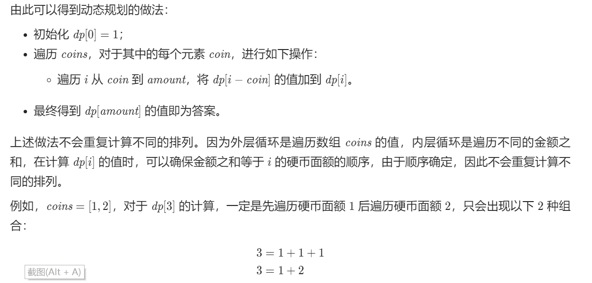
- **其实就是先花完一种钱再花下一种，不然就会重复计数**

~~~java
class Solution {
    public int change(int amount, int[] coins) {
        int[] dp = new int[amount + 1];
        dp[0] = 1;

        for (int coin : coins){
            for (int i = coin; i <= amount; i++){
                dp[i] += dp[i - coin];
            }
        }
        return dp[amount];
    }
}
~~~


### 11、最长公共子序列（42）

LeetCode 1143

给定两个字符串 `text1` 和 `text2`，返回这两个字符串的最长 **公共子序列** 的长度。如果不存在 **公共子序列** ，返回 `0` 。

一个字符串的 子序列 是指这样一个新的字符串：它是由原字符串在不改变字符的相对顺序的情况下删除某些字符（也可以不删除任何字符）后组成的新字符串。

例如，"ace" 是 "abcde" 的子序列，但 "aec" 不是 "abcde" 的子序列。
两个字符串的 公共子序列 是这两个字符串所共同拥有的子序列。

- `1 <= text1.length, text2.length <= 1000`
- `text1` 和 `text2` 仅由小写英文字符组成。

**示例 1：**

~~~
输入：text1 = "abcde", text2 = "ace" 
输出：3  
解释：最长公共子序列是 "ace" ，它的长度为 3 。
~~~

思路：

- 设dp[ i ] [ j ]表示字符串1零到i - 1和字符串2零到j - 1最长公共子序列的长度，也就是开dp数组的时候多开一位数的空间；因为状态转移方程会设计到之前的值，当 i 或者 j 为0时i - 1或者j - 1就变成负数了，为了防止这种情况，需要加很多判断，很麻烦，所以干脆直接多开一个空间用dp[ 1 ] [ 1 ]代表字符串0,0的情况。最后返回也好看直接返回dp[m] [n]
- 当两个字符串最后一个字符刚好相等时，dp[ i ] [ j ] = dp[ i - 1] [ j - 1]
- 当最后两个字符不正好相等时，取dp[ i - 1] [ j ]和dp[ i ] [ j - 1]之间的最大值
- 当任意一个字符串长度为0，最长公共子序列都为0，初始值都为0，数组建好默认都是0，所以直接从1,1开始动态规划就完事了，不用特地声明初始值
- 

~~~java
class Solution {
    public int longestCommonSubsequence(String text1, String text2) {
        int m = text1.length();
        int n = text2.length();
        int[][] dp = new int[m + 1][n + 1];

        for (int i = 1; i <= m; i++){
            for (int j = 1; j <= n; j++){
                if (text1.charAt(i - 1) == text2.charAt(j - 1)){
                    dp[i][j] = dp[i - 1][j - 1] + 1;
                } else {
                    dp[i][j] = Math.max(dp[i - 1][j],dp[i][j - 1]);
                }
            }
        }
        return dp[m][n];
    }
}
~~~

### 12、左上到右下最小路径和（31）

LeetCode 64

给定一个包含**非负整数**的 m x n 网格 grid ，请找出一条从左上角到右下角的路径，使得路径上的数字总和为最小。

说明：每次只能向下或者向右移动一步。

提示：

m == grid.length
n == grid[i].length
1 <= m, n <= 200

 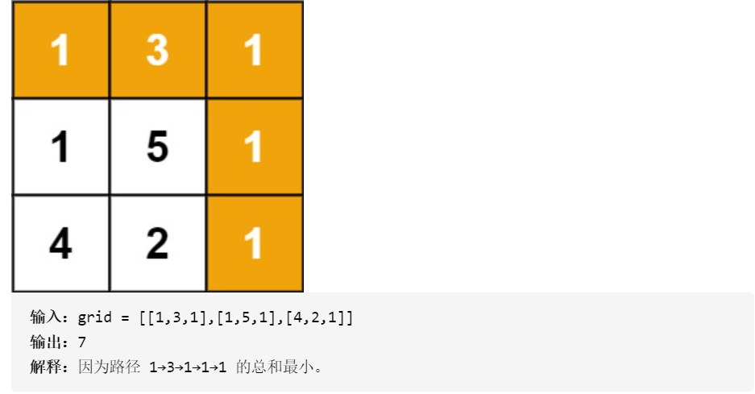

思路：

- 这题不能像第六题那样多开一个空间，因为数组中元素都大于等于0，比较最小的话多开的空间默认为0，比较都会为0
- do数组第一行和第一列其实是固定的，因为只能从一个方向来，相当于我们手动求出来，这样也可以避免数组在0时行和列变成-1，然后在从1,1开始dp
- 这题要对边界进行分情况讨论防止数组指针溢出
- 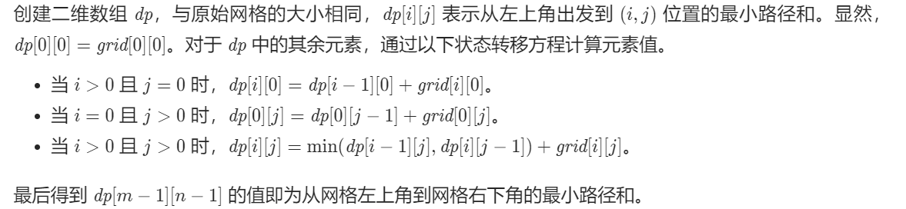

~~~java
class Solution {
    public int minPathSum(int[][] grid) {
        int row = grid.length;
        int column = grid[0].length;
        int[][] dp = new int[row][column];
        // 初始值不给的话，循环从0开始i-1不存在，
        dp[0][0] = grid[0][0];

        // 第一列，没有左边值，需要单独讨论，也就是说dp数组的第一行和第一列都是固定的其实，因为只能从一个方向来递增
        for (int i = 1; i < row; i++){
            dp[i][0] = dp[i - 1][0] + grid[i][0];
        }
        // 第一行，没有上边值，需要单独讨论
        for (int j = 1; j < column; j++){
            dp[0][j] = dp[0][j - 1] + grid[0][j];
        }

        // 不是第一列第一行，
        for (int i = 1; i < row; i++){
            for (int j = 1; j < column; j++){
                dp[i][j] = Math.min(dp[i - 1][j], dp[i][j - 1]) + grid[i][j];
            }
        }
        return dp[row - 1][column - 1];
    }
}
~~~

### 13、编辑距离（35）

给你两个单词 word1 和 word2，请你计算出将 word1 转换成 word2 所使用的最少操作数 。

你可以对一个单词进行如下三种操作：

- 插入一个字符
- 删除一个字符
- 替换一个字符

**提示：**

- `0 <= word1.length, word2.length <= 500`
- `word1` 和 `word2` 由小写英文字母组成

**示例 1：**

~~~
输入：word1 = "horse", word2 = "ros"
输出：3
解释：
horse -> rorse (将 'h' 替换为 'r')
rorse -> rose (删除 'r')
rose -> ros (删除 'e')
~~~

思路：

- 设**dp[i] [j]表示word1的前 i 个字符和word2的前 j 个字符的编辑距离**。也就是说word1的前 i 个字符变为word2的前 j 个字符需要dp[i] [j]步

- **如果已知dp[i] [j - 1]或dp[i - 1] [j]或dp[i - 1] [j - 1]就可以推出dp[i] [ j];**

- 因为状态转移方程涉及到i - 1，所以等于0的时候要手动输入特判

- 注意这里的i和j都是从1开始的，开辟dp数组多开一个空间，这样少很多边界特判。例如`word1 = "horse", word2 = "ros"`，那么`dp[3][2]=X`就表示"hor"和“ro”的编辑距离，即把"hor"变成“ro”最少需要X步。

- 如果下标为0就表示空串，比如：`dp[0][2]`就表示空串""和“ro”的编辑距离，空串情况需要我们手动加进数组

- 

- 区别两个状态转移方程区别就在于最后一个字母是否相同，如果不同就要加一，如果相同那就不要加一

  

  

~~~java
class Solution {
    public int minDistance(String word1, String word2) {
        // 根据题目条件，两个字符串都不为null，但可能长度为0	
        int m = word1.length();
        int n = word2.length();

        // A和B中有任意空串
        if (m == 0 || n == 0) {
            return m + n;
        }

        int[][] dp = new int[m + 1][n + 1];

        // 手动输入边界条件
        for (int i = 0; i <= m; i++){
            dp[i][0] = i;
        }

        for (int j = 0; j <= n; j++){
            dp[0][j] = j;
        }

        for (int i = 1; i <= m; i++){
            for (int j = 1; j <= n; j++){
                // 注意这里i和j实际上开dp数组多开了一个，为了边界条件少判断
                // 对应实际字符串要少算一个
                if (word1.charAt(i - 1) == word2.charAt(j - 1)){
                    dp[i][j] = 1 + Math.min(dp[i - 1][j], Math.min(dp[i][j - 1], dp[i - 1][j - 1] - 1));
                    
                } else {
                    dp[i][j] = 1 + Math.min(dp[i - 1][j], Math.min(dp[i][j - 1], dp[i - 1][j - 1]));
                }
            }
        }
        return dp[m][n];
    }
}
~~~

### 14、左上到右下有多少条路径（29）

​	一个机器人位于一个 m x n 网格的左上角 。机器人每次只能向下或者向右移动一步。机器人试图达到网格的右下。问总共有多少条不同的路径？**与数组值无关，所以函数签名只给出了m和n**

**示例 1：**

~~~
输入：m = 3, n = 7
输出：28
~~~

思路：动态规划

- 设dp[i] [j]表示从左上角到数组中i,j位置的路径有多少条
- 状态转移方程：dp[i] [j] = dp[i - 1] [j] + dp[i] [j - 1];
- 但是在 i 或者 j为0的时候上面的状态转移方程会数组越界，所以要手动给第0行或者第0列赋值
- 初始条件dp[0] [0]为1，代表从左上角到左上角有一种走法
- 第一行和第一列也赋值为1，因为只有一行或者一列的话也只有一种走法

~~~java
class Solution {
    public int uniquePaths(int m, int n) {
        int[][] dp = new int[m][n];

        for (int i = 0; i < m; i++){
            dp[i][0] = 1;
        }

        for (int j = 0; j < n; j++){
            dp[0][j] = 1;
        }

        for (int i = 1; i < m; i++){
            for (int j = 1; j < n; j++){
                dp[i][j] = dp[i - 1][j] + dp[i][j - 1];
            }
        }
        return dp[m - 1][n - 1];
    }
}
~~~

### 15、打家劫舍（24）

LeetCode 198

是一个专业的小偷，计划偷窃沿街的房屋。每间房内都藏有一定的现金，影响你偷窃的唯一制约因素就是相邻的房屋装有相互连通的防盗系统，**如果两间相邻的房屋在同一晚上被小偷闯入，系统会自动报警**。

给定一个代表每个房屋存放金额的非负整数数组，计算你 不触动警报装置的情况下 ，一夜之内能够偷窃到的最高金额。

**提示：**

- `1 <= nums.length <= 100`
- `0 <= nums[i] <= 400`

**示例 1：**

~~~java
输入：[1,2,3,1]
输出：4
解释：偷窃 1 号房屋 (金额 = 1) ，然后偷窃 3 号房屋 (金额 = 3)。
     偷窃到的最高金额 = 1 + 3 = 4 。
~~~

**示例 2：**

~~~
输入：[2,7,9,3,1]
输出：12
解释：偷窃 1 号房屋 (金额 = 2), 偷窃 3 号房屋 (金额 = 9)，接着偷窃 5 号房屋 (金额 = 1)。
     偷窃到的最高金额 = 2 + 9 + 1 = 12 。
~~~

思路：

- 题目意思翻译翻译，只能偷窃数组中不相邻的元素，求这样的最大值
- 如果只有一间房屋，那么只能偷这家。如果有两间房屋，只能偷一个，取这两家最大值偷取
- 如果房间数超过两家，那么有两个选项
  - 偷第k个，那么就不能偷第k-1个，偷窃总金额为前k-2间房屋最高总金额和第k间房屋之和
  - 偷第k-1个，不偷k，那么总金额直接为前k-1间房屋最高总金额
- 

**未优化空间复杂度写法：**

~~~java
class Solution {
    public int rob(int[] nums) {
        
        if (nums == null || nums.length == 0) {
            return 0;
        }
        int length = nums.length;
        if (length == 1) {
            return nums[0];
        }
        int[] dp = new int[length];
        dp[0] = nums[0];
        dp[1] = Math.max(nums[0], nums[1]);
        for (int i = 2; i < length; i++) {
            dp[i] = Math.max(dp[i - 2] + nums[i], dp[i - 1]);
        }
        return dp[length - 1];
    }
}

~~~

**优化空间复杂度写法：**

- 状态转移方程只和dp[i - 1]和dp[i - 2]有关，所以可以用两个变量代替，**滚动数组**，节省空间复杂度

~~~java
class Solution {
    public int rob(int[] nums) {
        int len = nums.length;
        if (len == 1){
            return nums[0];
        }
        
        // len等于2可写可不写，因为second一开始赋值Math.max(nums[0], nums[1]);
        if (len == 2){
            return Math.max(nums[0], nums[1]);
        }

        int first = nums[0];
        int second = Math.max(nums[0], nums[1]);

        for (int i = 2; i < len; i++){
            int temp = second;
            // 第一个second相当于dp[i],第二个second相当于dp[i - 1],first相当于dp[i - 2]
            second = Math.max(first + nums[i], second);
            first = temp;
        }
        return second;
    }
}
~~~

### 16、打家劫舍二（11）

LeetCode 213

​	你是一个专业的小偷，计划偷窃沿街的房屋，每间房内都藏有一定的现金。**这个地方所有的房屋都 围成一圈 ，这意味着第一个房屋和最后一个房屋是紧挨着的。**同时，相邻的房屋装有相互连通的防盗系统，如果两间相邻的房屋在同一晚上被小偷闯入，系统会自动报警 。

​	给定一个代表每个房屋存放金额的非负整数数组，计算你 在不触动警报装置的情况下 ，今晚能够偷窃到的最高金额。

**示例 1：**

~~~
输入：nums = [2,3,2]
输出：3
解释：你不能先偷窃 1 号房屋（金额 = 2），然后偷窃 3 号房屋（金额 = 2）, 因为他们是相邻的。
~~~

**示例 3：**

~~~
输入：nums = [0]
输出：0
~~~

思路：

- 设n为数组长度

- 这题和上一题的区别就是，偷第一间就不能偷最后一间，范围为0到n-2
- 偷最后一间就不能偷第一间，范围是1到n-1
- 需要手动给求打家劫舍的函数范围，然后取两个范围最大

~~~java
class Solution {
    public int rob(int[] nums) {
        int len = nums.length;
        if (len == 1){
            return nums[0];
        } 

        if (len == 2){
            return Math.max(nums[0], nums[1]);
        }

        return Math.max(robRange(nums, 0, len - 2), robRange(nums, 1, len - 1));
    }

    public int robRange(int[] nums, int start, int end){
        int first = nums[start];
        int second = Math.max(nums[start], nums[start + 1]);
        for (int i = start + 2; i <= end; i++){
            int temp = second;
            second = Math.max(first + nums[i], second);
            first = temp;
        }
        return second;
    }
}
~~~

### 17、最大正方形（21）

LeetCode 221

在一个由 `'0'` 和 `'1'` 组成的二维矩阵内，找到只包含 `'1'` 的最大正方形，并返回其面积。

提示：

m == matrix.length
n == matrix[i].length
1 <= m, n <= 300
matrix[i][j] 为 '0' 或 '1'

**示例 1：**


~~~
输入：matrix = [["1","0","1","0","0"],["1","0","1","1","1"],["1","1","1","1","1"],["1","0","0","1","0"]]
输出：4
注意数组类型都是char
~~~

思路：

- **设dp[i] [j]表示以（i, j) 为右下角，且只包含1的最大正方形的边长。**如果（i, j) 不是1，那dp[i] [j]就是0

- 根据木桶原理，状态转移方程就是 **min(上, 左, 左上) + 1**，因为要求是正方形

  

  

  

~~~java
class Solution {
    public int maximalSquare(char[][] matrix) {
        // 题目说了数组行列长度大于1，没有这个提示要加入特判防止输入的数组为空
        int maxSide = 0;
        int row = matrix.length;
        int column = matrix[0].length;
        int[][] dp = new int[row][column];

    


        for (int i = 0; i < row; i++){
            for (int j = 0; j < column; j++){
                // 只有右下角为1的才算dp
                if (matrix[i][j] == '1'){
                    // 边界都为1，防止下面状态转移方程0-1数组越界
                    if (i == 0 || j == 0){
                        dp[i][j] = 1;
                    } else {
                        dp[i][j] = 1 + Math.min(dp[i - 1][j], Math.min(dp[i][j - 1], dp[i - 1][j - 1]));
                    }      
                }
                // 用一个变量记录下遍历dp过程中最大值
                maxSide = Math.max(maxSide, dp[i][j]);
            }
        }
        int maxSize = maxSide * maxSide;
        return maxSize;
    }
}
~~~


## 回溯

​	回溯法，一种通过探索所有可能的候选解来找出所有解的算法。如果候选解被确认不是解，会回到上一层重新选择。

​	回溯简单说第一层for循环是第一个数的选择，for循环里的递归1是往下元素的选择

### 1、字符串的全排列（6）

剑指offer 38

​	输入一个字符串，打印出该字符串中字符的所有排列。你可以以任意顺序返回这个字符串数组，**但里面不能有重复元素。**

**示例:**

~~~java
输入：s = "abc"
输出：["abc","acb","bac","bca","cab","cba"]
~~~

思路:

- **注意此题输入的字符串可能有重复，但是在结果集的字符要求不重复**

- 此题其实和全排列1相似，只不过输入的字符可能有重复，但是结果不能有重复的字符，**在全排列1的基础上加上一个用set剪枝的操作就行了**
- toArray方法是将集合类变成数组的方法，传入参数为新建一个数组并指明长度
- 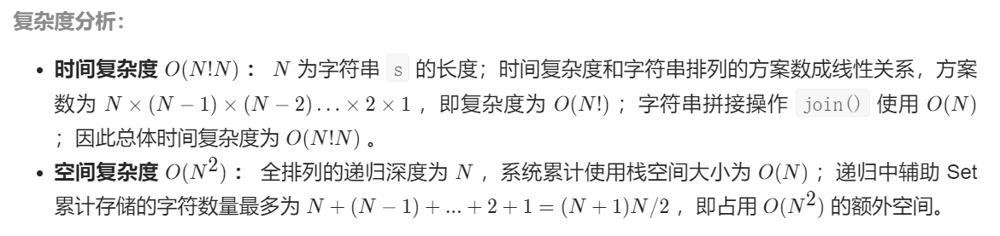

~~~java
class Solution {
    List<String> res;
    public String[] permutation(String s) {
        res = new LinkedList<>();
        char[] c = s.toCharArray();
        backtrack(c, 0);
        return res.toArray(new String[res.size()]);
    }

    private void backtrack(char[] c, int depth){
        if (depth == c.length){
            res.add(String.valueOf(c));
            return;
        }

        HashSet<Character> set = new HashSet<>();
        for (int i = depth; i < c.length; i++){
            if (set.contains(c[i])){
                continue;
            }
            // 这个set只是为了防止重复字符后面出现，游离与这个回溯体系之外，所以不用恢复
            set.add(c[i]);
            swap(c, depth, i);
            backtrack(c, depth + 1);
            swap(c, depth, i);
        }
    }

    private void swap(char[] c, int a, int b){
        char temp = c[a];
        c[a] = c[b];
        c[b] = temp;
    }
}
~~~


### 2、数字的全排列（70）

LeetCode 46

给定一个 **没有重复** 数字的序列，返回其所有可能的全排列。

~~~
示例:

输入: [1,2,3]
输出:
[
  [1,2,3],
  [1,3,2],
  [2,1,3],
  [2,3,1],
  [3,1,2],
  [3,2,1]
]
~~~

思路：回溯基本模板

- for循环就是选择列表，就相当于更换第一个元素，一个值里面不断往下递归再回溯
- 需要撤销选择是因为第二层或者更深结束了要回上一层继续往下，尝试其他的可能
- path记录已选择的路径，当元素都满了也就是长度和数组长度相等说明一个全排列凑齐了，加入最终的结果
- **全排列path加入结果一定要new一个新的**
- 回溯和主处理函数中都要用到res和path两个集合，为了减少回溯的参数，可在两个方法外面声明，注意因为path涉及到取消选择，所以要用linkedlist并最开始就声明为linkedlist
- 时间复杂度O(n * n!),因为题目没有重复，固定一个，下一个选择就少1时间复杂度为n阶乘，每次结果集加入path总共O(n)复杂度
- 空间复杂度O(n)

~~~java
class Solution {
    List<List<Integer>> res;
    //注意这里要声明为LinkedList，因为是全局的recur函数不知道是LinkedList<>();
    LinkedList<Integer> path;
    public List<List<Integer>> permute(int[] nums) {
        res = new LinkedList<>();
        path = new LinkedList<>();
        recur(nums, 0);
        return res;
    }

    public void recur(int[] nums, int depth){
        if(depth == nums.length){
            res.add(new LinkedList(path));
            return;
        }
        for(int num : nums){
            if(path.contains(num)) continue;
            path.add(num);
            recur(nums, depth + 1);;
            path.removeLast();
        }
    }
}
~~~

最优解：

- 将路径数组划分成左右两部分，左边的部分是已经加入path的数字，右边的部分是还没加入path的数字
- 具体说我们已经走到first这个位置，那么0到first-1已经加，其他还没
- 上面的方法是path一个个往里面添加再删除，这个方法是提前建好path,之后的操作只不过是改变path的顺序，最后形成结果加入结果集，就避免了每次都要遍历有没有访问过。
- 因为path已经提前建好，不用担心重复选择问题
- 然后开始for循环里的递归，交换，再+1下一次就不会再选这个元素了，再恢复
- 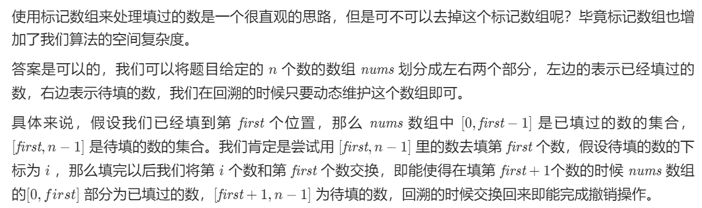
- Collections.swap方法被用于交换在指定列表中的指定位置的元素。
- 时间复杂度(O(n*n!))因为递归函数调用n!次，每次递归把答案复制进新数组是O(n)
- 空间复杂度O(n),因为递归深度

~~~java
class Solution {
    List<List<Integer>> res;
    List<Integer> path;
    public List<List<Integer>> permute(int[] nums) {
        res = new ArrayList<>();
        path = new ArrayList<>();
        for(int num : nums){
            path.add(num);
        }
        recur(nums,0);
        return res;
    }

    public void recur(int[] nums, int first){
        if(first == nums.length){
            res.add(new ArrayList<>(path));
        }

        for(int i = first; i < nums.length; i++){
            Collections.swap(path,first,i);
            recur(nums,first+1);
            Collections.swap(path,first,i);
        }
    }
}
~~~


### 3、全排列二（11）

LeetCode 47

给定一个**有重复**数字的序列 `nums` ，**按任意顺序** 返回所有不重复的全排列。

**示例 1：**

```
输入：nums = [1,1,2]
输出：
[[1,1,2],
 [1,2,1],
 [2,1,1]]
```

思路：

- 这题在上一题的基础上加了nums数组**数字可重复**，思路是在递归过程中对可能产生重复的地方剪枝
- 可以在搜索之前就对数组排序，**一旦发现某个分支继续下去可能会发生重复就提前剪枝**，也就是nums[i] == nums[i - 1]
- 什么时候剪枝是本题的难点，可以发现，**发生剪枝的地方都是相同的数在上一次刚刚被用过然后撤销了**，正是因为刚用过，所以要是再用相同的数值就重复了
- **总之和上一次相等的数，而且刚刚被撤销，就该剪枝**
- 用一个布尔数组标注是否被用过
- 时间复杂度：O(n * n!)
- 空间复杂度：O(n * n!)


~~~java
class Solution {
    List<List<Integer>> res;
    LinkedList<Integer> path;
    boolean[] used;
    public List<List<Integer>> permuteUnique(int[] nums) {
        res = new LinkedList<>();
        if(nums.length == 0) return res;
        path = new LinkedList<>();
        used = new boolean[nums.length];
        Arrays.sort(nums);
        recur(nums,0);
        return res;
    }

    public void recur(int[] nums, int depth){
        if(depth == nums.length){
            res.add(new LinkedList<>(path));
            return;
        }

        for(int i = 0; i < nums.length; i++){
            // 每一次都是从头开始，如果这个数被用过就跳过
            if(used[i]) continue;
			 // 剪枝条件：i > 0 是为了保证 nums[i - 1] 有意义
            // nums[i] == nums[i - 1]是因为排序数组相同的也跳过
            // 写 !used[i - 1] 是因为 nums[i - 1] 在深度优先遍历的过程中刚刚被撤销选择
            // 与上一个相等但是没有刚刚被撤销，不会跳过
            //上一个刚刚被撤销，但是不是相等的数那也没事，所以要同时满足这两个条件就剪枝
            if(i > 0 && nums[i] == nums[i - 1] && !used[i - 1])
                continue;

            path.add(nums[i]);
            used[i] = true;
            recur(nums,depth + 1);
            used[i] = false;
            path.removeLast();
        }
    }
}
~~~

### 4、子集（36）

leetcode 78

给你一个整数数组 `nums` ，数组中的元素 **互不相同** 。返回该数组所有可能的子集（幂集）。

解集 **不能** 包含重复的子集。你可以按 **任意顺序** 返回解集。

**示例 1：**

~~~java
输入：nums = [1,2,3]
输出：[[],[1],[2],[1,2],[3],[1,3],[2,3],[1,2,3]]
~~~

**提示：**

- `1 <= nums.length <= 10`
- `-10 <= nums[i] <= 10`
- `nums` 中的所有元素 **互不相同**

思路：

- 一共2^n个状态是因为每个元素都有两种选择，出现或者不出现。不像其他如全排列都得出现，确定一个就少一种可能变成阶乘
- 因为是子集，确定一个看下一个在不在就行了
- 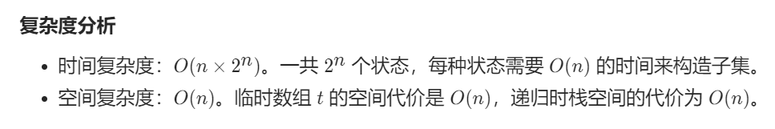

~~~java
class Solution {
    List<List<Integer>> res;
    LinkedList<Integer> path;
    public List<List<Integer>> subsets(int[] nums) {
        res = new LinkedList<>();
        path = new LinkedList<>();
        recur(nums, 0);
        return res;
    }

    private void recur(int[] nums, int cur){
        //因为题目中即使是空也加入了结果集，所以在结束前不管如何都要加入结果集
        //因为题目不存在重复，所以固定位置往下遍历选可能即可
        res.add(new LinkedList<>(path));
        if (cur == nums.length){
            return;
        }

        for (int i = cur;  i < nums.length; i++){
            path.add(nums[i]);
            recur(nums, i + 1);
            path.removeLast();
        }
    }
}
~~~

### 5、复原ip地址（34）

leetcode 93

给定一个只包含数字的字符串，用以表示一个 IP 地址，返回所有可能从 s 获得的 有效 IP 地址 。你可以按任何顺序返回答案。

有效 IP 地址 正好由四个整数（每个整数位于 **0 到 255 之间组成**，**且不能含有前导 0**），整数之间用 '.' 分隔。

例如："0.1.2.201" 和 "192.168.1.1" 是 有效 IP 地址，但是 "0.011.255.245"、"192.168.1.312" 和 "192.168@1.1" 是 无效 IP 地址。

**示例 1：**

~~~java
输入：s = "25525511135"
输出：["255.255.11.135","255.255.111.35"]
~~~

~~~java
class Solution {
    List<String> result;
    StringBuilder sb;
    public List<String> restoreIpAddresses(String s) {
        result = new LinkedList<String>();
        sb = new StringBuilder();
        if(s.length()>12) return result;//IP地址总长度超了,无法转换返回
        dfs(s,0,0,0);//开始dfs
        return result;
    }
    
    // dfs功能: 截取[start,end) 加入sb
    private void dfs(String s,int start,int end,int time){
        if(time > 5) return;
        if(time == 5 && start == s.length() && end==start+1){// 在第5次的时候判断说明已经截取4次了,且遍历到尾部,end==start+1防止重复(看到for循环就可以理解了)
            result.add(sb.toString());
            return;
        }
        if(end > s.length()) return;// 无法截取[start,end) end超了
        if(end-start > 1 && s.charAt(start)=='0') return;//当截取长度不是1(若长度为1允许为0),其他情况出现首零,返回
        if(end > start && Integer.parseInt(s.substring(start,end))>255) return;//大于255,返回
        
        for(int i=1;i<=3;i++){// 截取 长度 1,2,3 三种情况
            sb.append(s.substring(start, end));//加入
            if(time > 0 && time <= 3) sb.append('.');

            dfs(s, end, end+i, time+1);//继续裁剪

            if(time > 0 && time <= 3) sb.deleteCharAt(sb.length()-1);//还原数据的操作
            sb.delete(sb.length() - (end-start),sb.length());
        }
    }
}
~~~


### 6、等于目标值的组合总和（39）

LeetCode 39

给定一个无重复元素的数组 candidates 和一个目标数 target ，找出 candidates 中所有可以使数字和为 target 的组合。

**candidates 中的数字可以无限制重复被选取。**

**说明：**

- 所有数字（包括 `target`）都是正整数。
- 解集不能包含重复的组合。

**示例 1：**

~~~java
输入：candidates = [2,3,6,7], target = 7,
所求解集为：
[
  [7],
  [2,2,3]
]
~~~

思路：

- 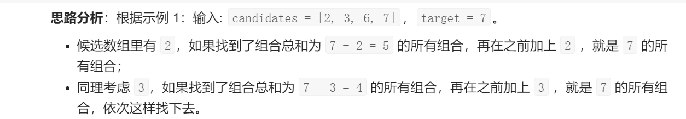
- 根据上面思路画出树形图，**本题难点在于如何避免出现重复结果，能否在搜索的时候就避免重复结果？**
- 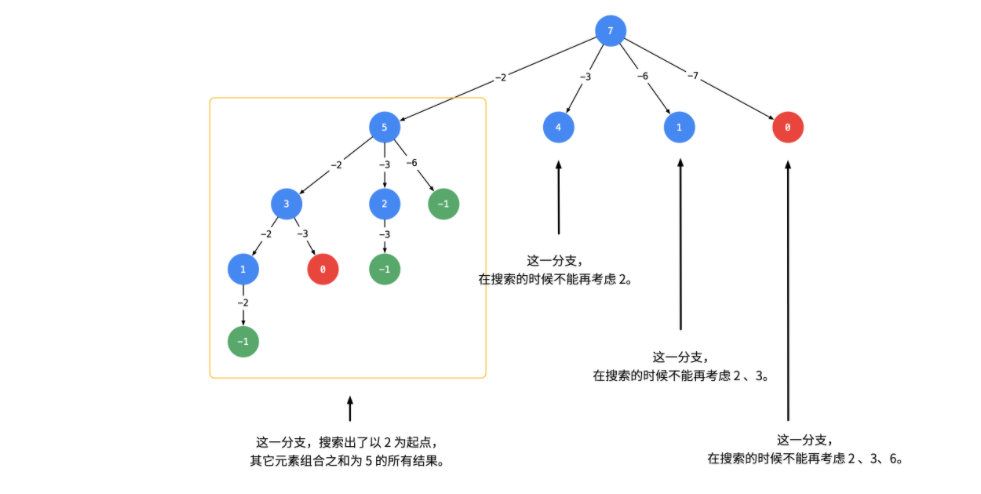
- 因为每一个数字都可以重复多次选取，前一个分支把所有包括2的考虑到了，所以第二个分支不用再考虑2了，同理考虑过3就不用再考虑其他的了
- 因为每次for循环都是以depth为起点，所以会自动排除之前一个
- 根据上面画树形图的经验，**如果 target 减去一个数得到负数，那么减去一个更大的树依然是负数，同样搜索不到结果。**基于这个想法，我们可以对输入数组进行排序，添加相关逻辑达到进一步剪枝的目的；


~~~java
public class Solution {
    List<List<Integer>> res;
    LinkedList<Integer> path;
    public List<List<Integer>> combinationSum(int[] candidates, int target) {
        
        res = new LinkedList<>();
        path = new LinkedList<>();

        // 排序是剪枝的前提
        Arrays.sort(candidates);
        dfs(candidates, target, 0);
        return res;
    }

    private void dfs(int[] candidates, int target, int begin) {
        // 由于进入更深层的时候，小于 0 的部分被剪枝，因此递归终止条件值只判断等于 0 的情况
        if (target == 0) {
            res.add(new LinkedList<>(path));
            return;
        }

        for (int i = begin; i < candidates.length; i++) {
            // 重点理解这里剪枝，前提是候选数组已经有序，
            if (target - candidates[i] < 0) {
                break;
            }
            
            path.add(candidates[i]);
            // 注意：由于每一个元素可以重复使用，下一轮搜索的起点依然是 i，这里非常容易弄错
            dfs(candidates, target - candidates[i], i);
            path.removeLast();
        }
    }
}
~~~

### 7、等于目标值的组合总和二（9）

LeetCode 40

给定一个数组 candidates 和一个目标数 target ，找出 candidates 中所有可以使数字和为 target 的组合。candidates 中的每个数字在每个组合中只能使用一次。

说明：

所有数字（包括目标数）都是正整数。
解集不能包含重复的组合。 

**示例 1:**

~~~
输入: candidates = [10,1,2,7,6,1,5], target = 8,
所求解集为:
[
  [1, 7],
  [1, 2, 5],
  [2, 6],
  [1, 1, 6]
]
~~~

思路：

- 

~~~java
public class Solution {
    List<List<Integer>> res;
    LinkedList<Integer> path;
    public List<List<Integer>> combinationSum2(int[] candidates, int target) {
        
        res = new LinkedList<>();
        path = new LinkedList<>();

        // 排序是剪枝的前提
        Arrays.sort(candidates);
        dfs(candidates, target, 0);
        return res;
    }

    private void dfs(int[] candidates, int target, int begin) {
        // 由于进入更深层的时候，小于 0 的部分被剪枝，因此递归终止条件值只判断等于 0 的情况
        if (target == 0) {
            res.add(new LinkedList<>(path));
            return;
        }

        for (int i = begin; i < candidates.length; i++) {
            // 重点理解这里剪枝，前提是候选数组已经有序，
            if (target - candidates[i] < 0) {
                break;
            }

            // 小剪枝：同一层相同数值的结点，从第 2 个开始，候选数更少，结果一定发生重复，因此跳过，用 continue
            if (i > begin && candidates[i] == candidates[i - 1]) {
                continue;
            }

            path.add(candidates[i]);
            // 因为元素不可以重复使用，这里递归传递下去的是 i + 1 而不是 i
            dfs(candidates, target - candidates[i], i + 1);
            path.removeLast();
        }
    }
}
~~~


## 位运算

### 1、找出数组中只出现了一次的两个数(2)

剑指offer 56-1

​	一个整型数组 `nums` 里除两个数字之外，其他数字都出现了两次。请写程序找出这两个只出现一次的数字。**要求时间复杂度是O(n)，空间复杂度是O(1)。**

**示例 1：**

```
输入：nums = [4,1,4,6]
输出：[1,6] 或 [6,1]
```

​	思路：

- 要求时间复杂度O(n)排除两次for循环，要求空间复杂度是O(1)排除用哈希表统计
- 两个相同数字异或得到0，一个数字和0异或不变，0异或任何数对结果不产生影响
- 如果数组中只有一个数字只出现了一次，那么将数组中所有数字进行异或运算，相同的都会抵消为0，最后只剩下那个数字
- 本题难点就在于有两个只出现一次的数字，无法一次异或得到目标数字，所以得想办法将数组分为两个，两个数字各在一个数组中
- 设两个只出现了一次的数字分别为x和y，既然这两个数不同，那么二进制至少有一位数字0和1是不同的，根据这个来分组。
- 具体就是先对数组全部元素异或得到的就是x和y的异或，这个结果为1的位这两个数肯定不同，因为二进制异或是按位异或的，根据这个分组原数组。
- 时间复杂度O(n),空间复杂度O(1)

~~~java
class Solution {
    public int[] singleNumbers(int[] nums) {
        int x = 0, y = 0, n = 0, m = 1;
        //所有异或的结果n
        for(int num : nums){
            n ^= num;
        }
		//找异或完哪一位为1，这一位就不同，m用来记录哪一位不同
        while((n & m) == 0){
            m <<= 1;
        }

        for(int num : nums){
            if((num & m) == 0) x ^= num;
            else y ^= num;
        }
        return new int[]{x,y};
    }
}
~~~

### 2、找出数组中只出现一次的数(2)

剑指offer 56-2

在一个数组 `nums` 中除一个数字只出现一次之外，其他数字都出现了三次。请找出那个只出现一次的数字。

**限制：**

- `1 <= nums.length <= 10000`
- `1 <= nums[i] < 2^31`

**示例 1：**

```
输入：nums = [9,1,7,9,7,9,7]
输出：1
```

思路：

- 统计所有数所有位二进制1各出现的次数，因为题目限制了范围最多32位数，所以新建一个count数组记录每一位1出现的次数
- 统计出次数后每一位求余3，得到的就是结果，再拼起来就可以了
- 注意记录数的时候，是数不断无符号右移，因为高位不能再补1
- 生成数要左移，且要从最大的开始左移，没有无符号左移，左移不需要补位，没有有符号无符号的说法

~~~java
class Solution {
    public int singleNumber(int[] nums) {
        int[] counts = new int[32];
        for(int num : nums){
            for(int i = 0; i < 32; i++){
                counts[i] += num & 1;
                num >>>= 1;
            }
        }

        int res = 0;
        int m = 3;
        for(int i = 0; i < 32; i++){
            //因为一开始初始化为0，实际上只要左移31次，而循环32次，所以放到前面
            res <<= 1;
            res |= counts[31 - i] % 3;
        }
        return res;
    }
}
~~~

### 3、二进制中位1的个数（13）

剑指offer 15 leetcode 191

请实现一个函数，输入一个整数（以二进制串形式），输出该数二进制表示中 1 的个数。例如，把 9 表示成二进制是 1001，有 2 位是 1。因此，如果输入 9，则该函数输出 2。

~~~
示例 1：

输入：00000000000000000000000000001011
输出：3
解释：输入的二进制串 00000000000000000000000000001011 中，共有三位为 '1'。
示例 2：

输入：00000000000000000000000010000000
输出：1
解释：输入的二进制串 00000000000000000000000010000000 中，共有一位为 '1'。
~~~

法一：

- 输入的是一个32位得2进制整数，只要将这个数与1进行与运算，如果得0说明最后一位是0，如果为1说明最后一位是1
- 每判断一次最后一位就将这个二进制数进行一个无符号右移的操作，即高位补0，然后再重新判断最后一位，其中统计1出现的次数
- 注意n >>= 1;会超时，涉及 Java 中的 `算术右移` 和 `逻辑右移` 。算术右移>>，舍弃最低位，高位用符号位来填补。逻辑右移也就是无符号右移>>>，舍弃最低位高位用0填补。对于负数而言最高位为1，算术右移最高位仍然填1，也就是n永远不会为0，会死循环。

~~~java
public class Solution {
    // you need to treat n as an unsigned value
    public int hammingWeight(int n) {
        int res = 0;
        while(n != 0){
            res += n & 1;
            n >>>= 1;
        }
        return res;
    }
}
~~~

法二：

- 法二更巧妙，利用了二进制中位运算的一个规律
- **n&(n-1)可以把n中出现的最后一个1变为0**

~~~java
public class Solution {
    public int hammingWeight(int n) {
        int res = 0;
        while (n != 0) {
            res += 1;
            n &= n - 1;
        }
        return res;
    }
}
~~~

### 4、只出现一次的数（33）

leetcode 136

给定一个非空整数数组，除了某个元素只出现一次以外，其余每个元素均出现两次。找出那个只出现了一次的元素。

说明：

你的算法应该具有线性时间复杂度。 你可以不使用额外空间来实现吗？

**示例 1:**

~~~
输入: [2,2,1]
输出: 1
~~~

思路：

- 两个相同的数异或结果为0,0异或任何数结果不变，所以将所有数异或得到的结果就是结果

~~~java
class Solution {
    public int singleNumber(int[] nums) {
        int res = 0;
        for (int num : nums){
            res ^= num;
        }
        return res;
    }
}
~~~


## 双指针和滑动窗口

### 1、找出排序数组中和为s的两个数字

​	给定一个递增排序的数组，在数组中查找两个数和为s，如果有多对数字和为s，任意输出一对即可。

**示例 1：**

```
输入：nums = [2,7,11,15], target = 9
输出：[2,7] 或者 [7,2]
```

思路：

- 使用hashmp可以用来找到特定的数字组合，空间复杂度为O(n)
- 但是本题为有序数组，且输出任意一个即可，用双指针对撞法，空间复杂度可为O(1)
- 注意这题仅要求两个数字，所以可以双指针控制两个数字的大小

~~~java
class Solution {
    public int[] twoSum(int[] nums, int target) {
        int i = 0, j = nums.length - 1;
        while(i < j) {
            int s = nums[i] + nums[j];
            if(s < target) i++;
            else if(s > target) j--;
            else return new int[] { nums[i], nums[j] };
        }
        return new int[0];
    }
}
~~~

### 2、和为s的正整数序列（5）

​	输入一个正整数s，输出所有和为s的**连续正整数序列，至少有两个数**，序列内按从小到大排序，不同序列按首个数字从小到大排列

**示例 1：**

```
输入：target = 9
输出：[[2,3,4],[4,5]]
```

思路：滑动窗口

- 这题和上一题的区别就是，这是连续的一系列值，是一个窗口，不仅仅是两个指针
- 滑动窗口确保了连续
- 滑动窗口和大于目标值则右移左指针，滑动窗口和小于目标值则左移右指针，若相等则记录结果并将左指针向右移动1
- 因为是连续正整数序列且至少两个数，所以初始化滑动窗口两端可以为1,2，和为3
- toArray() 方法将 Arraylist 对象转换为数组。
- toArray方法，数组空间等于0时，将会动态的创建和集合size相同空间大小的数组，性能是最好的。


~~~java
class Solution {
    public int[][] findContinuousSequence(int target) {
     int i = 1,j = 2;
     int s = 3;
     List<int[]> res = new ArrayList<>();

     while(i < j){
        if(s == target){
             int[] temp = new int[j - i + 1];
             for(int k = 0; k < j - i + 1; k ++){
                 temp[k] = i + k;
             }
             res.add(temp);
         }

         if(s >= target){
             s -= i;
             i++;
         }else{
             j++;
             s += j;
         }
     }
     return res.toArray(new int[res.size()][]);
    }
}
~~~

### 3、找出所有三数之和为0的（118）

leetcode 15

给你一个包含 n 个整数的数组 nums，判断 nums 中是否存在三个元素 a，b，c ，使得 a + b + c = 0 ？**请你找出所有和为 0 且不重复的三元组。**

注意：**答案中不可以包含重复的三元组。**

~~~
示例 1：

输入：nums = [-1,0,1,2,-1,-4]
输出：[[-1,-1,2],[-1,0,1]]
示例 2：

输入：nums = []
输出：[]
示例 3：

输入：nums = [0]
输出：[]
~~~

思路：排序+双指针逼近

- 先将数组排序，固定一个值，然后用双指针去寻找这个固定值的负数 
- 注意在查找过程中注意去重，**固定的值需要去重，双指针行进过程中也需要去重**，这题的难点就在于去重
- 固定一个值，用for循环遍历数组，遍历的时候如果发现遍历到正数了那么必然加起来不可能为0直接退出循环，如果同时去重。分为三数加起来正好相等的话那么就加入结果集，如果小于那么左指针+1，如果大于那么右指针-1，同时做好左右指针的去重
- List<String> list = Arrays.asList("a","b","c");该方法将数组转化为List集合
- 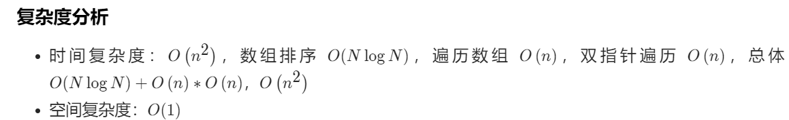

~~~java
class Solution {
    public List<List<Integer>> threeSum(int[] nums) {
        List<List<Integer>> res = new ArrayList<>();
        if(nums.length < 3) return res;
        Arrays.sort(nums);

        for(int i = 0; i < nums.length - 2; i++){
            // 提前剪枝操作，降低时间复杂度
            if(nums[i] > 0) break;
            // 对固定的i进行去重，这个去重是防止前一个同样的值，不会导致少算两个相同值，因为相同值前一个相等的已经算上了
            if(i > 0 && nums[i] == nums[i - 1]) continue;
            int left = i + 1,right = nums.length - 1;
            int target = -nums[i];

            while(left < right){
                if(nums[left] + nums[right] == target){
                    res.add(Arrays.asList(nums[i],nums[left],nums[right]));
                    left++;
                    right--;
                    // 左右双指针遍历也要去重，同样也只是和之前相等的值进行比较
                    while(left < right && nums[left] == nums[left - 1])
                        left++;
                    while(left < right && nums[right] == nums[right + 1])
                        right--;
                }else if(nums[left] + nums[right] < target){
                    left++;
                }else{
                    right--;
                }
            }
        }
        return res;
    }
}
~~~

### 4、无重复字符的最长子串的长度（滑动窗口）（185）

leetcode 03 ,剑指offer 48

给定一个字符串，请你找出其中不含有重复字符的 **最长子串** 的长度。

**示例 1:**

~~~java
输入: s = "abcabcbb"
输出: 3 
解释: 因为无重复字符的最长子串是 "abc"，所以其长度为 3。
~~~

思路：双指针 i , j 加HashMap

- 右指针 j 遍历字符s，用一个HashMap记录每个字符最后一次出现的位置
- 更新左指针，保证 i + 1 和 j之间无重复的字符，所以i的初始值赋-1；如果map中已经出现过这个字母了那么就将这个i指针更新到之前出现的位置，那么i+1到j之间就不会有重复了
- 为防止出现abba,即a的索引在之前，导致回到了很久之前，但是中途已经出现其他重复的了，所以得用 i = Math.max(i,map.get(temp));，保证i不回退
- 如果出现abba，i先在-1，然后j到第二个b的时候发现出现重复，就把i移动到第一个b的位置，然后遇到a这时候如果简单赋值i又会回到a，所以不能让a回退，这种情况不变就行
- 那么最大值便是 j - i,在循环中不断更新这个最大值就行了

~~~java
class Solution {
    public int lengthOfLongestSubstring(String s) {
        int i = -1, max = 0;
        HashMap<Character,Integer> map = new HashMap<>();
        for(int j = 0; j < s.length(); j++){
            char temp = s.charAt(j);
            if(map.containsKey(temp))
                //防止两个相同字符中间出现重复如abba,i不能开倒车，如果是发生重复后重新算的字符位置就保持不动就行了
                i = Math.max(i,map.get(temp));
            map.put(temp,j);
            max = Math.max(max,j - i);
        }
        return max;
    }
}
~~~

### 5、比较版本号（35）

 LeetCode 165

​	给你两个版本号 `version1` 和 `version2` ，请你比较它们。每一个版本号由一个或者多个修订号组成，每个修订号由多位数字组成。修订号可能有前导0，前导0忽略不计，比如001和1相等。

返回规则如下：

- 如果 `version1 > version2` 返回 `1`，
- 如果 `version1 < version2` 返回 `-1`，
- 除此之外返回 `0`。

**示例 1：**

~~~
输入：version1 = "1.01", version2 = "1.001"
输出：0
解释：忽略前导零，"01" 和 "001" 都表示相同的整数 "1"
~~~

**示例 2：**

~~~
输入：version1 = "1.0", version2 = "1.0.0"
输出：0
解释：version1 没有指定下标为 2 的修订号，即视为 "0"
~~~

思路：

- 整体思路是，用两个指针分别从头开始遍历两个字符，每次分别计算出一个修订号，然后将这两个修订号比较
- 如果到头了就一直让它为0
- 

~~~java
class Solution {
    public int compareVersion(String version1, String version2) {
        int len1 = version1.length();
        int len2 = version2.length();
        int index1 = 0, index2 = 0;

        while (index1 < len1 || index2 < len2){
            if (index1 < len1 && version1.charAt(index1) == '.'){
                index1++;
            }
            if (index2 < len2 && version2.charAt(index2) == '.'){
                index2++;
            }

            int value1 = 0;
            int value2 = 0;
            // 一轮循环算出一个修订号，结束index在‘.’的位置，下一个循环会加一，如果结束了就不会加1
            while (index1 < len1 && version1.charAt(index1) != '.'){
                value1 = value1 * 10 + version1.charAt(index1++) - '0';
            }
            while (index2 < len2 && version2.charAt(index2) != '.'){
                value2 = value2 * 10 + version2.charAt(index2++) - '0';
            }
            
            if (value1 != value2){
                return value1 < value2 ? -1 : 1;
            }
        }
        return 0;
    }
}
~~~

### 6、等于目标值的长度最小的子数组（19）

给定一个含有 n 个正整数的数组和一个正整数 target 。

找出该数组中满足其和 **≥ target** 的长度最小的 连续子数组 [numsl, numsl+1, ..., numsr-1, numsr] ，并返回其长度。如果不存在符合条件的子数组，返回 0 。

**示例 1：**

```
输入：target = 7, nums = [2,3,1,2,4,3]
输出：2
解释：子数组 [4,3] 是该条件下的长度最小的子数组。
```

**提示：**

- `1 <= target <= 109`
- `1 <= nums.length <= 105`
- `1 <= nums[i] <= 105`

 思路：滑动窗口

- 暴力解就是两个for循环，枚举以每一个值为起点的子数组，时间复杂度O(n^2)
- 用两个指针start和end表示滑动窗口的左右边界，一开始都设为0
- 如果还没有大于等于目标值就一直循环把end加一
- 如果大于目标值了就记录下最小值，然后将和中start减去，然后将start的值加上1.因为是要求最小，后面的值也就不用看了
- 因为可能减去start之后和仍旧大于目标值，这时候还要继续减去start，所以要用while循环，不用if
- 时间复杂度O(n)，空间O(1)

~~~java
class Solution {
    public int minSubArrayLen(int target, int[] nums) {
        int n = nums.length;
        int res = Integer.MAX_VALUE;
        int start = 0, end = 0;
        int sum = 0;

        while (end < n){
            sum += nums[end]; 
            while (sum >= target){
                res = Math.min(res, end - start + 1);
                sum -= nums[start];
                start++;
            }
            end++;
        }
        return res == Integer.MAX_VALUE ? 0 : res;
    }
}
~~~

### 7、滑动窗口的最大值（36）？

LeetCode 239

给你一个整数数组 nums，有一个大小为 k 的滑动窗口从数组的最左侧移动到数组的最右侧。你只可以看到在滑动窗口内的 k 个数字。滑动窗口每次只向右移动一位。

返回滑动窗口中的最大值。

**示例 1：**

~~~java
输入：nums = [1,3,-1,-3,5,3,6,7], k = 3
输出：[3,3,5,5,6,7]
解释：
滑动窗口的位置                最大值
---------------               -----
[1  3  -1] -3  5  3  6  7       3
 1 [3  -1  -3] 5  3  6  7       3
 1  3 [-1  -3  5] 3  6  7       5
 1  3  -1 [-3  5  3] 6  7       5
 1  3  -1  -3 [5  3  6] 7       6
 1  3  -1  -3  5 [3  6  7]      7
~~~

**示例 2：**

~~~java
输入：nums = [1], k = 1
输出：[1]
~~~

思路：

- 建立一个从大到小存储的链表，然后遍历数组，如果发现当前元素比链表中最后一个小就直接添加到链表，如果发现当前元素比链表最后一个元素大就一直删除链表最后一个元素，直到比链表中最后一个要小
- 当窗口的长度为k时，就保存窗口中的最大值，最大值就是队列首部的元素
- 结果数组应该有nums.length - k + 1个元素

~~~java
class Solution {
    public int[] maxSlidingWindow(int[] nums, int k) {
        // 数组长度如果小于2，那就是0或者1，那么不存在滑动窗口，直接返回原数组就行
        if (nums == null || nums.length < 2){
            return nums;
        }
        
        // list存储由大到小的数的下标，因为由下标找数简单，由数找下标难
        LinkedList<Integer> list = new LinkedList<>();
        int[] res = new int[nums.length - k + 1];

        for (int i = 0; i < nums.length; i++){
            while (!list.isEmpty() && nums[list.peekLast()] <= nums[i]){
                list.removeLast();
            }

            list.add(i);
			// 开头最大值不在滑动窗口范围内，已经失效了
            if (list.peek() <= i - k){
                list.removeFirst();
            }

            if (i + 1 - k >= 0){
                res[i + 1 - k] = nums[list.peek()];
            }
        }
        return res;
    }
}
~~~

### 8、移动0到数组末尾（26）

给定一个数组 `nums`，编写一个函数将所有 **`0` 移动到数组的末尾，同时保持非零元素的相对顺序**。

**示例:**

~~~
输入: [0,1,0,3,12]
输出: [1,3,12,0,0]
~~~

思路：

- 参考快排思想，以0为中间点将不等于0的放到0左边，将等于0的放到右边
- 使用双指针，左指针i一开始在左边为0，右指针从0开始遍历
- 只要遇到不等于0的数右指针 j 就会和左指针 i 交换，然后将左指针+1，遇到等于0的数 i 不动，j+1继续遍历
- 也就是说左指针i保持指向0，且左边都是非0，右指针j只要遍历到非0就和i交换然后将i + 1

~~~java
class Solution {
    public void moveZeroes(int[] nums) {
        if (nums == null){
            return;
        }

        int n = nums.length;
        int i = 0;
        for (int j = 0; j < n; j++){
            if (nums[j] != 0){
                int temp = nums[j];
                nums[j] = nums[i];
                nums[i] = temp;
                i++;
            }
        }
    }
}
~~~


## 字符串

### 1、左旋转字符串（2）

​	字符串的左旋转操作是把字符串前面的若干个字符转移到字符串的尾部。请定义一个函数实现字符串左旋转操作的功能。比如，输入字符串"abcdefg"和数字2，该函数将返回左旋转两位得到的结果"cdefgab"。

**示例 1：**

```
输入: s = "abcdefg", k = 2
输出: "cdefgab"
```

思路：

- 用stringbuilder根据索引，先加从后面再加前面，注意第几个是从1开始算的

~~~java
class Solution {
    public String reverseLeftWords(String s, int n) {
        StringBuilder res = new StringBuilder();
        for(int i = n; i < s.length(); i++)
            res.append(s.charAt(i));
        for(int i = 0; i < n; i++)
            res.append(s.charAt(i));
        return res.toString();
    }
}
~~~

### 2、反转单词顺序（51）

剑指offer 58 LeetCode 151

输入一个英文句子，翻转句子中单词的顺序，但单词内字符的顺序不变。为简单起见，标点符号和普通字母一样处理。例如输入字符串"I am a student. "，则输出"student. a am I"。s中至少有一个单词

**示例 1：**

~~~java
输入: "the sky is blue"
输出: "blue is sky the"
~~~

**示例 2：**

~~~java
输入: "  hello world!  "
输出: "world! hello"
解释: 输入字符串可以在前面或者后面包含多余的空格，但是反转后的字符不能包括。
~~~

**示例 3：**

~~~java
输入: "a good   example"
输出: "example good a"
解释: 如果两个单词间有多余的空格，将反转后单词间的空格减少到只含一个。
~~~

思路：双指针倒序遍历

- 题目所给字符串开头结尾可能有多个字符串，字符串中间也有可能有多个空字符串，格式并不统一，需要对每个做提前处理
- 首先把这个字符串的开头结尾空格去了
- 双指针，一个指针j标记字符串末尾，一个指针i循环遍历一个单词到前一个位置
- 然后加入StringBuilder类型的res,因为单词间要有空格所以多加一个空格，但是最后一个单词会多加一个空格，所以最后也要做一个trim的操作
- 注意：substring(a,b)是左闭右开的
- 时间复杂度O(n)，空间复杂度O(n)

~~~java
class Solution {
    public String reverseWords(String s) {
        s.trim();
        int j = s.length() - 1;
        int i = j;
        StringBuilder res = new StringBuilder();

        while(i >= 0){
            while(i >= 0 && s.charAt(i) != ' ') i--;
            res.append(s.substring(i+1,j+1) + ' ');
            while(i >= 0 && s.charAt(i) == ' ') i--;
            j = i;
        }
        return res.toString().trim();
    }
}
~~~

### 3、字符串转换整数（50）

LeetCode 8

​	请你来实现一个 `myAtoi(string s)` 函数，使其能将字符串转换成一个 32 位有符号整数


**示例 1：**

~~~java
输入：s = "42"
输出：42
解释：加粗的字符串为已经读入的字符，插入符号是当前读取的字符。
第 1 步："42"（当前没有读入字符，因为没有前导空格）
         ^
第 2 步："42"（当前没有读入字符，因为这里不存在 '-' 或者 '+'）
         ^
第 3 步："42"（读入 "42"）
           ^
解析得到整数 42 。
由于 "42" 在范围 [-231, 231 - 1] 内，最终结果为 42 。
~~~

**示例 2：**

~~~java
输入：s = "   -42"
输出：-42
解释：
第 1 步："   -42"（读入前导空格，但忽视掉）
            ^
第 2 步："   -42"（读入 '-' 字符，所以结果应该是负数）
             ^
第 3 步："   -42"（读入 "42"）
               ^
解析得到整数 -42 。
由于 "-42" 在范围 [-231, 231 - 1] 内，最终结果为 -42 。
~~~

**示例 3：**

~~~java
输入：s = "4193 with words"
输出：4193
解释：
第 1 步："4193 with words"（当前没有读入字符，因为没有前导空格）
         ^
第 2 步："4193 with words"（当前没有读入字符，因为这里不存在 '-' 或者 '+'）
         ^
第 3 步："4193 with words"（读入 "4193"；由于下一个字符不是一个数字，所以读入停止）
             ^
解析得到整数 4193 。
由于 "4193" 在范围 [-231, 231 - 1] 内，最终结果为 4193 。
~~~

**翻译翻译：**

- 需要去掉前导空格
- 需要判断第一个字符为+和-的情况，可以设计一个变量sign，初始化为1，如果遇到-将sign修正为+
- 需要判断是否为数字，可用字符的ASCII码来比较，即‘0’ <= c <= '9'
- 遇到不是数字字符的情况直接提前退出循环
- 如果转换以后的数字超过了 int 类型的范围，需要截取。这里不能将结果 res 变量设计为 long 类型，注意：由于输入的字符串转换以后也有可能超过 long 类型，因此需要在循环内部就判断是否越界，只要越界就退出循环，这样也可以减少不必要的计算；
- 由于涉及下标访问，因此全程需要考虑数组下标是否越界的情况。
- 由于题目中说「环境只能保存 32 位整数」，因此这里在每一轮循环之前先要检查乘以 1010 以后是否溢出，具体细节请见编码。
- Java 、Python 和 C++ 字符串的设计都是不可变的，即使用 trim() 会产生新的变量，因此我们尽量不使用库函数，使用一个变量 index 去做遍历，这样遍历完成以后就得到转换以后的数值。


~~~java
class Solution {
    public int myAtoi(String s) {
        int len = s.length();
        char[] charArray = s.toCharArray();
		// 去除前导空格
        int index = 0;
        while(index < len && charArray[index] == ' '){
            index++;
        }
        // 如果已经遍历完成（针对极端用例 "      "）
        if(index == len) return 0;
        int sign = 1;
        char firstChar = charArray[index];
        if(firstChar == '+'){
            index++;
        }else if(firstChar == '-'){
            index++;
            sign = -1;
        }

        int res = 0;
        while (index < len) {
            char currChar = charArray[index];
            //先判断不合法的情况,不合法提前break
            if (currChar > '9' || currChar < '0') {
                break;
            }

            // 题目中说：环境只能存储 32 位大小的有符号整数，因此，需要提前判：断乘以 10 以后是否越界
            if (res > Integer.MAX_VALUE / 10 || (res == Integer.MAX_VALUE / 10 && (currChar - '0') > Integer.MAX_VALUE % 10)) {
                return Integer.MAX_VALUE;
            }
            if (res < Integer.MIN_VALUE / 10 || (res == Integer.MIN_VALUE / 10 && (currChar - '0') > -(Integer.MIN_VALUE % 10))) {
                return Integer.MIN_VALUE;
            }
			//因为是从前往后算需要把前面结果乘10，然后加上现在这位乘符号位
            res = res * 10 + sign * (currChar - '0');
            index++;
        }
        return res;
    }
}
~~~

### 4、字符串相加（95）

LeetCode 415

给定两个字符串形式的非负整数 `num1` 和`num2` ，计算它们的和。**你不能使用任何內建 BigInteger 库， 也不能直接将输入的字符串转换为整数形式**，所以返回也是返回String

思路：模拟人工的加法

- 这种相加的题都是模拟人手工加，也就是对齐最小的一位，从后往前加，然后高位没有了就补0；这题和两数相加非常像leetcode2

- 真正计算的话，char字符是可以直接计算的，字符  -  ‘0’就是数字的值
- 加法都是又对齐开始，从最后一位开始，依次往前，记录上一位加下一位，再记录下进位
- 如果一个字符串遍历完了，就让他的值为0
- 注意最后要反转一下，因为是从个位数开始从前往后加的

~~~java
class Solution {
    public String addStrings(String num1, String num2) {
        StringBuilder res = new StringBuilder();
        int i = num1.length() - 1, j = num2.length() - 1;
        int add = 0;

        //统一的写法，将进位为1的情况也加入条件，因为最后一个位相加可能进位为1
        while(i >= 0 || j >= 0 || add == 1){
            int x = i >= 0 ? num1.charAt(i) - '0' : 0;
            int y = j >= 0 ? num2.charAt(j) - '0' : 0;
            int temp = x + y + add;
            add = temp / 10;
            res.append(temp % 10);
            i--;
            j--;
        }
        return res.reverse().toString();
    }
}
~~~

### 5、两数相加（57）

leetcode 2

给你两个 非空 的链表，表示两个非负的整数。它们每位数字都是按照 逆序 的方式存储的，并且每个节点只能存储 一位 数字。

请你将两个数相加，**并以相同形式返回一个表示和的链表**，返回一个新链表。

你可以假设除了数字 0 之外，这两个数都不会以 0 开头。

**示例 1：**表示342+465


~~~java
输入：l1 = [2,4,3], l2 = [5,6,4]
输出：[7,0,8]
解释：342 + 465 = 807.
~~~

思路：

- 逆序排列数字是为了方便我们加，从头开始先加个位，短的后面高位补0就行了
- 链表开始一位对一位往后加，记住进位
- 短的链表后面补0
- 如果最后循环结束l1和l2都遍历完了进位仍为1，补一个结点1
- 用一个dummy结点方便返回头结点，cur结点往下构建新节点
- 时间复杂度O(n),空间复杂度O(1)

~~~java
class Solution {
    public ListNode addTwoNumbers(ListNode l1, ListNode l2) {
        ListNode dummy = new ListNode(0);
        ListNode cur = dummy;
        int carry = 0;

        while(l1 != null || l2 != null || carry == 1){
            int x = l1 != null ? l1.val : 0;
            int y = l2 != null ? l2.val : 0;
            int temp = x + y + carry;
            cur.next = new ListNode(temp % 10);
            carry = temp / 10;
            cur = cur.next;
            if(l1 != null) l1 = l1.next;
            if(l2 != null) l2 = l2.next;
        }
        return dummy.next;
    }
}
~~~

### 6、最长公共前缀（26）

LeetCode 14

编写一个函数来查找字符串数组中的最长公共前缀。如果不存在公共前缀，返回空字符串 `""`。

**示例 1：**

~~~
输入：strs = ["flower","flow","flight"]
输出："fl"
~~~

思路：

- 从前往后遍历字符串的每一列，比较相同列上的字符是否相等
- 以第一个字符串为基准，遍历第一个字符串的每个字符和其他字符串依次比较
- 注意substring(m, n)是不包括最后一个字符的
- 

~~~java
class Solution {
    public String longestCommonPrefix(String[] strs) {
        if (strs == null || strs.length == 0){
            return "";
        }

        int len = strs[0].length();
        int count = strs.length;

        for (int i = 0; i < len; i++){
            char c = strs[0].charAt(i);
            for (int j = 1; j < count; j++){
                // 注意因为第一个字符串为基准，可能这个字符串很长，在i等于后面数组的长度时就提前结束
                if (i == strs[j].length() || strs[j].charAt(i) != c){
                    return strs[0].substring(0, i);
                }
            }
        }
        // 可能第一个数组很短，遍历完第一个还没有返回，木桶原理嘛
        return strs[0];
    }
}
~~~

### 7、替换空格为字符串

请实现一个函数，把字符串 `s` 中的每个空格替换成"%20"。

**示例 1：**

~~~
输入：s = "We are happy."
输出："We%20are%20happy."
~~~

思路：

- 不能简单将字符转换成字符数组再替换空格，因为转换成字符串它不仅占一个位置
- 可以用StringBuilder,从头到尾遍历，遇到字符加字符，遇到空格不加空格加字符串
- StringBuilder不仅可以加字符串也可以加字符

~~~java
class Solution {
    public String replaceSpace(String s) {
        StringBuilder res = new StringBuilder();
        for (char c : s.toCharArray()){
            if (c == ' '){
                res.append("%20");
            } else {
                res.append(c);
            }
        }
        return res.toString();
    }
}
~~~


## 堆

### 1、数据流的中位数（6）

剑指offer 41 LeetCode 295

​	给定一个数据流，如果长度是偶数就返回排在中间两个数的平均值，如果长度是奇数就直接返回中位数。再写一个往数据流添加数据的方法

思路：

- 将数据分成两半，一半大一半小，大的那部分用小顶堆，小的那部分用大顶堆，这样从两个堆里拿出堆顶就可以计算中位数
- 当两部分相等时，直接计算中位数，当总数为奇数时默认小顶堆多添加一个
- 当总数为偶数个添加时，总数会变成奇数个，总之小顶堆要多一个，所以先加到大顶堆再把大顶堆堆顶给小顶堆
- 当总数为奇数个，先加小顶堆再给大顶堆，因为你一开始不知道这个数属于哪里
- 时间复杂度查找是O(1)，添加数字是O(logn),因为堆的插入和弹出是O(logn)
- 空间复杂度是O(n)，因为两个大顶堆存储

### 2、数组中的第k个最大元素（186）

leetcode 215

在未排序的数组中找到第 **k** 个最大的元素。请注意，你需要找的是数组排序后的第 k 个最大的元素，而不是第 k 个不同的元素。即排序后从后往前第k个，相当于索引nums.length - k

**示例 1:**

~~~
输入: [3,2,1,5,6,4] 和 k = 2
输出: 5
~~~

**示例 2:**

~~~
输入: [3,2,3,1,2,4,5,5,6] 和 k = 4
输出: 4
~~~

思路：大顶堆，删除堆顶k-1次，最后的堆顶就是我们要的结果

- 建一个大顶堆，这里和堆排一样，不过我们要取第k大，只需要删除堆顶k-1次就得到第k大，

~~~java
class Solution {
    public int findKthLargest(int[] nums, int k) {
        int heapSize = nums.length;
        buildMaxHeapify(nums,heapSize);
        // 这个条件是本题最核心的，
        for(int i = nums.length - 1; i >= nums.length - k + 1; i--){
            swap(nums, 0 , i);
            heapSize--;
            //交换完了堆顺序就不对了，以0为根根正一次
            maxHeapify(nums, 0, heapSize);
        }
        return nums[0];
    }
	//从左到右，从上到下，用maxHeapify建堆
    public void buildMaxHeapify(int[] nums, int heapSize){
        //从非叶子节点heapSize / 2开始建队
        for(int i = heapSize / 2; i >= 0; i--){
            maxHeapify(nums, i, heapSize);
        }
    }
	//这个函数作用是假定左右子节点已经是堆了
    public void maxHeapify(int[] nums, int curRoot, int heapSize){
        int l = curRoot * 2 + 1, r = curRoot * 2 + 2;
        int max = curRoot;
        if(l < heapSize && nums[l] > nums[max])
            max = l;

        if(r < heapSize && nums[r] > nums[max])
            max = r;

        if(max != curRoot){
            swap(nums,max,curRoot);
            maxHeapify(nums, max, heapSize);
        }
        
    } 
    //交换数组中对应值
    public void swap(int[] nums, int i , int j){
        int temp = nums[i];
        nums[i] = nums[j];
        nums[j] = temp;
    }
}
~~~

### 3、打印出数组中最小的k个数（18）

剑指offer 40

输入整数数组 `arr` ，找出其中最小的 `k` 个数。

**限制：**

- `0 <= k <= arr.length <= 10000`
- `0 <= arr[i] <= 10000`

**示例 1：**

~~~
输入：arr = [3,2,1], k = 2
输出：[1,2] 或者 [2,1]
~~~

思路：大顶堆

- **维护数组前k个值为大根堆，然后遍历数组剩余的元素与堆顶比较，如果小于堆顶就删除堆顶，插入这个元素到大顶堆**，那么最后大顶堆里剩下的k个数一定是最小的k个放入结果数组就好
- 大顶堆可以使用java提供的PriorityQueue,默认是小顶堆，需要实现Comparator接口重写compare规则改成大顶堆
- 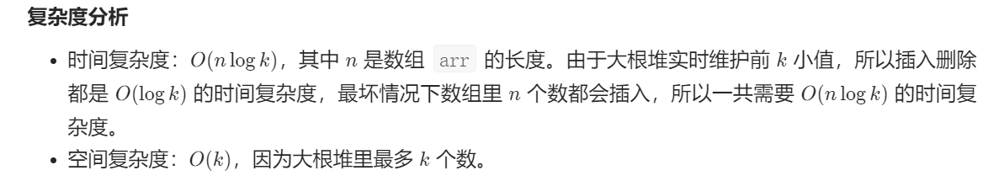

~~~java
class Solution {
    public int[] getLeastNumbers(int[] arr, int k) {
        int[] res = new int[k];
        if(k == 0) return res;

        Queue<Integer> queue = new PriorityQueue<>(
            new Comparator<Integer>(){
                public int compare(Integer num1, Integer num2){
                    return num2 - num1;
                }
            });
        
        for(int i = 0; i < k; i++){
            queue.offer(arr[i]);
        }

        for(int i = k; i < arr.length; i++){
            if(queue.peek() > arr[i]){
                queue.poll();
                queue.offer(arr[i]);
            }
        }

        for(int i = 0; i < k; i++){
            res[i] = queue.poll();
        }
        return res;
    }
}
~~~


## 二分

### 1、基本二分查找（79）

leetcode 704

给定一个 n 个元素有序的（升序）整型数组 nums 和一个目标值 target  ，写一个函数搜索 nums 中的 target，如果目标值存在返回下标，否则返回 -1。

思路：

- 经典二分查找，while我喜欢用小于等于
- 算出mid,如果和目标值相等就返回
- 如果小于目标值left = mid + 1
- 如果大于目标值right = mid - 1
- 时间复杂度O(log(n))，空间复杂度O(1)

~~~java
class Solution {
    public int search(int[] nums, int target) {
        int left = 0;
        int right = nums.length - 1;

        while(left <= right){
            int mid = left + (right - left) / 2;
            if(nums[mid] == target ){
                return mid;
            }else if(nums[mid] < target){
                left = mid + 1;
            }else if(nums[mid] > target){
                right = mid - 1;
            }
        }
        return -1;
    }
}
~~~

### 2、找右侧边界的二分

- 在基本二分基础上，找到目标值时不返回结果，而是令left=mid+1不断向右逼近
- 需要对结果校验，因为可能存在目标值不存在情况那就返回-1
- 找左边界校验右索引是否小于0，还有right最终是否等于目标结果

~~~java
class Solution {
    public int search(int[] nums, int target) {
        int left = 0;
        int right = nums.length - 1;

        while(left <= right){
            int mid = left + (right - left) / 2;
            if(nums[mid] <= target){
                left = mid + 1;
            }else if(nums[mid] > target){
                right = mid - 1;
            }
        }
        if(right < 0 || nums[right] != target)
            return -1;
        return right;
    }
}
~~~

### 3、找左侧边界的二分

- 在基本二分基础上，找到目标值时不返回结果，而是另right=mid-1不断向左逼近
- 需要对结果校验，因为可能存在目标值不存在情况那就返回-1
- 找左边界校验左索引是否大于等于数组长度，还有left最终是否等于目标结果

~~~java
class Solution {

    public static int search(int[] nums, int target) {
        int left = 0;
        int right = nums.length - 1;

        while(left <= right){
            int mid = left + (right - left) / 2;
           if(nums[mid] < target){
                left = mid + 1;
            }else if(nums[mid] >= target){
                right = mid - 1;
            }
        }
        if(left >= nums.length || nums[left] != target)
            return -1;
        return left;
    }
}
~~~

### 4、x的平方根（53）

LeetCode 69

实现 int sqrt(int x) 函数。计算并返回 x 的平方根，其中 x 是非负整数。由于返回类型是整数，结果只保留整数的部分，小数部分将被舍去。

**示例 2:**

~~~java
输入: 8
输出: 2
说明: 8 的平方根是 2.82842..., 
     由于返回类型是整数，小数部分将被舍去。
~~~

思路：

- 二分查找，因为可能有多个数字同事满足mid * mid 小于x，而我们要找的是右边界，所以在等于的时候也另left = left + 1
- 因为mid * mid这个操作可能超出int范围所以每次比较需要强转为long类型再比较
- 时间复杂度O(logn)，空间复杂度O(1)

~~~java
class Solution {
    public int mySqrt(int x) {
        int left = 0;
        int right = x;

        while(left <= right){
            int mid = left + (right - left) / 2;
            if((long)mid * mid > x){
                right = mid - 1;
            }else if(mid * mid <= x){
                left = left + 1;
            }
        }
        return right;
    }
}
~~~

### 5、寻找两个正序数组的中位数（39）

给定两个大小分别为 `m` 和 `n` 的正序（从小到大）数组 `nums1` 和 `nums2`。请你找出并返回这两个正序数组的 **中位数** 。

**你能设计一个时间复杂度为 `O(log (m+n))` 的算法解决此问题吗？**

**示例 1：**

~~~
输入：nums1 = [1,3], nums2 = [2]
输出：2.00000
解释：合并数组 = [1,2,3] ，中位数 2
~~~

**示例 2：**

~~~
输入：nums1 = [1,2], nums2 = [3,4]
输出：2.50000
解释：合并数组 = [1,2,3,4] ，中位数 (2 + 3) / 2 = 2.5
~~~

思路：

- 最开始想法是两个数组都给一个指针依次比较遍历，遍历计算中位数，这样时间复杂度O(m + n)空间复杂度O(1),达不到题目要求时间复杂度，只能采用二分


### 6、搜索旋转排序数组（65）

LeetCode 33

​	**整数数组 `nums` 按升序排列**，数组中的值 **互不相同** 。然后对其旋转，给你 **旋转后** 的数组 `nums` 和一个整数 `target` ，如果 `nums` 中存在这个目标值 `target` ，则返回它的索引，否则返回 `-1` 。

~~~
提示：
1 <= nums.length <= 5000
-10^4 <= nums[i] <= 10^4
nums 中的每个值都 独一无二
题目数据保证 nums 在预先未知的某个下标上进行了旋转
-10^4 <= target <= 10^4

~~~

**示例 1：**

~~~
输入：nums = [4,5,6,7,0,1,2], target = 0
输出：4
~~~

思路：

- 什么是旋转数组，例如， `[0,1,2,4,5,6,7]` 在下标 `3` 处经旋转后可能变为 `[4,5,6,7,0,1,2]` 。
- 也就是说一个升序数组被分成了两个升序数组，取一个mid值，分割成两个数组[l, mid]` 和 `[mid + 1, r]，**其中必定有一个是有序的**,分割出来必定是一个有序一个无序。
- 如果[l, mid - 1]是有序的，l <= target <= mid ，就将搜索范围缩小至[l, mid - 1]
- 如果[mid + 1, r]是有序的，mid + 1 <= target <= r ，就将搜索范围缩小至[mid + 1, r]
- 只对有序的进行查找，不断循环对有序的二分看看target在不在里面，有序就可以判断target在不在范围里，不在这个范围里就去另一边找，再循环，再分。
- 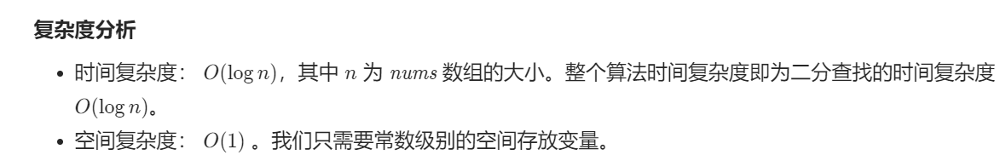

~~~java
class Solution {
    public int search(int[] nums, int target) {
        int left = 0;
        int right = nums.length - 1;

        while(left <= right){
            int mid = left + (right - left) / 2;
            if(nums[mid] == target){
                return mid;
            }

            if(nums[mid] >= nums[left]){
                if(nums[left] <= target && target < nums[mid]){
                    right = mid - 1;
                }else{
                    left = mid + 1;
                }
            }else{
                if(nums[mid] < target && target <= nums[right]){
                    left = mid + 1;
                }else{
                    right = mid - 1;
                }
            }
        }
        return -1;
    }
}
~~~

### 7、旋转数组的最小数字(33)

剑指offer 11 LeetCode 153

把一个数组最开始的若干个元素搬到数组的末尾，我们称之为数组的旋转。输入一个递增排序的数组的一个旋转，输出旋转数组的最小元素。例如，数组 [3,4,5,1,2] 为 [1,2,3,4,5] 的一个旋转，该数组的最小值为1。**数组中值可能有重复**

**示例 1：**

~~~
输入：[3,4,5,1,2]
输出：1
~~~

思路：

- 核心思想：每次二分取一个mid值，这个mid值的左边或者右边肯定有一部分是有序的，mid值肯定不在那个有序的半边，通过每次和最右边的值比较可以判断现在支点左边是有序还是右边有序。有一种特殊情况就是pivot和最右边的值相等，这种情况让right--就好。

- **mid值小于最右边值，说明右边是有序的，右边肯定没有最小值，mid可能是最小值，所以 right = mid**
- **mid值大于右边值，说明左边有序，最小值在右边，mid必然不是最小值，因为它已经大于右边的了，所以left = mid + 1**

- **如果mid值和最右边的值相等，可以把right--,反正right都是有替代品**
- 

~~~java
class Solution {
    public int minArray(int[] numbers) {
        int left = 0;
        int right = numbers.length - 1;

        while(left <= right){
            int mid = left + (right - left) / 2;
            if(numbers[mid] > numbers[right]){
                left = mid + 1;
            }else if(numbers[mid] < numbers[right]){
                right = mid;
            }else{
                right--;
            }
        }
        return numbers[left];
    }
}
~~~

### 8、排序数组中查找目标数字出现的次数（12）

剑指offer 53-1

给定一个按照**升序排列的整数数组** nums，和一个目标值 target。找出目标值出现的次数

**示例 1:**

~~~
输入: nums = [5,7,7,8,8,10], target = 8
输出: 2
~~~

思路：二分

- 因为是排序数组，自然想到二分
- 二分可以找出左右边界等于目标值的，比如找出目标值右边界，再找出目标值减-1的目标值，直接相减都不用再+1了
- 二分时间复杂度对数级别O(logn),空间复杂度为O(1)

~~~java
class Solution {
    public int search(int[] nums, int target) {
        return find(nums,target) - find(nums,target - 1);
    }
    //寻找右边界
    public int find(int[] nums, int target){
        int left = 0, right = nums.length - 1;
        while(left <= right){
            int mid = left + (right - left) / 2;
            if(nums[mid] <= target){
                left = mid + 1;
            }else if(nums[mid] > target){
                right = mid - 1;
            }
        }
        return right;
    }
}
~~~

### 9、在排序数组中查找元素第一个和最后一个位置（34）

LeetCode 34 剑指offer 53-2

给定一个按照升序排列的整数数组 nums，和一个目标值 target。找出给定目标值在数组中的开始位置和结束位置。

如果数组中不存在目标值 target，返回 [-1, -1]。可以设计并实现时间复杂度为 `O(log n)` 的算法解决此问题吗？

**示例 1：**

~~~java
输入：nums = [5,7,7,8,8,10], target = 8
输出：[3,4]
~~~

二分查找技巧：

- 查找右边界，在mid值等于目标时不返回，令left = mid + 1,返回right，就检查if(right < 0 || nums[right != target])
- 查找左边界，在mid值等于目标时不返回，令right = mid - 1,返回left,就检查if(left >= nums.length || nums[left]!=tag=rget)

~~~java
class Solution {
    public int[] searchRange(int[] nums, int target) {
       int start = find(nums,target);
       int end = find(nums, target+1) - 1;
       if(start>=nums.length||nums[start]!=target)
            return new int[]{-1,-1};
        return new int[]{start,end};
    }

    public int find(int[] nums, int target){
        int left = 0;
        int right = nums.length - 1;

        while(left <= right){
            int mid = left + (right - left) / 2;
            if(nums[mid] < target){
                left = mid + 1;
            }else if(nums[mid] >= target){
                right = mid - 1;
            }
        }
        return left;
    }
}
~~~


### 10、找出0到n-1缺失的数字（5）

​	**一个长度为n-1的递增排序数组**中的所有数字都是唯一的，并且每个数字都在范围0～n-1之内。在范围0～n-1内的n个数字中有且只有一个数字不在该数组中，请找出这个数字。

**示例 1:**

~~~
输入: [0,1,3]
输出: 2
~~~

思路：

- 顺序遍历解法时间复杂度为O（N）

- 有序数组首先想到二分法，时间复杂度降为log(N)
- **由于中间缺失一个数组，数组肯定分成了两部分，一部分是数组值和下标相等的，一部分是数组值和下标不相等的，我们要找的值就是不相等的那部分数组的第一个对应的下标**
- 二分法，left负责找右数组第一个，right负责找左数组最后一个
- 如果mid值和下标相等，那么，右数组第一个肯定在left + 1往后
- 如果mid值和下标不相等，那么左数组最后一个肯定在mid - 1开始往左

~~~java
class Solution {
    public int missingNumber(int[] nums) {
        int left = 0;
        int right = nums.length - 1;

        while (left <= right){
            int mid = left + (right - left);
            if (mid == nums[mid]){
                left = mid + 1;
            } else {
                right = mid - 1;
            }
        }
        return left;
    }
}
~~~


## 


## 位运算

### 1、求1加到n

​	求 `1+2+...+n` ，要求不能使用乘除法、for、while、if、else、switch、case等关键字及条件判断语句（A?B:C）。

**示例 1：**

```
输入: n = 3
输出: 6
```

思路：

- (1 + n) * n / 2;平均值计算用到了乘除法不行，for循环相加用到了for也不行
- 递归的结束条件要用到if也不行，再想想？

~~~java
public int sumNums(int n) {
    if(n == 1) return 1;
    n += sumNums(n - 1);
    return n;
}
~~~

- 想办法在递归中去掉if来实现n==1时结束递归,可以利用与操作的短路原理，左边为false右边不会执行

~~~java
class Solution {
    int res = 0;
    public int sumNums(int n) {
        boolean x = n > 1 && sumNums(n-1) > 0;
        res += n;
        return res;   }
}
~~~

### 2、用rand7()实现rand10()  （42）

已有方法 rand7 可生成 1 到 7 范围内的均匀随机整数，试写一个方法 rand10 生成 1 到 10 范围内的均匀随机整数。

不要使用系统的 Math.random() 方法。

**提示:**

1. `rand7` 已定义。
2. 传入参数: `n` 表示 `rand10` 的调用次数,函数不用传

**示例 1:**

~~~java
输入: 1
输出: [7]
~~~

**示例 2:**

~~~
输入: 2
输出: [8,4]
~~~

思路：

- 如果用rand10()实现rand7()那么只要使用rand10()然后筛选出小于等于7的数就可以了，因为1到7概率都是十分之一。**所以可以得出一个结论用一个大的rand可以实现一个小的rand**
- 所以要想办法得出一个大的rand，要保证大的rand概率平均，没有重复。**(rand7() - 1) * 7 + rand7();**
- 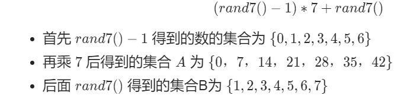
- 这样构建，A和B相加，正好覆盖了1到49，每个只出现一次。换成其他数比如乘6就会出现重复，比如0 + 7和 1 + 6.乘7的话0 + 7和7 + 1就不重合了。乘7才能保证以下一个数为基准相加开始得到一个新的数
- 一个通用的公式：**(randX() - 1)*Y + randY() 可以等概率的生成[1, X * Y]范围的随机数**
- 时间复杂度最坏O（+无穷）期望O（1），因为是随机的
- 空间O（1）

~~~java
class Solution extends SolBase {
    public int rand10() {
        int num = (rand7() - 1) * 7 + rand7();
        while (num > 10){
            num = (rand7() - 1) * 7 + rand7();
        }
        return num;
    }
}
~~~

思路：再优化

- 上面用了49个数来求rand10有点浪费，可以只用1到40
- 剔除大于40的，只要得到的数在1到40之间都可以，得到的结果余10再加上1正好是1到10
- 因为1到40概率相等，每个数再余10还是相等，题目要求1到10所以还要+1，不然求余就是1到9

~~~java
class Solution extends SolBase {
    public int rand10() {
        int num = (rand7() - 1) * 7 + rand7();
        while (num > 40){
            num = (rand7() - 1) * 7 + rand7();
        }
        return num % 10 + 1;
    }
}
~~~

### 3、第一个只出现一次的字符

剑指offer 50

​	在字符串s中找**第一个**只出现一次的字符,如果没有就返回一个空格，s只包含小写字母

**示例:**

~~~java
s = "abaccdeff"
返回 'b'

s = "" 
返回 ' '
~~~

思路：遍历两次hashmap

- 查找第一个只出现一次的字符，因为要判断是不是出现了一次，所以肯定要遍历两次数组
- 用一个map结构，遍历字符的同时，判断数组中有没有，有就将value设为false没有就是true
- 然后再遍历一遍，遇到的第一个true就是结果，因为题目要求了要第一个只出现一次的不是任意一个

~~~java
class Solution {
    public char firstUniqChar(String s) {
        Map<Character,Boolean> map = new HashMap<>();
        char[] words = s.toCharArray();
        for(char word : words){
            map.put(word,!map.containsKey(word));
        }

        for(char word : words){
            if(map.get(word)){
                return word;
            }
        }
        return ' ';
    }
}
~~~

## 其他

### 1、最长回文子串（66）

LeetCode 5

给你一个字符串 `s`，找到 `s` 中最长的回文子串。1 <= s.length <= 1000,s仅由数字和英文字母组成。简单说就是两个相同字符所占的最大长度

**示例 1：**

~~~java
输入：s = "babad"
输出："bab"
解释："aba" 同样是符合题意的答案。
~~~

思路：中心拓展法

- 回文子串就是字符串以中心为对称，一个回文子串去掉左右两端依然是回文子串
- **核心思想：回文子串必然存在一个中心，这个中心可能是一个字符也可能是两个相等的字符，遍历字符串，必有一个最长回文子串的中心。用start和end记录最大回文子串位置，直到有长度超过end-start的就更换**
- 建立一个辅助函数，这个辅助函数功能是计算出以一个或者两个点为中心，向左右拓展最大回文子串的长度是多少
- 一次遍历整个字符串，以这一个字符串为起点或者和他下一个字符串组成两个起点向左右拓展，取最大的长度，然后推算出左右起点位置

- 分为回文串为奇数和偶数两种情况，因为奇数个是以一个点为中心向左右扩散的，而偶数是以两个点为中心向左右扩展的

- left = right 的时候，此时回文中心是一个字符，回文串的长度是奇数

- right = left + 1 的时候，此时回文中心是一个空隙，回文串的长度是偶数

- 注意java中截取字符串的方法substring两个参数为索引，是左闭又开的，不包括，右边的索引，所以最后end要+1

- 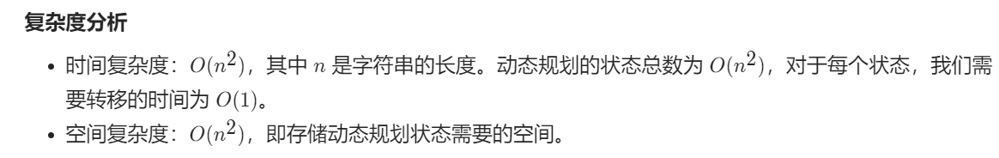

  

~~~java
class Solution {
    public String longestPalindrome(String s) {
        // 以start和end记录到目前为止最长回文子串的长度
        int start = 0;
        int end = 0;

        for (int i = 0; i < s.length(); i++){
            // 计算以一个为中心和以两个点为中心的回文子串长度，取最大
            int len_odd = expendCenter(s, i, i);
            int len_even = expendCenter(s, i, i + 1);
            int len = Math.max(len_odd, len_even);
            if (len > end - start){
                // 注意len - 1是因为i是从左到右遍历，如果要取两个，就是i和i + 1
                // 对于两个中心拓展的，比如第0,1,2,4，以1,2为中心。i为1,计算最左边start时，1 - 4 / 2 = -1,而实际上我们需要的是0,所以实际上计算左下标要多减一个1,这对于以一个为起点的没有影响
                start = i - (len - 1) / 2;
                end = i + len / 2;
            }
        }
        return s.substring(start, end + 1);
    }

    private int expendCenter(String s, int left, int right){
        while (left >= 0 && right < s.length() && s.charAt(left) == s.charAt(right)){
            left--;
            right++;
        }
        // 左右相等就直接将left和right拓展了，不管下一个是否真的相等，所以到最后不相等的时候肯定多拓展了一次，所以相等于right - left  + 1 - 2
        return right - left - 1;
    }
}
~~~

### 2、调整数组顺序使奇数位于偶数前面（26）

剑指offer21

输入一个整数数组，实现一个函数来调整该数组中数字的顺序，使得所有奇数位于数组的前半部分，所有偶数位于数组的后半部分。

~~~
示例：
输入：nums = [1,2,3,4]
输出：[1,3,2,4] 
注：[3,1,2,4] 也是正确的答案之一。
~~~

思路：

- 左右两个指针，左指针从左往右搜索偶数，右指针从右往左搜素奇数，然后互换，只要左指针和右指针不相等就一直循环下去
- 因为是到左右指针相等所以用<
- 注意和快排不一样的要判断

~~~java
class Solution {
    public int[] exchange(int[] nums) {
        int left = 0;
        int right = nums.length - 1;

        while(left < right){
            while(left < right && nums[left] % 2 == 1){
                left++;
            }

            while(left < right && nums[right] % 2 == 0){
                right--;
            }

            if(left < right){
                int temp = nums[left];
                nums[left] = nums[right];
                nums[right] = temp;
            }
        }
        return nums;
    }
}
~~~

### 3、剪绳子、整数拆分求最大乘积(3)

剑指offer14-1  LeetCode343

给定一个正整数 *n*，将其拆分为**至少**两个正整数的和，并使这些整数的**乘积最大化**。 返回你可以获得的最大乘积。**说明:** 你可以假设 *n* 不小于 2 且不大于 58

**示例 1:**

~~~
输入: 2
输出: 1
解释: 2 = 1 + 1, 1 × 1 = 1。
~~~

示例 2：

~~~
输入: 10
输出: 36
解释: 10 = 3 + 3 + 4, 3 × 3 × 4 = 36。
~~~

法一：动态规划

思路：

- 用一个dp数组记录数i的拆分后最大乘积
- 那么可以写出状态转移方程，dp[i] = max(j * (i - j) , j * dp[i - j])，即拆出一个数字之后可以对另一部分继续拆即dp[i-j],也可以对另一部分不拆直接求乘积
- 初始状态是dp[2] = 1
- 第一层for循环表示第i个数字，第二个for循环表示每次切的数字，注意可以直接从2开始切，因为切出两个1对于乘积没有任何作用
- dp[i] = Math.max(dp[i], Math.max(j * (i - j), j * dp[i - j])); 不同的j都会有一个dp[i]，这是在取不同的j情况下dp[i]的最大值

~~~java
class Solution {
    public int cuttingRope(int n) {
        int[] dp = new int[n + 1];
        dp[2] = 1;
        for(int i = 3; i < n + 1; i++){
            for(int j = 2; j < i; j++){
                dp[i] = Math.max(dp[i], Math.max(j * (i - j), j * dp[i - j]));
            }
        }
        return dp[n];
    }
}
~~~

法二：贪心，偏数学了

思路：数学结论

- 切3最优，剩下余数0、1、2单独讨论， a = n / 3;用来看有几个3，int b = n % 3;用来看余数
- 余数为0，直接返回3^a
- 余数为1，将一个3和1组合为4，拆分乘积为4
- 余数为2，2不动
- double pow(double x, double y);
- 注意Math.pow返回double,需要用int强转

~~~java
class Solution {
    public int integerBreak(int n) {
        if(n <= 3) return n-1;
        int a = n / 3;
        int b = n % 3;
        if(b == 0) return (int)Math.pow(3, a);
        //多一个1，1*3 < 2*2
        if(b == 1) return (int)Math.pow(3,a-1)*4;
        //多一个2，2就这样了拆成1*1反而更少
        if(b == 2) return (int)Math.pow(3,a)*2;
        return -1;
    }
}
~~~

### 4、数值的整数次方(15)

剑指offer 16 leetcode 50

实现 [pow(*x*, *n*)](https://www.cplusplus.com/reference/valarray/pow/) ，即计算 x 的 n 次幂函数（即，x^n）。不得使用库函数，同时不需要考虑大数问题。-2^31 <= n <= 2^31 -1

~~~java
示例 1：

输入：x = 2.00000, n = 10
输出：1024.00000
示例 2：

输入：x = 2.10000, n = 3
输出：9.26100
~~~

思路：

- 最简单的方式就是一个for循环打印x个数,但是这种暴力解超时时间复杂度O(n)
- 可以用**快速幂**，将时间复杂度降到O(logn)
- 所谓快速幂就是将原本x^n，中的n用二进制表示，然后将二进制转化为10进制，转化为10进制时会出现很多2次幂，每后一个二次幂是前一个二次幂的平方，这样每次只需计算二次幂的平方即可，不用一个一个去计算，将时间复杂度降到了logn
- 注意因为有负数次幂，所以要将x变成1/x,次方变成正的，所以如果要用**int n**涉及到一个**-n**操作,那么-2^31变成2^31就超出int范围了，所以要用一个long变量存储n的值
- 注意==的优先级高于&，所以&要加括号
- 

~~~java
class Solution {
    public double myPow(double x, int n) {
        if(x == 0) return 0;
        long b = n;
        double res = 1.0;
        if(b < 0){
            x = 1 / x;
            b = -b;
        }
        while(b != 0){
            if((b & 1) == 1) res *= x;
            x *= x;
            b >>= 1;
        }
        return res;
    }
}
~~~

### 5、整数反转（24）

leetcode 7

给你一个 32 位的有符号整数 x ，返回将 x 中的数字部分反转后的结果。

如果反转后整数超过 32 位的有符号整数的范围 [−231,  231 − 1] ，就返回 0。

**假设环境不允许存储 64 位整数（有符号或无符号）。**

**示例 1：**

~~~
输入：x = 123
输出：321
~~~

思路：

- 反复弹出数字末尾，添加到新的结果

  ~~~java
  // 弹出 x 的末尾数字 digit
  digit = x % 10
  x /= 10
  
  // 将数字 digit 推入 rev 末尾
  rev = rev * 10 + digit
  ~~~

- 但是题目要求不允许使用 64 位整数，即运算过程中的数字必须在 32 位有符号整数的范围内，因此我们不能直接按照下面式子计算，需要另寻他路。


- 
- 如果还没加下一个10以内的数你就已经超了，那肯定不行，如果满足这个式子下面无论你加0到9，都没问题

~~~java
class Solution {
    public int reverse(int x) {
        int res = 0;
        while (x != 0){
            if (res < Integer.MIN_VALUE / 10 || res > Integer.MAX_VALUE / 10){
                return 0;
            }
            int digit = x % 10;
            res = res * 10 + digit;
            x /= 10;
        }
        return res;
    }
}
~~~

