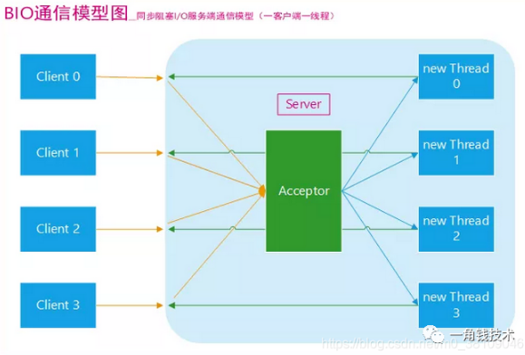
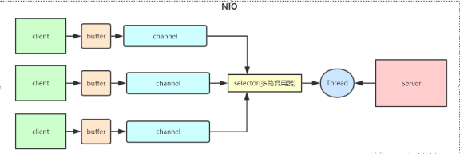
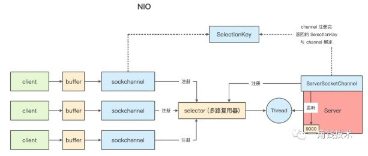

# BIO,NIO,AIO

​	IO模型就是说用什么样的通道进行数据的发送和接收，Java 共支持3种网络变成 IO 模式：BIO、NIO、AIO。

Java 中的 BIO、NIO 和 AIO 理解为是 Java 语言对操作系统的各种 IO 模型的封装。我们在使用这些 API 的时候，不需要关系操作系统层面的知识，也不需要根据不同操作系统编写不同的代码。

### 同步、异步、阻塞、非阻塞的区别

​	**阻塞和非阻塞常用于形容多线程之间的影响，同步和异步通常形容一次方法调用；**

**同步和异步**

- 同步和异步的区别最大在于**异步的话调用者不需要等待结果处理**，被调用者会**通过回调等机制来通知调用者返回结果。**

**阻塞和非阻塞**

- **阻塞** : 阻塞就是发起一个请求，调用者一直等待请求结果返回，**也就是当前线程会被挂起**，**无法从事其他任务。**传统的IO流都是阻塞式的。也就是说，当一个线程调用read()或者write()方法时，该线程将被阻塞，在此期间，该线程不能执行其他任何任务。
- **非阻塞**：发起一个请求调用者不用一直等待结果返回，可以做其他事。JavaNIO是非阻塞式的。当线程从某通道进行读写数据时，该线程会去执行其他任务。线程通常将非阻塞IO的空闲时间用于在其他通道上执行IO操作，所以单独的线程可以管理多个输入和输出通道。因此NIO可以让服务器端使用一个或有限几个线程来同时处理连接到服务器端的所有客户端。

### 同步异步、阻塞非阻塞一个好的例子

**老张烧开水**

出场人物：老张，水壶两把（普通水壶，简称水壶；会响的水壶，简称响水壶）。

1. 老张把水壶放到火上，立等水开。（**同步阻塞**）
2. 老张把水壶放到火上，去客厅看电视，时不时去厨房看看水开没有。（**同步非阻塞**）
3. 老张把响水壶放到火上，立等水开。（**异步阻塞**）
4. 老张把响水壶放到火上，去客厅看电视，水壶响之前不再去看它了，响了再去拿壶。（**异步非阻塞**）

**所谓同步异步，只是对于水壶而言**

- 普通水壶：同步；响水壶：异步。
- 虽然都能干活，但响水壶可以在自己完工之后，提示老张水开了，这是普通水壶所不能及的
- **同步只能让调用者去轮询自己**（情况2中），造成老张效率的低下。

**所谓阻塞非阻塞，仅仅对于老张而言**

- 立等的老张：阻塞；看电视的老张：非阻塞。
- 情况1 和 情况3 中老张就是阻塞的，媳妇喊他都不知道。虽然情况3中响水壶是异步的，可对于立等的老张没有太大的意义。所以一般异步是配合非阻塞使用的，这样才能发挥异步的效用。

### BIO（Blocking I/O)同步阻塞

特点：

- 同步阻塞IO模式，**数据的读取和写入必须阻塞在一个线程内等待其**完成。**一请求一应答通信模型**。
- **如果要处理多个客户端请求，就必须使用多线程**。线程创建销毁成本很高，可以**用线程池降低创建和回收成本。**
- 在活动连接数不是很高（小于单机1000）情况下，这种模型是不错的。、

弊端：

- 这种模式服务器处理请求之所以**慢是因为服务器线程在等待IO**，让高速运转的CPU去等待及其低效的网络IO是非常不合算，为了将网络IO的等待时间从线程之中分离出来，出现了NIO

### NIO(New I/O)同步非阻塞

​	同步非阻塞，服务器实现模式为**一个线程可以处理多个请求（连接）**，客户端发送的连接请求都会注册到 **多路复用器 selector** 上，**多路复用器轮询到连接有 IO 请求就进行处理**。

​	

​	**NIO是面向缓冲、基于通道的。**使用NIO可以将将BIO网络IO等待时间从业务线程中抽取出来。

##### NIO如何工作

​	NIO的关键组件是**channel(通道)、buffer(缓冲区)、selector(选择器)**

- **buffer(缓冲区)**：IO面向流，而NIO面向缓冲区，**读取数据时直接读到缓冲区，写入数据也直接写入缓冲区**。

  缓冲区**实质上是一个数组**，通常它是一个字节数组（ByteBuffer），也可以使用其他类的数组。每一种Java基本类型（除了Boolean）都对应一种缓冲区。

- **channel(通道)** ：一个channel可以和文件或者套接字对应，可以通过它来读取和写入数据。通道是双向的，流是单向的，通道只和缓冲区交互，因为缓冲区的存在通道可以实现非阻塞。
- **selector(选择器)** ： Channel会注册到Selector上，**Selector选择器可以监听多个Channel通道**感兴趣的事情(read、write、accept(服务端接收)、connect，**实现一个线程管理多个Channel**，节省线程切换上下文的资源消耗。

##### 特点

- 同步非阻塞模式。支持面向缓冲，基于通道的I/O操作方法
- I/O面向流，NIO面向缓冲区，NIO直接读到缓冲区中进行操作
- NIO通过channel通道进行读写，通道是双向的可读可写，而流的读写是单向的。无论读写只能和Buffer交互
- 但是JDK原生NIO编程复杂，还会出现很多bug，Netty的出现改善了原生NIO存在的问题

##### 应用

​	特别是Netty是目前最流行的一个Java开源框架NIO框架，**Netty提供异步的、事件驱动的网络应用程序框架和工具**，用以快速开发高性能、高可靠性的网络服务器和客户端程序。相比JDK原生NIO，Netty提供了相对十分简单易用的API，非常适合网络编程。

### NIO的特性

我们从一个问题来总结：**NIO 与 IO 的区别**？

​	如果是在面试中来回答这个问题，我觉得首先肯定要从 **NIO 流是非阻塞 IO**，**而 IO 流是阻塞 IO说起**。然后可以从 NIO 的**3个核心组件/特性**为 NIO 带来的一些改进来分析。

#### IO流是阻塞的，NIO流不是阻塞的

​	Java NIO 使我们可以进行**非阻塞 IO 操作**。比如说，单线程中从通道读取数据到 buffer，同时可以继续做别的事情，**当数据读取到 buffer 中后，线程再继续处理数据**。写数据也是一样的。另外，非阻塞写也是日常，一个线程请求写入一些数据到某通道，但不需要等待它完全写入，这个线程同时可以去做别的事情。

​	Java IO 的各种流是阻塞的，这意味这，**当一个线程调用 read() 或 write() 时，该线程被阻塞**，直到有一些数据被读取或数据完全写入。该线程在此期间不能再干任何事情了。

#### IO 面向流（Stream oriented），NIO 面向缓冲区（Buffer oriented）

**Buffer（缓冲区）**

Buffer 是一个对象，它包含一些要写入或者要读出的数据。在 NIO 类库中加入 Buffer对象，体现了新库与原库 I/O的一个重要区别：

- NIO 是直接读到 Buffer 中进行操作。在 NIO 库中，所有的数据都是用缓冲区处理的。在读取数据时，它是直接读到缓冲区中的；在写入数据时，写入到缓存中。任何时候访问 NIO 中的数据，都是通过缓冲区进行操作。
- 最常用的缓冲区是 ByteBuffer，ByteBuffer 提供流一组功能用于操作 byte 数组。除了 ByteBuffer 还有其他的一些缓冲区，事实上，每一种 Java 基本类型（除了 Boolean 类型）都对应有一种缓冲区。

#### NIO 通过 Channel（通道）进行读写

**Channel（通道）**

​	通道是双向的，可读也可以写，而流的读写是单向的。无论读写，通道只能和 Buffer 交互。因为 Buffer，通道可以异步地读写。

#### NIO 有选择器，而 IO 没有

**Selectors（选择器、多路复用器）**

​	NIO 模型的 selector 就像一个大总管，负责监听各种 I/O 事件，然后转交给后端线程去处理。

​	NIO 相对于 BIO 非阻塞的体现就在：BIO 的后端线程需要阻塞等待客户端写数据（比如 read 方法），如果客户端不写数据线程就要阻塞。

​	NIO 把等到客户端操作的时候交给了大总管 selector ，**selector 负责轮询所有已注册的客户端，发现有事件发生了才转交给后端线程处理，后端线程不需要做任何阻塞等待，直接处理客户端事件的数据即可，处理完马上结束，或返回线程池供其他客户端事件继续使用。还有就是 channel 的读写是非阻塞的。**

### Redis

​	Redis 就是典型的 NIO 线程模型，**selector 收集所有的事件并且转给后端线程**，线程连续执行所有事件命令并将结果写回客户端。

### AIO（Asynchronous I/O)

​	AIO是异步IO的缩写，虽然在NIO提供了非阻塞方法，但是NIO的IO行为还是同步的。对于NIO来说，业务线程在IO准备好时得到通知，接着由这个线程自行进行IO操作，本身还是同步的。

​	AIO更进了一步，它不是在IO准备好时通知线程，而是在IO操作已经完成后在发出通知，业务逻辑变成了一个回调函数，等IO操作完成后系统自动触发。

##### 	**异步非阻塞一般适用于连接数较多且连接时间较长的应用。与同步非阻塞的区别在哪里？**

异步非阻塞无需一个线程去轮询所有IO操作的状态改变，**在相应的状态改变后，系统会通知对应的线程来处理。**对应到烧开水中就是，为每个水壶上面装了一个开关，水烧开之后，水壶会自动通知我水烧开了。

### **BIO、NIO、AIO适用场景**

- BIO方式适用于连**接数目比较小且固定的架构**，这种方式对服务器资源要求比较高，并发局限于应用中，JDK1.4以前的唯一选择。
- NIO方式适用于**连接数目多且连接比较短**（轻操作）的架构，比如聊天服务器，弹幕系统，并发局限于应用中，编程比较复杂。
- AIO方式使用于连接数目多且**连接比较长**（重操作）的架构，比如相册服务器，充分调用OS参与并发操作，编程比较复杂，JDK7开始支持。