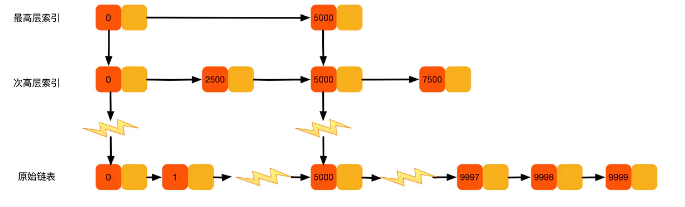
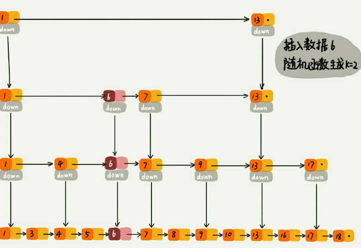

# 跳表

### 什么是跳表

​	跳表是一种用来快速查找的数据结构，**查询时间复杂度是O(logn)**，**空间复杂度是O(n)。****跳表的本质是同时维护了多个链表**，并且链表是分层的。跳表内所有链表的元素都是排序的，查找时可以从顶级链表开始查找，根据顶级链表范围跳到下一层链表查找。很显然，跳表是一种用空间换时间的查找算法。实现二分查找的有序链表。

### 跳表如何动态维护数据结构

作为一种动态数据结构，我们需要某种手段来维护索引与原始链表大小之间的平衡，也就是说，如果链表中结点多了，索引结点就相应地增加一些，避免复杂度退化，以及查找、插入、删除操作性能下降。

如果你了解红黑树、AVL 树这样平衡二叉树，你就知道它们是通过左右旋的方式保持左右子树的大小平衡，而跳表是通过随机函数来维护前面提到的“平衡性”。

当我们往跳表中插入数据的时候，我们可以选择同时将这个数据插入到部分索引层中。如何选择加入哪些索引层呢？

我们通过一个随机函数，来决定将这个结点插入到哪几级索引中，比如随机函数生成了值 K，那我们就将这个结点添加到第一级到第 K 级这 K 级索引中。随机函数的选择很有讲究，从概率上来讲，能够保证跳表的索引大小和数据大小平衡性，不至于性能过度退化。

### 跳表与平衡二叉树

​	跳表与平衡二叉树，对平衡树的插入删除往往可能导致平衡树进行一次全局的调整，对跳表的插入和删除只需要对整个数据结构进行局部操作即可，这样带来的好处就是：在高并发的情况下，你需要一个全局锁保证整个平衡树的线程安全，但是对于跳表，你只需要部分锁即可。

### 为什么Redis选择使用跳表而不是红黑树来实现有序集合（zset)？

Redis 中的有序集合(zset) 支持的操作：

1. 插入一个元素
2. 删除一个元素
3. 查找一个元素
4. 有序输出所有元素
5. 按照范围区间查找元素（比如查找值在 [100, 356] 之间的数据）

其中，前四个操作红黑树也可以完成，且时间复杂度跟跳表是一样的。但是，按照区间来查找数据这个操作，红黑树的效率没有跳表高。**按照区间查找数据时**，跳表可以做到 O(logn) 的时间复杂度定位区间的起点，然后在原始链表中顺序往后遍历就可以了，非常高效。

