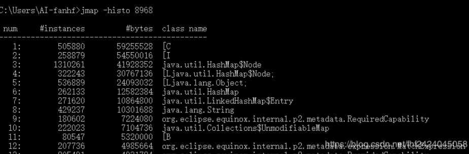

# 如何排查OOM问题

### 什么是OOM

​	OOM为out of memory的简称，来源于java.lang.OutOfMemoryError，指**程序需要的内存空间大于系统分配的内存空间**

### 什么导致OOM

- 分配的空间太少了
- 发生内存泄露或者内存溢出
  - 内存泄露：申请使用完的内存没有释放，导致虚拟机不能再次使用该内存，此时这段内存就泄露了
  - 内存溢出：申请的内存超出了JVM能提供的内存大小，此时称之为溢出。

### 常见的OOM问题

- java堆内存溢出：java.lang.OutOfMemoryError: Java heap space ，般由于内存泄露或者堆的大小设置不当引起。对于内存泄露，需要通过内存监控软件查找程序中的泄露代码，而堆大小可以通过虚拟机参数-Xms,-Xmx等修改。
- java方法区：（java8 元空间）溢出了，一般出现于大量Class或者jsp页面，或者采用cglib等反射机制的情况，因为上述情况会产生大量的Class信息存储于方法区。此种情况可以通过更改方法区的大小来解决，使用类似-XX:PermSize=64m -

### 如何排查

一般手段是：先通过内存映像工具对Dump出来的堆转储快照进行分析，**重点是确认内存中的对象是否是必要的，也就是要先分清楚到底是出现了内存泄漏还是内存溢出。**

- 如果是内存泄漏，可进一步通过工具查看泄漏对象到GC Roots的引用链。这样就能够找到泄漏的对象是通过怎么样的路径与GC Roots相关联的导致垃圾回收机制无法将其回收。掌握了泄漏对象的类信息和GC Roots引用链的信息，就可以比较准确地定位泄漏代码的位置。
- 如果不存在泄漏，那么就是内存中的对象确实必须存活着，那么此时就需要通过虚拟机的堆参数（ -Xmx和-Xms）来适当调大参数；从代码上检查是否存在某些对象存活时间过长、持有时间过长的情况，尝试减少运行时内存的消耗。

### 排查操作

#### 1、使用dmesg命令查看系统日志

​	dmesg |grep -E ‘kill|oom|out of memory’，可以查看操作系统启动后的系统日志，这里就是查看跟内存溢出相关联的系统日志。

#### 2、这时候，需要启动项目，使用ps命令查看进程

​	ps -aux|grep java命令查看一下你的java进程，就可以找到你的java进程的进程id。

#### 3、接着使用top命令

​	top命令显示的结果列表中，会看到%MEM这一列，这里可以看到你的进程可能对内存的使用率特别高。以查看正在运行的进程和系统负载信息，包括cpu负载、内存使用、各个进程所占系统资源等。

#### 4、使用jstat命令

​	用jstat -gcutil 20886 1000 10命令，就是用jstat工具，对指定java进程（20886就是进程id，通过ps -aux | grep java命令就能找到），按照指定间隔，看一下统计信息，这里会每隔一段时间显示一下，包括新生代的两个S0、s1区、Eden区，以及老年代的内存使用率，还有young gc以及full gc的次数。

~~~
例如：

看到的东西类似下面那样：

S0       S1     E            O         YGC  FGC

26.80   0.00   10.50    89.90    86     954
~~~

其实如果大家了解原理，应该知道，一般来说大量的对象涌入内存，结果始终不能回收，会出现的情况就是，快速撑满年轻代，然后young gc几次，根本回收不了什么对象，导致survivor区根本放不下，然后大量对象涌入老年代。老年代很快也满了，然后就频繁full gc，但是也回收不掉。

然后对象持续增加不就oom了，内存放不下了，爆了呗。

所以jstat先看一下基本情况，马上就能看出来，其实就是大量对象没法回收，一直在内存里占据着，然后就差不多内存快爆了。

#### 5、使用jmap命令查看

​	执行jmap -histo pid可以打印出当前堆中所有每个类的实例数量和内存占用，如下，class name是每个类的类名（[B是byte类型，[C是char类型，[I是int类型），bytes是这个类的所有示例占用内存大小，instances是这个类的实例数量。

#### **6、把当前堆内存的快照转储到dumpfile_jmap.hprof文件中，然后可以对内存快照进行分析**

使用jmap -dump:format=b,file=文件名 [pid]，就可以把指定java进程的堆内存快照搞到一个指定的文件里去，但是jmap -dump:format其实一般会比较慢一些，也可以用gcore工具来导出内存快照

 

例如：jmap -dump:format=b,file=D:/log/jvm/dumpfile_jmap.hprof 20886

 

接着就是可以用MAT工具，或者是Eclipse MAT的内存分析插件，来对hprof文件进行分析，看看到底是哪个王八蛋对象太多了，导致内存溢出了

 

#### 8、总结：

- 一般常见的OOM，要么是短时间内涌入大量的对象，导致你的系统根本支持不住，此时你可以考虑优化代码，或者是加机器；要么是长时间来看，你的很多对象不用了但是还被引用，就是内存泄露了，你也是优化代码就好了；这就会导致大量的对象不断进入老年代，然后频繁full gc之后始终没法回收，就撑爆了 

- 要么是加载的类过多，导致class在永久代理保存的过多，始终无法释放，就会撑爆

我这里可以给大家最后提一点，人家肯定会问你有没有处理过线上的问题，你就说有，最简单的，你说有个小伙子用了本地缓存，就放map里，结果没控制map大小，可以无限扩容，最终导致内存爆了，后来解决方案就是用了一个ehcache框架，自动LRU清理掉旧数据，控制内存占用就好了。

 

另外，务必提到，线上jvm必须配置-XX:+HeapDumpOnOutOfMemoryError，-XX:HeapDumpPath=/path/heap/dump。因为这样就是说OOM的时候自动导出一份内存快照，你就可以分析发生OOM时的内存快照了，到底是哪里出现的问题。

