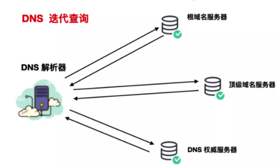

# 浏览器中输入url之后发生了什么

### 0.URL解析

​	对URL进行解析，确定目标服务器和文件名，然后根据这些信息生成HTTP请求消息

### 1.DNS域名解析

​	我们在浏览器输入网址，其实就是要向服务器请求我们想要的页面内容，所有浏览器首先要确认的是域名所对应的服务器在哪里。将**域名解析成对应的服务器IP地址**这项工作，是由DNS服务器来完成的。

- 检查**浏览器DNS缓存**有没有，没有浏览器就会对操作系统发起一个系统调用，**检查操作系统缓存**。
- 操作系统的DNS缓存没有，那么就尝试**读取本地host文件**
- 本地hosts文件里也没有，会**查找路由器缓存**

- 向**运营商（ISP）提供的本地DNS服务器**发起域名解析请求
- **运营商服务器会首先查找自身的缓存**，如果没有就代浏览器就**向根域名服务器**发起请求。ISP 维护的 DNS 服务器，它的主要职责就是通过向网络中其他 DNS 服务器询问正确的 IP 地址。
- 根域名服务器没有就再去**顶级域名服务器、二级域名服务器去找**
- **从客户端到本地服务器属于递归查询，而DNS服务器之间的交互属于迭代查询。**

### 2.建立TCP连接

三次握手

客户端发送一个带有SYN标志的数据包给服务端，服务端收到后，回传一个带有SYN/ACK标志的数据包以示传达确认信息，最后客户端再回传一个带ACK标志的数据包，代表握手结束，连接成功。

### 3. 发送HTTP请求

与服务器建立了连接后，就可以向服务器发起请求了。这里我们先看下请求报文的结构（如下图）：

请求报文
在浏览器中查看报文首部（以google浏览器为例）：

请求行包括请求方法、URI、HTTP版本。首部字段传递重要信息，包括请求首部字段、通用首部字段和实体首部字段。我们可以从报文中看到发出的请求的具体信息。具体每个首部字段的作用，这里不做过多阐述。

### 4.服务器处理请求

服务器端收到请求后的由web服务器（准确说应该是http服务器）处理请求，诸如Apache、Ngnix、IIS等。web服务器解析用户请求，知道了需要调度哪些资源文件，再通过相应的这些资源文件处理用户请求和参数，并调用数据库信息，最后将结果通过web服务器返回给浏览器客户端。

### 5.返回响应结果

在HTTP里，有请求就会有响应，哪怕是错误信息。这里我们同样看下响应报文的组成结构：

响应报文

在响应结果中都会有个一个HTTP状态码，比如我们熟知的200、301、404、500等。通过这个状态码我们可以知道服务器端的处理是否正常，并能了解具体的错误。

状态码由3位数字和原因短语组成。根据首位数字，状态码可以分为五类：

### 6.关闭TCP连接

为了避免服务器与客户端双方的资源占用和损耗，当双方没有请求或响应传递时，任意一方都可以发起关闭请求。与创建TCP连接的3次握手类似，关闭TCP连接，需要4次握手。

### 7.浏览器解析HTML

准确地说，浏览器需要加载解析的不仅仅是HTML，还包括CSS、JS。以及还要加载图片、视频等其他媒体资源。