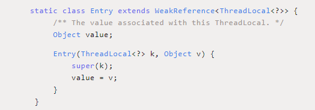

# ThreadLocal详解

### Thread类

~~~java
public class Thread implements Runnable{
    ThreadLocal.ThreadLocalMap threadLocals = null;
}
~~~

Thread`中有一个 `threadLocals` 属性表示线程的本地变量。这个属性的类型是 `ThreadLocal.ThreadLocalMap

### ThreadLocal是什么

​	ThreadLocal是JDK提供的，它提供了**线程本地变量**，也就是如果你创建了一个ThreadLocal变量，**那么每个访问这个变量的线程都会有这个变量的一个本地副本**，多线程操作这个变量时，实际上操作的就是这个变量副本，保证了多个线程之间互不干扰。

### ThreadLoalMap

​	从名字上看，可以猜到它也是一个类似HashMap的数据结构，是ThreadLocal的一个内部类，是一个类Map结构。

​	在ThreadLoalMap中，也是初始化一个大小16的Entry数组，Entry对象用来保存每一个key-value键值对，只不过这里的**key永远都是ThreadLocal对象**，**并且是一个弱引用。**是不是很神奇，**通过ThreadLocal对象的set方法，结果把ThreadLocal对象自己当做key，放进了ThreadLoalMap中。**

​	每个线程在往`ThreadLocal`里放值的时候，都会往自己的`ThreadLocalMap`里存，读也是以`ThreadLocal`作为引用，在自己的`map`里找对应的`key`，从而实现了**线程隔离**。

**我们还要注意`Entry`， 它的`key`是`ThreadLocal<?> k` ，继承自`WeakReference`， 也就是我们常说的弱引用类型。**

这里需要注意的是，**ThreadLoalMap的Entry是继承WeakReference**，和HashMap很大的区别是，**Entry中没有next字段**，所以就不存在链表的情况了。

### ThreadLocal

首先，它是一个数据结构，有点像HashMap，可以保存"key : value"键值对，但是一个ThreadLocal只能保存一个，并且各个线程的数据互不干扰。

~~~java
ThreadLocal<String> localName = new ThreadLocal();
localName.set("全力");
String name = localName.get();
~~~

在线程1中初始化了一个ThreadLocal对象localName，并通过set方法，保存了一个值全力，同时在线程1中通过`localName.get()`可以拿到之前设置的值，但是如果在线程2中，拿到的将是一个null。**当我们调用 `set(v)`方法时，就是以当前 `ThreadLocal`变量为 `key`，传入参数为 `value`，向 `ThreadLocal.ThreadLocalMap`存数据**;**当我们调用 `get()`方法时，就是以当前 `ThreadLocal`变量为 `key`，从 `ThreadLocal.ThreadLocalMap`取对应的数据**

这是为什么，如何实现？不过之前也说了，ThreadLocal保证了各个线程的数据互不干扰。

看看`set(T value)`和`get()`方法的源码

~~~java
 public void set(T value) {
     //1. 获取当前线程实例对象
    Thread t = Thread.currentThread();
      
	//2. 通过当前线程实例获取到ThreadLocalMap对象
    ThreadLocalMap map = getMap(t);
    if (map != null)
        //3. 如果Map不为null,则以当前threadLocl实例为key,值为value进行存入
        map.set(this, value);
    else
         
		//4.map为null,则新建ThreadLocalMap并存入value
        createMap(t, value);
}

public T get() {
    Thread t = Thread.currentThread();
    ThreadLocalMap map = getMap(t);
    if (map != null) {
        ThreadLocalMap.Entry e = map.getEntry(this);
        if (e != null) {
            @SuppressWarnings("unchecked")
            T result = (T)e.value;
            return result;
        }
    }
    return setInitialValue();
}

ThreadLocalMap getMap(Thread t) {
    return t.threadLocals;
}
~~~

可以发现，**每个线程中都有一个`ThreadLocalMap`数据结构，当执行set方法时，其值是保存在当前线程的`threadLocals`变量中**，当执行get方法中，是从当前线程的`threadLocals`变量获取。

所以在线程1中set的值，对线程2来说是摸不到的，而且在线程2中重新set的话，也不会影响到线程1中的值，保证了线程之间不会相互干扰。

### hash冲突

没有链表结构，那发生hash冲突了怎么办？

采用**线性探测**的方式，根据 `key`计算 `hash`值，**如果出现冲突，则向后探测**，当到哈希表末尾的时候再从0开始，直到找到一个合适的位置。

这种算法也决定了 `ThreadLocalMap`不适合存储大量数据。

### 内存泄露

ThreadLocal可能导致内存泄漏，为什么？

先看看Entry的实现：

~~~java
static class Entry extends WeakReference<ThreadLocal<?>> {
    /** The value associated with this ThreadLocal. */
    Object value;

    Entry(ThreadLocal<?> k, Object v) {
        super(k);
        value = v;
    }
}
~~~

通过之前的分析已经知道，**当使用ThreadLocal保存一个value时，会在ThreadLocalMap中的数组插入一个Entry对象**，**按理说key-value都应该以强引用保存在Entry对象中**，**但在ThreadLocalMap的实现中，key被保存到了WeakReference对象中。**

这就导致了一个问题，**ThreadLocal在没有外部强引用时，发生GC时会被回收**，如果创建ThreadLocal的线程一直持续运行，那么这个Entry对象中的value就有可能一直得不到回收，发生内存泄露。

### 如何避免内存泄露

​	ThreadTocal其实就相当于一个工具壳，它调用set方法将value调入线程的ThreadTocalMap结构的变量threadlocals中，通过get再拿出来使用，如果调用线程不终止，那么会一直放在里面，可以调用remove方法删除。

​	既然已经发现有内存泄露的隐患，自然有应对的策略，**在调用ThreadLocal的get()、set()后发生GC可能会清除ThreadLocalMap中key为null的Entry对象，这样对应的value就没有GC Roots可达了，下次GC的时候就可以被回收**，**当然如果调用remove方法，肯定会删除对应的Entry对象。**

**如果使用ThreadLocal的set方法之后，没有显示的调用remove方法，就有可能发生内存泄露，所以养成良好的编程习惯十分重要，使用完ThreadLocal之后，记得调用remove方法。**

### 为何线程里面的threadlocals变量被设计为ThreadTocalMap结构

因为一个线程可能绑定多个ThreadTocal变量啊

