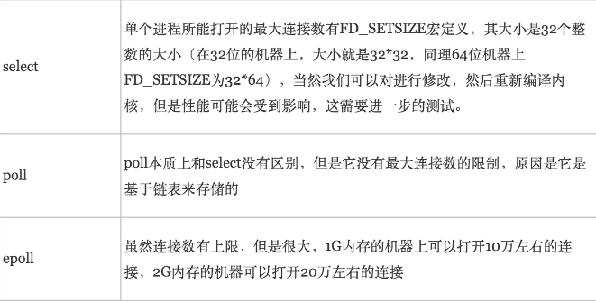
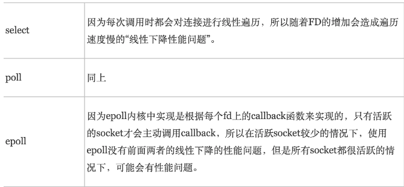

# IO多路复用

### 什么是文件描述符FD

​	文件描述符（File descriptor）是计算机科学中的一个术语，**是一个用于表述指向文件的引用的抽象化概念。** 

当程序打开一个现有文件或者创建一个新文件时，内核向进程返回一个文件描述符。在程序设计中，一些涉及底层的程序编写往往会围绕着文件描述符展开。

### 什么是IO多路复用？

​	I/O多路复用就是通过一种机制，**一个进程可以监视多个描述符，一旦某个描述符就绪（一般是读就绪或者写就绪），能够通知程序进行相应的读写操作。**

​	目前支持I/O多路复用的系统调用有 **select，pselect，poll，epoll**，但select，pselect，poll，epoll本质上都是同步I/O，因为他们都需要在读写事件就绪后自己负责进行读写，也就是说这个读写过程是阻塞的，而异步I/O则无需自己负责进行读写，异步I/O的实现会负责把数据从内核拷贝到用户空间。

### IO多路复用的三种实现

​	epoll跟select都能提供多路I/O复用的解决方案。在现在的Linux内核里有都能够支持，`其中epoll是Linux所特有，而select则应该是POSIX所规定`，一般操作系统均有实现。

- select
- poll
- epoll

#### select

​	select目前几乎在所有的平台上支持，`其良好跨平台支持也是它的一个优点`。`select的一个缺点在于单个进程能够监视的文件描述符的数量存在最大限制`，在Linux上一般为1024，`可以通过修改宏定义甚至重新编译内核的方式提升这一限制`，但是这样也会造成效率的降低。

`select本质上是通过设置或者检查存放fd标志位的数据结构来进行下一步处理`。这样所带来的缺点是：

- **select最大的缺陷就是单个进程所打开的FD是有一定限制的，它由FD_SETSIZE设置，默认值是1024。**
- **对socket采用轮询的方式线性扫描，效率较低。**当套接字比较多的时候，每次select()都要通过遍历FD_SETSIZE个Socket来完成调度，不管哪个Socket是活跃的，都遍历一遍。这会浪费很多CPU时间。`如果能给套接字注册某个回调函数，当他们活跃时，自动完成相关操作，那就避免了轮询`，这正是epoll与kqueue做的。

#### poll

​	poll本质上和select没有区别，它将用户传入的数组拷贝到内核空间，然后查询每个fd对应的设备状态， **但是它没有最大连接数的限制**，原因是它是基于链表来存储的.

**它没有最大连接数的限制**，原因是它是基于链表来存储的，但是同样有缺点：

- 每次调用 poll ，都需要把 fd 集合从用户态拷贝到内核态，这个开销在 fd 很多时会很大；
- 对 socket 扫描是线性扫描，采用轮询的方法，效率较低（高并发时）。
- 从上面看，**select和poll都需要在返回后，通过遍历文件描述符来获取已经就绪的socket。**事实上，`同时连接的大量客户端在一时刻可能只有很少的处于就绪状态`，因此随着监视的描述符数量的增长，其效率也会线性下降。

#### epoll

​	**epoll可以理解为event poll**，不同于忙轮询和无差别轮询，**epoll会把哪个流发生了怎样的I/O事件通知我们**。所以我们说epoll实际上是**事件驱动（每个事件关联上fd）**的，此时我们对这些流的操作都是有意义的。（复杂度降低到了O(1)）

#### epoll的优点

- 没有最大并发连接的限制，能打开的FD的上限远大于1024（1G的内存上能监听约10万个端口）；
- 效率提升，**去掉了遍历文件描述符，而是通过监听回调的的机制**。只有活跃可用的FD才会调用callback函数；**即Epoll最大的优点就在于它只管你“活跃”的连接，而跟连接总数无关，因此在实际的网络环境中，Epoll的效率就会远远高于select和poll；**
- 内存拷贝，利用mmap()文件映射内存加速与内核空间的消息传递；即epoll使用mmap减少复制开销。(mmap就是用户空间共享内核空间数据，减少用户空间到内核空间的拷贝次数)

### select、poll、epoll的区别

​	**select，poll，epoll都是IO多路复用的机制。**I/O多路复用就通过一种机制，可以监视多个描述符，一旦某个描述符就绪（一般是读就绪或者写就绪），能够通知程序进行相应的读写操作。**但select，poll，epoll本质上都是同步I/O，因为他们都需要在读写事件就绪后自己负责进行读写，也就是说这个读写过程是阻塞的**，而异步I/O则无需自己负责进行读写，异步I/O的实现会负责把数据从内核拷贝到用户空间。 

1. **支持一个进程所能打开的最大连接数**

2. **FD剧增后带来的IO效率问题**

3. **消息传递方式**

   

### 总结

​	**select，poll实现需要自己不断轮询所有fd集合**，直到设备就绪，期间可能要睡眠和唤醒多次交替。而epoll其实也需要调用epoll_wait不断轮询就绪链表，期间也可能多次睡眠和唤醒交替，但是它是**设备就绪时，调用回调函数，把就绪fd放入就绪链表中**，并唤醒在epoll_wait中进入睡眠的进程。虽然都要睡眠和交替，但是select和poll在“醒着”的时候要遍历整个fd集合，**而epoll在“醒着”的时候只要判断一下就绪链表是否为空就行了**，这节省了大量的CPU时间。这就是回调机制带来的性能提升。

​	select，poll每次调用都要把fd集合从用户态往内核态拷贝一次，并且要把current往设备等待队列中挂一次，而epoll只要一次拷贝，而且把current往等待队列上挂也只挂一次（在epoll_wait的开始，注意这里的等待队列并不是设备等待队列，只是一个epoll内部定义的等待队列）。这也能节省不少的开销。 

### nginx/redis 所使用的IO模型是什么？

#### Redis IO多路复用技术

redis 是一个单线程却性能非常好的内存数据库， 主要用来作为缓存系统。 redis 采用网络IO多路复用技术来保证在多连接的时候， 系统的高吞吐量。

### **为什么 Redis 中要使用 I/O 多路复用这种技术呢？**

​	首先，Redis 是跑在单线程中的，**所有的操作都是按照顺序线性执行的**，但是**由于读写操作等待用户输入或输出都是阻塞的，所以 I/O 操作在一般情况下往往不能直接返回**，这会导致某一文件的 I/O 阻塞导致整个进程无法对其它客户提供服务，而  **I/O 多路复用** 就是为了解决这个问题而出现的。

**redis的io模型主要是基于epoll实现的**，不过它也提供了 select和kqueue的实现，默认采用epoll。

### epoll 水平触发（LT）与 边缘触发（ET）的区别？

EPOLL事件有两种模型：

- Edge Triggered (ET) 边缘触发只有数据到来,才触发,不管缓存区中是否还有数据。
- Level Triggered (LT) 水平触发只要有数据都会触发。