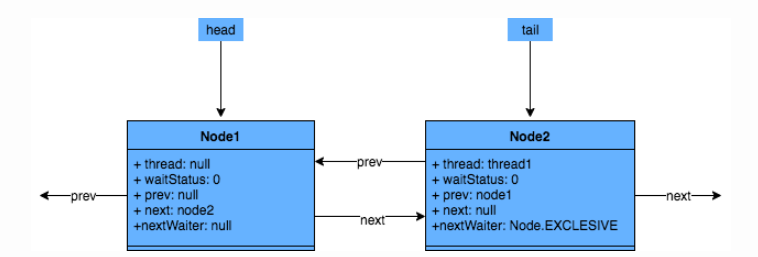

# AQS

​	**AQS 是一个用来构建锁和同步器的框架，使用 AQS 能简单且高效地构造出应用广泛的大量的同步器**，比如我们提到的 `ReentrantLock`，`Semaphore`，其他的诸如 `ReentrantReadWriteLock`，`SynchronousQueue`，`FutureTask`(jdk1.7) 等等皆是基于 AQS 的。

- 上图中有颜色的为Method，无颜色的为Attribution。
- 总的来说，AQS框架共分为五层，自上而下由浅入深，从AQS对外暴露的API到底层基础数据。
- 当有自定义同步器接入时，只需重写第一层所需要的部分方法即可，不需要关注底层具体的实现流程。当自定义同步器进行加锁或者解锁操作时，先经过第一层的API进入AQS内部方法，然后经过第二层进行锁的获取，接着对于获取锁失败的流程，进入第三层和第四层的等待队列处理，而这些处理方式均依赖于第五层的基础数据提供层。

### 原理概览

​	**AQS核心思想是**，如果被请求的共享资源空闲，那么就将当前请求资源的线程设置为有效的工作线程，将共享资源设置为锁定状态；如果共享资源被占用，就需要一定的阻塞等待唤醒机制来保证锁分配。这个机制主要用的是CLH队列的变体实现的，将暂时获取不到锁的线程加入到队列中。

​	CLH：Craig、Landin and Hagersten队列，是单向链表，AQS中的队列是CLH变体的虚拟**双向队列（FIFO）**，**AQS是通过将每条请求共享资源的线程封装成一个节点来实现锁的分配。**

**AQS使用一个Volatile的int类型的成员变量来表示同步状态，通过内置的FIFO队列来完成资源获取的排队工作，通过CAS完成对State值的修改。**

### AQS数据结构

​	AQS中最基本的数据结构——Node，Node即为上面CLH变体队列中的节点。

### 同步状态State

​	AQS的同步状态——State。AQS中维护了一个名为state的字段，意为同步状态，是由Volatile修饰的，用于展示当前临界资源的获锁情况。

~~~java
private volatile int state;
~~~

下面提供了几个访问这个字段的方法：

​	这几个方法都是Final修饰的，说明子类中无法重写它们。我们可以通过修改State字段表示的同步状态来实现多线程的独占模式和共享模式（加锁过程）。

### AQS重要方法与ReentrantLock的关联

​	从架构图中可以得知，AQS提供了大量用于自定义同步器实现的Protected方法。自定义同步器实现的相关方法也只是为了通过修改State字段来实现多线程的独占模式或者共享模式。自定义同步器需要实现以下方法（ReentrantLock需要实现的方法如下，并不是全部）：

​	一般来说，自定义同步器要么是独占方式，要么是共享方式，它们也只需实现tryAcquire-tryRelease、tryAcquireShared-tryReleaseShared中的一种即可。AQS也支持自定义同步器同时实现独占和共享两种方式，如ReentrantReadWriteLock。ReentrantLock是独占锁，所以实现了tryAcquire-tryRelease。

### 线程加入等待队列

​	获取锁失败后，会执行addWaiter(Node.EXCLUSIVE)加入等待队列，具体实现方法如下：

~~~java
private Node addWaiter(Node mode) {
	Node node = new Node(Thread.currentThread(), mode);
	// Try the fast path of enq; backup to full enq on failure
	Node pred = tail;
	if (pred != null) {
		node.prev = pred;
		if (compareAndSetTail(pred, node)) {
			pred.next = node;
			return node;
		}
	}
	enq(node);
	return node;
}
private final boolean compareAndSetTail(Node expect, Node update) {
	return unsafe.compareAndSwapObject(this, tailOffset, expect, update);
}
~~~

主要的流程如下：

- 通过当前的线程和锁模式新建一个节点。
- Pred指针指向尾节点Tail。
- 将New中Node的Prev指针指向Pred。
- 通过compareAndSetTail方法，完成尾节点的设置。这个方法主要是对tailOffset和Expect进行比较，如果tailOffset的Node和Expect的Node地址是相同的，那么设置Tail的值为Update的值

### 等待队列中线程出队列时机

回到最初的源码：

~~~java
public final void acquire(int arg) {
	if (!tryAcquire(arg) && acquireQueued(addWaiter(Node.EXCLUSIVE), arg))
		selfInterrupt();
}
~~~

​	总的来说，一个线程获取锁失败了，被放入等待队列，acquireQueued会把放入队列中的线程不断去获取锁，直到获取成功或者不再需要获取（中断）。

### Lock函数通过Acquire方法进行加锁，但是具体是如何加锁的呢？

AQS的Acquire会调用tryAcquire方法，tryAcquire由各个自定义同步器实现，通过tryAcquire完成加锁过程。

### JUC中的应用场景

除了上边ReentrantLock的可重入性的应用，AQS作为并发编程的框架，为很多其他同步工具提供了良好的解决方案。下面列出了JUC中的几种同步工具，大体介绍一下AQS的应用场景：

