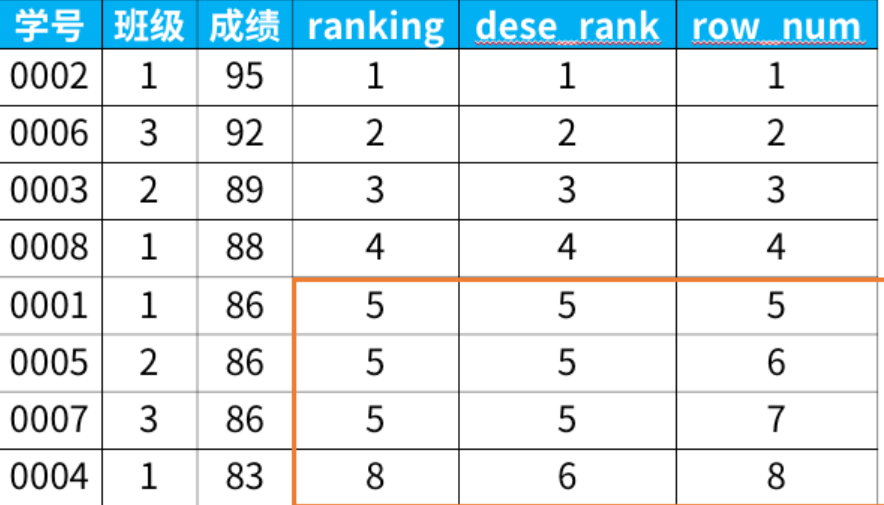

# SQL语句练习

### 组合两个表

LeetCode 175

有两个表：

表1: `Person`

~~~java
+-------------+---------+
| 列名         | 类型     |
+-------------+---------+
| PersonId    | int     |
| FirstName   | varchar |
| LastName    | varchar |
+-------------+---------+
PersonId 是上表主键
~~~

表2: `Address`

~~~java
+-------------+---------+
| 列名         | 类型    |
+-------------+---------+
| AddressId   | int     |
| PersonId    | int     |
| City        | varchar |
| State       | varchar |
+-------------+---------+
AddressId 是上表主键
~~~

编写一个 SQL 查询，满足条件：无论 person 是否有地址信息，都需要基于上述两表提供 person 的以下信息：

~~~java
FirstName, LastName, City, State
~~~

思路：左连接连表查询，保留person全部信息

- 左连接保留左表全部信息，即使为null
- 内连接取公共的数据

~~~java
select FirstName, LastName, City, State
from Person left join Address
on Person.PersonId = Address.PersonId;
~~~

### 第二高的薪水

LeetCode 176

编写一个 SQL 查询，获取 `Employee` 表中第二高的薪水（Salary） 。

~~~sql
+----+--------+
| Id | Salary |
+----+--------+
| 1  | 100    |
| 2  | 200    |
| 3  | 300    |
+----+--------+
~~~

例如上述 `Employee` 表，SQL查询应该返回 `200` 作为第二高的薪水。如果不存在第二高的薪水，那么查询应返回 `null`。

~~~java
+---------------------+
| SecondHighestSalary |
+---------------------+
| 200                 |
+---------------------+
~~~

思路：

- 这里的第一个select起到一个打印输出的功能

- 题目要求不存在第二高就返回null，这里用到一个ifnull(a,b)函数，如果括号里a是null就执行b、
- 从大到小排序后要筛选出唯一的第二大的，用limit，后面的第一个参数是从0开始的，第二个参数代表个数；比如limit 0,1表示第一个数

~~~sql
select ifnull(
    (select distinct Salary 
     from Employee 
     order by Salary 
     desc limit 1,1), 0) 
	as SecondHighestSalary;
~~~

### 分数排名

LeetCode 176

编写一个 SQL 查询来实现分数排名。

如果两个分数相同，则两个分数排名（Rank）相同。请注意，平分后的下一个名次应该是下一个连续的整数值。换句话说，名次之间不应该有“间隔”。

~~~
+----+-------+
| Id | Score |
+----+-------+
| 1  | 3.50  |
| 2  | 3.65  |
| 3  | 4.00  |
| 4  | 3.85  |
| 5  | 4.00  |
| 6  | 3.65  |
+----+-------+
~~~

例如，根据上述给定的 `Scores` 表，你的查询应该返回（按分数从高到低排列）：

~~~
+-------+------+
| Score | Rank |
+-------+------+
| 4.00  | 1    |
| 4.00  | 1    |
| 3.85  | 2    |
| 3.65  | 3    |
| 3.65  | 3    |
| 3.50  | 4    |
+-------+------+
~~~

思路：分两个写，写一个子查询

- 题目要求查出两列，一列为分数的降序，一列为这个分数对应的排名，**排名不跳**，**相同的分数是并列的**
- **可以分两部分写**，第一部分很简单就是将分数降序排，也不用去重
- 第二部分就是对左边的分数实现排名，再写一个select子查询。
- 第二部分思路是，用聚合函数count计算出去重后大于等于左侧分数的个数就是排名了
- 用到聚合函数了，就是将表b的每一行和a的一行比聚合计算出一个数
- 还MySQL8.0之后支持**窗口函数**来解决这种问题了

~~~java
select a.Score as  Score ,
       (select count(distinct b.Score) 
       from Scores b 
       where b.Score >= a.Score) as `Rank`
from Scores a
order by Score desc;
~~~

思路：窗口函数

窗口函数的基本语法如下：

~~~sql
<窗口函数> over (partition by <用于分组的列名>
                order by <用于排序的列名>)
~~~

专用窗口函数rank, dense_rank, row_number有什么区别呢？

它们的区别我举个例子，你们一下就能看懂：

~~~sql
select *,
   rank() over (order by 成绩 desc) as ranking,
   dense_rank() over (order by 成绩 desc) as dese_rank,
   row_number() over (order by 成绩 desc) as row_num
from 班级表
~~~

也就是rank()会根据数量跳排名，dense_rank()即使有并列也不跳，row_number()并列递增

所以本题答案：

~~~sql
select Score,
       dense_rank() over(order by Score desc) as `Rank` 
from Scores;
~~~

### 超过经理收入的员工

LeetCode 181

`Employee` 表包含所有员工，他们的经理也属于员工。每个员工都有一个 Id，此外还有一列对应员工的经理的 Id。

~~~
+----+-------+--------+-----------+
| Id | Name  | Salary | ManagerId |
+----+-------+--------+-----------+
| 1  | Joe   | 70000  | 3         |
| 2  | Henry | 80000  | 4         |
| 3  | Sam   | 60000  | NULL      |
| 4  | Max   | 90000  | NULL      |
+----+-------+--------+-----------+
~~~

给定 `Employee` 表，编写一个 SQL 查询，该查询可以获取收入超过他们经理的员工的姓名。在上面的表格中，Joe 是唯一一个收入超过他的经理的员工。

~~~
+----------+
| Employee |
+----------+
| Joe      |
+----------+
~~~

思路：

- 经理也在表里面，单表查询即可
- 同一张表模拟两个,没有两张表就自己造，自己和自己另一个镜像比较

~~~sql
select a.Name as Employee
from Employee a, Employee b
where a.ManagerId = b.Id and a.Salary > b.Salary;
~~~

### 查找重复的电子邮箱

LeetCode 182

编写一个 SQL 查询，查找 `Person` 表中所有重复的电子邮箱。

**示例：**

~~~sql
+----+---------+
| Id | Email   |
+----+---------+
| 1  | a@b.com |
| 2  | c@d.com |
| 3  | a@b.com |
+----+---------+
~~~

根据以上输入，你的查询应返回以下结果：

~~~sql
+---------+
| Email   |
+---------+
| a@b.com |
+---------+
~~~

思路：

- group by再用having过滤
- 这题不要打印出聚合函数，group保证了唯一性，having过滤

~~~sql
select Email 
from Person
group by Email
having count(Email) > 1;
~~~

### 从不订购的客户

LeetCode 183

某网站包含两个表，`Customers` 表和 `Orders` 表。编写一个 SQL 查询，找出所有从不订购任何东西的客户。

`Customers` 表：

~~~sql
+----+-------+
| Id | Name  |
+----+-------+
| 1  | Joe   |
| 2  | Henry |
| 3  | Sam   |
| 4  | Max   |
+----+-------+
~~~

`Orders` 表：

~~~sql
+----+------------+
| Id | CustomerId |
+----+------------+
| 1  | 3          |
| 2  | 1          |
+----+------------+
~~~

例如给定上述表格，你的查询应返回：

~~~sql
+-----------+
| Customers |
+-----------+
| Henry     |
| Max       |
+-----------+
~~~

思路：

如果我们有一份曾经订购过的客户名单，就很容易知道谁从未订购过。

我们可以使用下面的代码来获得这样的列表。

~~~sql
select customerid from orders;
~~~

然后，我们可以使用 `NOT IN` 查询不在此列表中的客户。

~~~sql
select customers.name as 'Customers'
from customers
where customers.id not in
(
    select customerid from orders
);
~~~

### 部门工资最高的员工

LeetCode 184

`Employee` 表包含所有员工信息，每个员工有其对应的 Id, salary 和 department Id。

~~~sql
+----+-------+--------+--------------+
| Id | Name  | Salary | DepartmentId |
+----+-------+--------+--------------+
| 1  | Joe   | 70000  | 1            |
| 2  | Jim   | 90000  | 1            |
| 3  | Henry | 80000  | 2            |
| 4  | Sam   | 60000  | 2            |
| 5  | Max   | 90000  | 1            |
+----+-------+--------+--------------+
~~~

`Department` 表包含公司所有部门的信息。

~~~sql
+----+----------+
| Id | Name     |
+----+----------+
| 1  | IT       |
| 2  | Sales    |
+----+----------+
~~~

编写一个 SQL 查询，找出每个部门工资最高的员工。对于上述表，您的 SQL 查询应返回以下行（行的顺序无关紧要）。

~~~sql
+------------+----------+--------+
| Department | Employee | Salary |
+------------+----------+--------+
| IT         | Max      | 90000  |
| IT         | Jim      | 90000  |
| Sales      | Henry    | 80000  |
+------------+----------+--------+
~~~

思路：

- 题目要求找出工资最高的员工，先求出每个部门的最高工资是多少，再从员工表找出符合最高工资员工，所以要写一个子查询
- 先写一个查询查找每个部门对应的最高工资

~~~sql
select DepartmentId, max(Salary)
from Employee
group by DepartmentId
~~~

- 然后从员工表中找出匹配这个最高工资和部门号的所有员工

~~~sql
select 
    Department.Name as Department,
    Employee.Name as Employee,
    Salary
from
    Employee,
    Department
where
    Employee.DepartmentId = Department.Id 
    and (Employee.DepartmentId ,Salary)
    in (
        select DepartmentId, max(Salary)
        from Employee
        group by DepartmentId
    )
~~~

