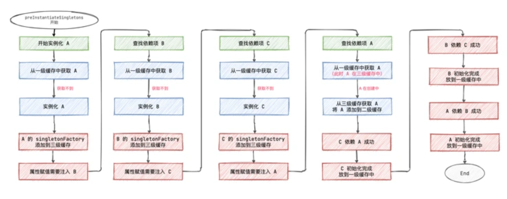

# Spring如何解决循环依赖

### 什么是循环依赖

​	**循环依赖：就是N个类循环(嵌套)引用**。通俗的讲就是N个Bean互相引用对方，最终形成`闭环`。用一副经典的图示可以表示成这样（A、B、C都代表对象，虚线代表引用关系）：

根据官方文档说明，**Spring 会自动解决基于 setter 注入的循环依赖。**如果Spring IoC 容器会在运行时检测到构造函数注入循环引用

当然在咱们工作中现在都使用 `@Autowired` 注解来注入属性，@Autowired就是基于setter 注入的。

### Spring 是如何解决循环依赖的

答案是Spring单例Bean创建的时候使用了三级缓存。

- singletonObjects： 一级缓存，存储已经实例化完成、初始化完成的单例Bean对象。
- earlySingletonObjects： 二级缓存，存储 singletonObject，这个 Bean 实例化了，还没有完全初始化。
- singletonFactories： 三级缓存，存储 singletonFactory。

#### 缓存步骤

1. 先从一级缓存singletonObjects中尝试获取，如果获取到就直接return
2. 如果获取不到，那就说明对象正在创建之中，那就再尝试从二级缓存中获取，获取到就return
3. 还是获取不到就允许singletonFactories通过singletonFactory.getObject()获取,如果获取到了就从三级缓存移除，移动到二级缓存。经过singletonFactorie.getObject()后放进二级缓存，这时候对象已经实例化了，**但还没有完全初始化，但是对象的引用已经可以被其他引用了**

#### 具体步骤（以A和B循环依赖举例）

1. 一级缓存获取不到A
2. 开始实例化A
3. A的singletonFactory添加到三级缓存
4. A发现属性赋值要注入B，一级缓存没有B
5. 开始实例化B
6. B的singletonFactory添加到三级缓存
7. B发现属性赋值要注入A，去一级缓存尝试获取A，发现A在创建中，通过三级缓存singletonFactory.getObject()方法创建A，然后添加到二级缓存，此时A可以被引用，尽管没有完全初始化好
8. B依赖A成功，然后B初始化完成后放入一级缓存
9. A也就依赖B成功，放入一级缓存

